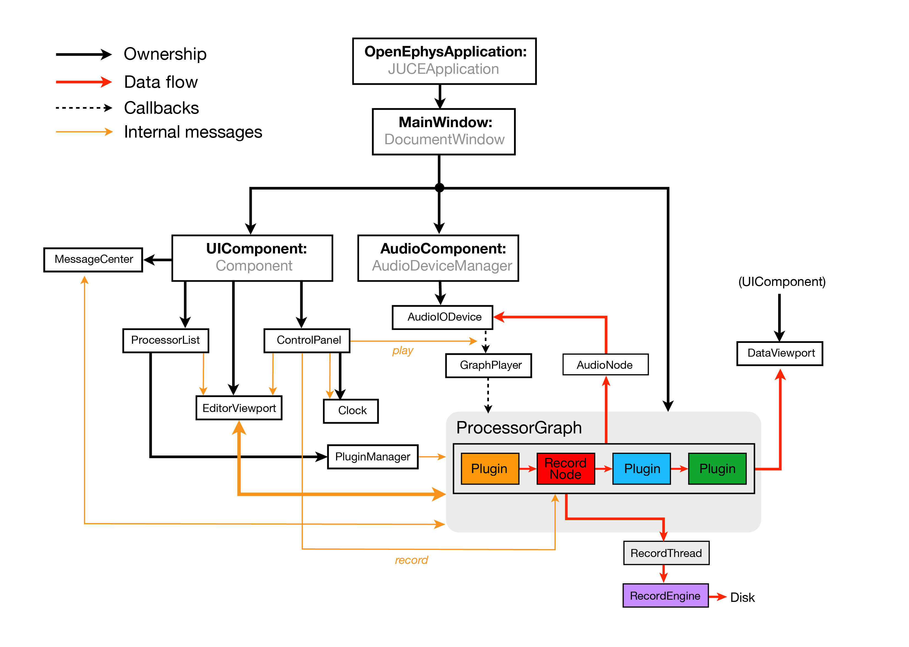

.. _modifyingthehostapplication:
.. role:: raw-html-m2r(raw)
   :format: html

Modifying the host application
================================

We welcome contributions to the main `plugin-GUI repository <https://github.com/open-ephys/plugin-GUI>`__, but these may require a bit more prior knowledge than building or modifying plugins. This page aims to provide a high-level overview of the GUI's code base. However, if you'd like to make changes more substantial than a minor bug fix, we strong recommend `submitting an issue on GitHub <https://github.com/open-ephys/plugin-GUI/issues>`__ describing your plans, so the Open Ephys core team can help guide you in the right direction.

Recommended workflow
--------------------

If you're planning to update the host application, or any of the plugins in the `plugin-GUI repository <https://github.com/open-ephys/plugin-GUI>`__, we encourage you to follow these steps:

1. Fork the `GUI's GitHub repository <https://github.com/open-ephys/plugin-GUI>`__ to your own account.

2. Clone the fork via the `command line <https://docs.github.com/en/repositories/creating-and-managing-repositories/cloning-a-repository#cloning-a-repository-using-the-command-line>`__ or the `GitHub Desktop app <https://desktop.github.com/>`__. 

3. Compile the GUI for your platform of choice according to the steps on :ref:`this page<compilingthegui>`.

4. `Open an issue <https://github.com/open-ephys/plugin-GUI/issues>`__ describing the changes you'd like to make, whether it's fixing a bug or adding a new feature. This will ensure that we avoid any redundant development efforts.

5. Create a new branch for your changes based on the **main** branch: :code:`git checkout -b <newbranchname>`

6. Make your changes (and ensure that the GUI successfully compiles).

7. Push your changes to GitHub: :code:`git push -u origin <newbranchname>`

8. Open a pull request against the **development** branch of the main GUI repository.

If your changes look good, they will be merged and included in the next release!

Code organization
------------------

The top-level directory of the `plugin-GUI repository <https://github.com/open-ephys/plugin-GUI>`__ contains the following folders:

* **.github** - GitHub Actions scripts for building the GUI on Linux, macOS, and Windows. Whenever the code is updated in the **testing** or **master** branches, these scripts will automatically regenerate the GUI's binaries and upload them to `Artifactory <https://openephys.jfrog.io/ui/native/GUI-binaries/>`__.

* **Build** - empty directory where platform-specific build files will be located. Any files that end up in this directory will not be included in your git commits.

* **JuceLibraryCode** - a customized version of the source code for the `Juce Library <https://juce.com/>`__. The Open Ephys GUI uses this library for a wide variety of functions, including drawing the user interface, real-time data processing, threading, and file I/O.

* **Plugins** - source code for plugins that are included by default with the host application.

* **Resources** - includes a variety of useful resources, including sample data files, scripts, and libraries used by the GUI.

* **Source** - the source code for the host application. The key classes are described below.

Program structure
------------------

This diagram showcases how key C++ classes interact within the host application:

* *Solid black arrows* denote ownership: which objects are responsible for creating and destroying other objects?

* *Dashed black arrows* indicate the precisely timed callbacks that drive data acquisition.

* *Red arrows* show how data flows through the application. All of the data processing takes place within the **ProcessorGraph**, but may leave the graph to be stored to disk by the **RecordNode**, sent to audio monitors by the **AudioNode**, or visualized within the **DataViewport**.

* *Orange arrows* denote the essential message-passing interactions. The messages sent between the **EditorViewport** and the **ProcessorGraph** are especially important, as they are responsible for constructing and verifying the signal chain.

Core application classes
##########################

When the application starts, the first object created is an **OpenEphysApplication**, which is derived from the :code:`JUCEApplication` class. This object initializes the application and owns the **MainWindow**, but doesn't do much else. When the **MainWindow** is created, it creates the three central objects of the application: the **UIComponent**, the **AudioComponent**, and the **ProcessorGraph**.

* The **UIComponent** owns all of the objects the user can interact with directly. Editing the **ProcessorGraph**, starting and stopping acquisition, and receiving updates about the application's state is all handled by objects created by the **UIComponent**. It is derived from Juce's :code:`Component` class

* The **AudioComponent** communicates with the computer's audio card, which drives the callbacks to the **ProcessorGraph** and enables audio monitoring of incoming data. It is derived from Juce's :code:`AudioDeviceManager` class.

* The **ProcessorGraph** stores information about the signal chain and ensure that data is processed efficiently. It is derived from Juce's :code:`AudioProcessorGraph` class.

User interface classes
#######################

The **UIComponent** has five main regions, each of which is an object that it is responsible for creating and destroying:

* The **ControlPanel** occupies the top of the application window. It contains a CPU usage meter, a disk space meter, a play button, and a record button. It also own the **Clock**, which displays the total time spent acquiring or recording data.

* The **ProcessorList** sits on the left-hand side of the application window and contains a list of all the available modules for creating and processing data. Modules are selected from the list and dragged onto the **EditorViewport** to construct the signal chain. The **ProcessorList** can be collapsed to provide additional room for data visualization once the signal chain is in place.

* The **EditorViewport**, near the bottom of the application window, displays the editors for all of the monitors currently in the signal chain. The editors provide a graphical interface for modifying the parameters of each module. Once they're inside the **EditorViewport**, editors can be dragged and dropped to change their ordering within a signal chain, but only if acquisition is paused.

* The **MessageCenter** lives at the bottom of the application window and displays messages that are relevant to the user. Most of these messages currently originate in the **ProcessorGraph**, but they could come from almost any object within the program.

* The **DataViewport** contains tabs for different types of visualizers. Whenever a plugin with a visualizer is added to the signal chain, it can either claim a tab within the **DataViewport** or place its display in a separate window. This affords the GUI incredible flexibility. In a setup with multiple monitors, each visualizer can occupy a separate window on its own screen. If the GUI is being used on a laptop, all of the visualizers are organized into easy-to-find tabs.

The processor graph
####################

* The **ProcessorGraph** manages user-defined data processing pipelines composed of different combinations of plugins. All of the modules that create the **ProcessorGraph** are derived from a custom **GenericProcessor** class.

There are five main types of plugins that can be placed in the ProcessorGraph:

* **Sources** feed data into the graph. They can only have outputs, never inputs. Every valid signal chain must have at least one source.

* **Filters** modify the data they receive. They can be as simple as bandpass filters or resamplers, or more complex spike detectors or ripple/spindle detectors. Filters can process continuous signals or discrete events.

* **Sinks** send data outside of the signal chain, but do not modify the underlying data stream. Examples of sinks include graphical displays, network streams, or plugins that communicate with digital output hardware (such as Arduinos).

* **Utilities** perform specialized functions such as merging or splitting signal chains, or starting/stopping recording based on digital inputs.

* **Record Nodes** write incoming data to disk in a format specified by the currently loaded **RecordEngine**. It's possible to use multiple Record Nodes in a single signal chain, in order to record data at different processing stages.

In addition to the user-defined signal chain, one module is created by default:

* The **AudioNode** allows signals to be sent to the computer's audio card, for purposes of audio monitoring. The last two channels of every :ref:`audiomonitor` are automatically connected to the Audio Node.

.. |br| raw:: html

   
