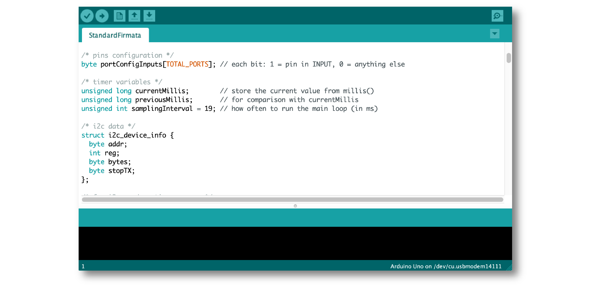
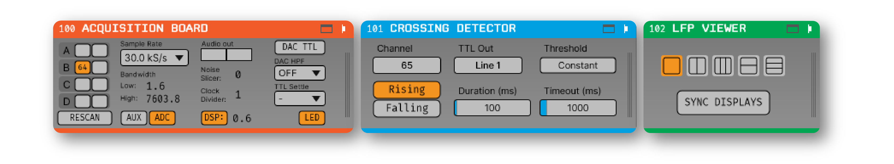

.. _closedlooplatency:

.. role:: raw-html-m2r(raw)
   :format: html

Measuring Closed-Loop Latency
==============================

One of the key features of the Open Ephys GUI is that it provides the ability to reconfigure your signal chains on the fly. "Source" plugins that acquire neural data can be combined with "filter" plugins that detect salient events, which can be linked to "Sink" plugins that can trigger electrical or optical stimulation to the brain. Because of the modular nature of the GUI, the same closed-loop signal chain can be used with a variety of different data sources.

When using the GUI for closed-loop feedback experiments, all of the data processing happens in *software*, which limits the speed at which the system can respond to incoming events. In general, you can expect about 20-30 milliseconds of delay between the time at which the external event occurs, and the time at which the GUI generates an output in respond to that event. There are ways to reduce this delay, as this tutorial will explain, but given the limitations of both hardware and software, it will never reach sub-millisecond precision. Nevertheless, this timescale is still useful for a wide range of closed-loop paradigms, including:

* Delivering stimulation at the onset of seizure-like activity (using the :ref:`multibandintegrator` plugin)
* Triggering feedback at a specific phase of an ongoing oscillation (using the :ref:`phasecalculator` plugin)
* Activating an output when an analog signal crosses a threshold (using the :ref:`crossingdetector` plugin)

This tutorial will guide you through the steps involved in setting up a signal chain capable of delivering closed-loop feedback. It will show you how to measure the latency of your setup, and will discuss the tradeoffs involved in attempting to minimize latency.

Required hardware
#################

* 1 `Open Ephys Acquisition Board <https://open-ephys.org/acq-board>`__ with 5V power supply and USB cable (headstages are optional)
* 2 `Open Ephys I/O Boards <https://open-ephys.org/acquisition-system/io-board-pcb>`__ with HDMI cables
* 2 Arduinos with 5V operating voltage (e.g. `Arduino Uno <https://store-usa.arduino.cc/products/arduino-uno-rev3/?selectedStore=us>`__). along with the appropriate USB cables
* 2 BNC cables
* 2 BNC Female-to-Binding Post Adapters (e.g., `Thorlabs T1452 <https://www.thorlabs.com/thorproduct.cfm?partnumber=T1452>`__)
* 4 hookup wires (minimum 5" long) with bare ends

.. note:: It's possible to carry out the steps below with an alternative set of hardware components. Cases where substitutes can be used will be explained throughout the tutorial. If you'd like to test closed-loop latency with a different set of components, we recommend reading through the tutorial first.

Configuring the Arduinos
########################

First, we need to make sure the Arduinos are running the correct firmware.

**Arduino #1** will be generating the signal that our system will respond to. In this example, we will use the "Blink" sketch that's included as a built-in example in the IDE. This sketch makes one of the Arduino's digital pins alternate between 0V and 5V levels at 1 second intervals. It can be substituted with a device that can be programmed to generate similar behavior, such as a signal generator or a National Instruments DAQ.

To configure Arduino #1, follow the steps below:

#. Launch the Arduino IDE (available from `arduino.cc <https://www.arduino.cc/en/software>`__)

#. In the "File" menu, open "Examples > 01.Basic > Blink"

.. image:: ../_static/images/tutorials/closedlooplatency/closedlooplatency-01.png
  :alt: Arduino Blink sketch

#. Connect the Arduino to the computer via USB

#. In the "Tools > Port" menu, make sure the correct device is selected

#. Use the "Upload" (right arrow) button to upload the Blink sketch to your device

When the sketch is successfully uploaded, a yellow LED on the Arduino should blink at 1 s intervals.

**Arduino #2** will be delivering our feedback signal by communicating with the :ref:`arduinooutput` plugin inside the GUI. It can be substituted with another device that works with the GUI, such as a `Pulse Pal <https://sanworks.io/shop/viewproduct?productID=1102>`__ from Sanworks.

To configure Arduino #2, follow the steps listed above, but upload the "File > Examples > Firmata > StandardFirmata" sketch:

Connecting the devices
#######################

Once the Arduinos have been configured, connect the various devices according to the schematic below:

.. image:: ../_static/images/tutorials/closedlooplatency/closedlooplatency-03.png
  :alt: Device connections for closed-loop latency tutorial

* The **acquisition board** should be connected to the computer via USB.

* **I/O board #1** should be connected to the :code:`ANALOG INPUT` port (2nd from left) of the acquisition board via HDMI.

* **I/O board #2** should be connected to the :code:`DIGITAL INPUT` port (4th from the left) of the acquisition board via HDMI.

* **Arduino #1** should be powered via USB. Use the hookup wire to connect pin 13 to the positive (red) terminal of the BNC adapter and the ground pin to the negative (black) terminal of the BNC adapter.

* **Arduino #2** should be connected via USB to the same computer as the acquisition board. Use the hookup wire to connect pin 13 to the positive (red) terminal of the BNC adapter and the ground pin to the negative (black) terminal of the BNC adapter.

* Use one BNC cable to connect the **BNC adapter** for Arduino #1 to input channel 1 of I/O board #1

* Use the other BNC cable to connect the **BNC adapter** for Arduino #2 to input channel 2 of I/O board #2

Building the signal chain
##########################

Once all of the devices are connected, launch the Open Ephys GUI. Starting with an empty signal chain, add the following plugins, from left to right:

#. **Rhythm FPGA** - It should automatically detect and connect to the acquisition board. Press the "ADC" button to add the analog input channels to the data stream.

#. **Crossing Detector** - If this plugin does not appear in the signal chain, it can be added via the Plugin Installer (File > Plugin Installer). Change the "threshold" value to 3. If there are headstages connected, set the input channel ("IN") to the first ADC channel (number of headstage channels + 1).

#. **Arduino Output** - Select the "Device" that corresponds to Arduino #2, the "Trig" channel to 1.

#. **Record Node** - Use the default settings.

#. **LFP Viewer** - Open the LFP Viewer in a tab using the button in the upper right corner of the plugin editor.

The final signal chain should look like this:

.. tip:: Setting the LFP Viewer to trigger when an event appears on channel 1 will ensure that the display is always aligned with the incoming events.

Measuring system latency
##########################

Press the play button to start data acquisition. You should be able to visualize the signal on ADC channel 1 alternating between 0 and 5 volts (in the example screenshot above, the Arduino signal is emitting a 3.3 V signal). There should be a very short (5 ms) event that coincides with the rising edge of this signal, and another short event that occurs shortly thereafter. The first event represents the time of the low-to-high transition picked up by the Crossing Detector, while the second event represents the digital output delivered by Arduino #2.

If these events do not appear as expected, double-check that the hardware connections and signal chain are configured correctly.

Once you can see the events in the LFP Viewer, hit the record button to save data. After about 2 minutes, hit the play button  to stop acquisition and recording.

The following code snippet shows how to load the event data using the `open-ephys-python-tools <https://github.com/open-ephys/open-ephys-python-tools>`__ library, and plot the intervals between events on channel 1 (from the Crossing Detector) and channel 2 (from the Arduino Output):

.. code:: python

  from open_ephys.analysis import Session

  import matplotlib.pyplot as plt

  session = Session('/path/to/recording')  # create a Session object

  df = session.recordnodes[0].recordings[0].events  # load the events DataFrame

  trigger = df[(df.channel == 1) &
                 (df.state == 1)] # select the "on" events on channel 1

  response = df[(df.channel == 2) &
                  (df.state == 1)] # select the "on" events on channel 2

  t_response = response.timestamp.values / 30000 * 1000 # convert to ms
  t_trigger = trigger.timestamp.values / 30000 * 1000 # convert to ms

  plt.hist(t_response - t_trigger, bins=np.arange(0,40,2))
  plt.show()

This should generate a plot that looks like this:

.. image:: ../_static/images/tutorials/closedlooplatency/closedlooplatency-05.png
  :alt: Latency histogram for 23 ms buffer.

This indicates the distribution of latencies for your system.

Settings that affect latency
##############################

The Open Ephys GUI (and most other software for real-time processing) moves data around using *buffers*. Each buffer contains a block of samples for a set of channels. The larger the buffer (in terms of samples or channels), the more time it takes to process, and hence higher latency. However, larger buffers can typically have higher *throughput*, because the overhead involved in initiating each buffer exchange consumes a smaller fraction of overall processing time.

There are two types of buffers that affect the latency in this setup. The first is the hardware-to-software buffer that is used to transmit data between the acquisition board and the Rhythm FPGA plugin. Because the USB protocol has a high amount of overhead for each data packet, this buffer is set to 10 ms at 30 kHz. If using a different type of transmission interface (such as Ethernet or PCIe), much smaller buffer sizes are possible. Changing the size of this buffer for the Rhythm FPGA plugin requires editing the source code and re-compiling the GUI.

The second, and more easily configurable, type of buffer is the one used to pass data between plugins in the GUI's signal chain. The size of this buffer can be changed by opening the "Audio Settings" interface, accessible via the "latency" button in the GUI's control panel. The samples displayed in the latency interface are based on the sample rate of your computer's audio card (44.1 kHz in most cases).

.. image:: ../_static/images/tutorials/closedlooplatency/closedlooplatency-07.png
  :alt: Audio settings interface.

The default latency is 23 ms, which works well for most open-loop signal chains. If you're delivering closed-loop feedback, it may be desirable to use a lower latency setting. However, keep in mind that smaller buffers have lower throughput, which may cause the CPU meter to spike.

Here is what the same latency measurements look like for a 10 ms and 5 ms buffer size:

.. image:: ../_static/images/tutorials/closedlooplatency/closedlooplatency-06.png
  :alt: Latency histogram for 10 ms and 5 ms buffers.

Note the diminishing returns for a 5 ms buffer, due to the fact that overall latency is limited by the size of the USB buffer.

The minimum latency is also affected by the number of continuous channels that are being processed simultaneously. If your CPU meter is spiking for smaller buffer sizes, try reducing the number of continuous channels by disabling unused channels with a :ref:`channelmap` plugin.

Next steps
###########

Once you've gotten the above setup working, it can be helpful to try using the :ref:`filereader` plugin to trigger feedback. For example, you could use the :code:`data_stream_16ch_hippocampus` dataset that's included in the example data in combination with a :ref:`bandpassfilter` and :ref:`phasedetector` plugin to replicate the theta-phase-specific stimulation used in `Siegle et al., 2014 <https://elifesciences.org/articles/03061>`__. In this case, you won't be able to measure the true latency, but it will allow you to test out a signal chain that can be used in an actual experiment.
