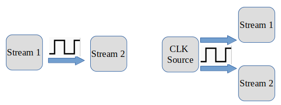

.. _synchronization:
.. role:: raw-html-m2r(raw)
   :format: html

Synchronizing Data Streams
===========================

The OpenEphys GUI is able to acquire, process and save data from multiple asynchronous data streams simultaneously. However, even if two asynchronous data streams have identical sample rates, they are neither guaranteed to start acquisition simultaneously nor acquire at the advertised sample rate exactly. The GUI is configurable to synchronize data from separate streams as data is written to disk. 

This tutorial uses Neuropixels probes and a National Instruments Data Acquisition (NIDAQ) device to demonstrate how to synchronize data streams.
 
Hardware Configuration
######################

Synchronization works by sharing a common digital reference signal between two asynchronous source data streams. The hardware sources must be configurable one of two ways to achieve this: 

* one data source generates a physical digital output that feeds into a digital input of the other source

* a completely separate digital source splits its digital output into both source streams

In the first case, the Neuropixels’ basestation can be configured to output its own physical clock signal that can be output as an input into the NIDAQ device:

#. Connect one end of an SMA cable to the SMA connector at the bottom of the Neuropixels basestation.

#. Connect the other end of the SMA cable to a digital input channel of the NIDAQ device*. 

In the second case, the Neuropixels’ basestation can be configured as an input accepting the digital output of an Arduino, for example:

#. Connect one end of an SMA cable to the SMA connector at the bottom of the Neuropixels basestation.

#. Connect the other end of the SMA cable to a digital output channel of the Arduino*.

#. Connect the same digital output of the Arduino into a digital input channel of the NIDAQ device*.

.. note:: * You will likely need an adapter to match the digital terminals.

Software Configuration
######################

Online synchronization only occurs within a RecordNode as data is written to disk. This means that data coming into and out of a RecordNode in a signal chain is not necessarily synchronized. In order to synchronize online, the RecordNode must be configured to match the active hardware configuration: 

#. Download the Neuropixels-PXI and NIDAQmx source processors via "File > Plugin Installer".

#. Insert a Neuropixels-PXI source processor into the signal chain.

#. If using the Neuropixels-PXI as the digital reference  generating source, change the default selection on the sync control pull-down menu from :code:`INPUT` to :code:`OUTPUT`. Select the desired clock rate (default is 1Hz).

#. Insert a NIDAQ source processor into the signal chain.

#. Select the Neuropixels-PXI processor in the signal chain and insert a Merger processor directly after it.

#. Right click on the Merger and select NIDAQ as the source processor to merge with.

#. Insert a RecordNode after the merger.

#. Select the ||| on the left side of the RecordNode to access the stream buffer monitors. The right most buffer monitor represents the NIDAQ stream, and any remaining buffers to the left represent the Neuropixels streams (two buffers at 30kHz and 2.5kHz for each 1.0 probe, one buffer at 30kHz for each 2.0 probe).

#. Under each buffer monitor, click on the sync line monitor to select the digital input channel which matches the physical sync channel used in your hardware configuration. For Neuropixels there is only one channel available so it is already configured. For NIDAQ devices, there will likely be multiple digital channels available; select the channel used in the hardware that contains the sync signal.

#. Designate one of the streams to be the main processor. By default this will be the 30kHz band of the first probe detected.

#. Ensure Binary Format is selected as this is currently the only format that supports online synchronization.

#. Ensure Record Events is enabled in the RecordNode.

Monitoring and Recording
########################

At this point, the GUI is configured to write synchronized data to disk. In order to acquire and record synchronized data:

#. Start data acquisition by pressing the Play button in the Control Panel. The sync monitors turn orange once acquisition starts and then green as each stream becomes synchronized.

#. Wait until all the orange sync monitors turn green. This generally happens instantaneously, however, it may take a few seconds to stabilize.

#. Start recording by pressing the Record button in the Control Panel. Data streams with green sync control monitors will be written to disk with synchronized timestamps.

Loading and Processing
######################

First, read the `Binary Format Docs <https://open-ephys.github.io/gui-docs/User-Manual/Recording-data/Binary-format.html>`__.
Synchronized data streams written to disk will contain an additional :code:`synchronized_timestamps.npy` file alongside the :code:`timestamps.npy` file. 
The :code:`synchronized_timestamps.npy` file contains one float timestamp (in seconds) for every integer timestamp (in sample number) found in the corresponding :code:`timestamps.npy` file. The :code:`synchronized_timestamps.npy` file provides a common time base to which timestamps belonging to the corresponding stream are mapped to.  

Events detected in a synchronized stream will only save their timestamps as sample numbers since acquisition started. For example, an event that occurred at sample number :code:`405012` will correspond to the continuous sample that occurred at timestamp :code:`405012`, which can then be mapped back to the common time base timestamp in the :code:`synchronized_timestamps.npy` file. 

For spike data, the values in :code:`spike_times.npy` represent the sample index at which the spike occurred, relative to the beginning of the :code:`continuous.dat` file. To get the actual timestamp at which the spike occurred, you must add the first timestamp from timestamps.npy in the corresponding continuous data stream the spike was detected in. Again, that timestamp can be mapped back to the common time base timestamp in the :code:`synchronized_timestamps.npy` file.  

Offline Synchronization
#######################

Offline synchronization can be performed as long as the same digital reference signal is shared between streams during a recording.

Neuropixels sample at roughly 30 kHz, but the actual sample rate can be slightly higher or lower.

If recording from multiple probes, or synchronizing data with another acquisition system, you’ll need to compute a timestamp scaling factor based on events that are shared across all data sources. Otherwise, the clocks will drift by ~10s of ms per hour.

To perform the alignment, you’ll need to identify the first and last shared reference signal in the recording.

The temporal offset between the start of the first sync pulses defines the shift between any device and the master clock. Once this is known, you can calculate the expected interval between the first and last sync pulse (given the expected sample rate of a device).

The ratio of the actual interval to the expected interval defines the scaling factor for that device. Then, each non-master clock can be transformed by the following equation (in Matlab):

:code:`aligned_timestamps = scaling .* original_timestamps + shift;`

The “aligned_timestamps” will now be aligned to the master clock, and are ready for further analysis.

More information regarding offline analysis can be found `here <https://github.com/open-ephys/open-ephys-python-tools/tree/main/open_ephys/analysis>`__ for Python tools and `here <https://github.com/open-ephys/open-ephys-matlab-tools/tree/main/open_ephys/analysis>`__ for Matlab tools.

Questions ? 
###########

If anything is still unclear after reading this tutorial, please reach out to support@open-ephys.org, we will respond directly and update the tutorial as needed. 