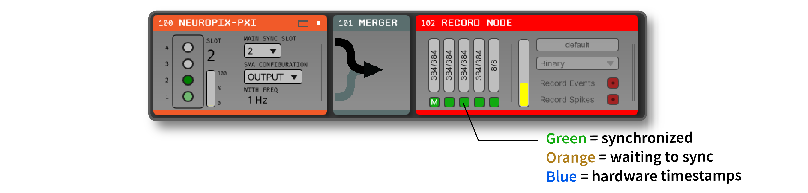

.. _datasynchronization:

.. role:: raw-html-m2r(raw)
   :format: html

Synchronizing Data Streams
============================

The Open Ephys GUI is able to acquire, process, and save data from multiple asynchronous data streams simultaneously. However, even if two data streams have identical sample rates, they are neither guaranteed to start acquisition simultaneously nor acquire data at exactly the advertised sample rate. Therefore, some synchronization procedure is required.

Synchronization is typically performed offline, using the timing events on a "sync line" that is shared between each data acquisition device. But the GUI can also be configured to synchronize data from separate streams in real time, as it is being written to disk. This tutorial uses the example of Neuropixels probes and a National Instruments Data Acquisition (NIDAQ) device to demonstrate how to synchronize data streams online.

General principles of synchronization
############################################

Whether synchronization is being performed online or offline, all data streams must share a common hardware sync line. Synchronization in software is accurate to within a few milliseconds, but is not precise enough for synchronizing electophysiogical signals acquired at tens of kilohertz.

The following diagram demonstrates the basic logic behind hardware-level synchronization:

.. image:: ../_static/images/tutorials/synchronization/sync-overview-01.png
  :align: center
  :alt: Hardware synchronization diagram

There are two data streams, *A* and *B*, which have approximately the same sample rate. However, they may start at slightly different times, and the clocks may drift apart over the course of the recording. Therefore, it's impossible to know which samples occurred simultaneously without comparing them to a reference signal that's shared across the two data streams

In this example, there are a few sample numbers that are important to note:

- The samples at which the recordings were stopped and started (**10** and **114** for *Stream A*, and **25** and **127** for *Stream B*).
- The samples at which the first recorded low-to-high transition on the sync line occurred (**12** for *Stream A* and **27** for *Stream B*).
- The samples at which the last recorded low-to-high transition on the sync line occurred (**112** for *Stream A* and **125** for *Stream B*).

With this information in hand, we can translate all of the timestamps from *Stream A* into timestamps from *Stream B*, and vice versa.

First, we'll compute a scaling factor, which is the ratio of the total number of samples between the first and last sync transitions:

.. code::

  t_first_A = 12
  t_last_A = 112

  t_first_B = 27
  t_last_B = 125

  scaling = (t_last_A - t_first_A) / (t_last_B - t_first_B)

In this case, the scaling factor is equal to :code:`100 / 98`, or 1.0204.

Now, we can translate all the timestamps from *Stream B* into timestamps from *Stream A*:

.. code::

  timestamps_B = range(25, 127)
  timestamps_A = (timestamps_B - t_first_B) * scaling + t_first_A

We can check this by plugging in the value of the last sync transition time on *Stream B*: :code:`(125 - 127) * 1.02 + 12 = 111.96`. Rounded to the nearest integer, this is **112**, which is the actual time of the last sync transition on *Stream A*.

Understanding how to perform this basic procedure is extremely useful, since it will allow you to synchronize any data streams, even ones that are recorded by separate pieces of software. As long as the recorded streams share one input line, they can be synchronized offline.

The Open Ephys GUI can perform these calculations in real time, provided the hardware and software are set up correctly. However, it's still important to know what's going on under the hood, in case you need to troubleshoot your setup.

Hardware Configuration
######################

When using the :ref:`neuropixelspxi` and :ref:`NI-DAQmx` plugins, there are two options for setting up the sync line:

#. Use the built-in sync output of the Neuropixels PXI basestation.

#. Use a separate device, such as an Arduino, to generate a sync signal that is routed to the Neuropixels PXI basestation and the NIDAQ device.

In the first case, the Neuropixels basestation can be configured to output its own physical clock signal that can serve as an input to the NIDAQ device:

#. Connect one end of an SMA cable to the SMA connector at the bottom of the Neuropixels basestation.

#. Connect the other end of the SMA cable to a digital input channel of the NIDAQ device.

.. note:: You will need an SMA-to-BNC adapter cable to connect the digital terminals, such as `this one <https://www.thorlabs.com/thorproduct.cfm?partnumber=CA2806>`__ from Thorlabs.

.. image:: ../_static/images/tutorials/synchronization/config_1.png
  :align: center
  :alt: NPX + NIDAQ

The advantage of this option is that it doesn't require any additional devices. However, the Neuropixels basestation can only generate pulses at regular intervals (1 Hz or 10 Hz), which can make it ambiguous which pulses were the first and last, especially if you're synchronizing data streams outside of the Open Ephys GUI (e.g., behavioral events recorded by another piece of software).

In the second case, the Neuropixels basestation can be configured as an input accepting the digital output of an Arduino, for example:

#. Connect one end of an SMA cable to the SMA connector at the bottom of the Neuropixels basestation.

#. Connect the other end of the SMA cable to a digital output channel of the Arduino.

#. Connect the same digital output of the Arduino into a digital input channel of the NIDAQ device.

.. image:: ../_static/images/tutorials/synchronization/config_2.png
  :align: center
  :alt: NPX + NIDAQ + Arduino

The Arduino can be configured to generate sync pulses at pseudo-random intervals, which makes it possible to align data streams in an unambiguous way, even if they are stopped at started at different times. An example implementation is available `here <https://github.com/open-ephys/sync-barcodes>`__.

For the purposes of this tutorial, either configuration will work.

.. note:: As of GUI version 1.0, the Record Node's synchronization algorithm can handle arbitrarily short pulses. So synchronization "barcodes" that encode integer values as a series of on/off pulses are perfectly fine to use for synchronization. The only type of pulses that are not compatible with the synchronizer would be continuous pulses with no variation in pulse width at frequencies of 20 Hz or higher.

Software Configuration
######################

Online synchronization occurs within the Open Ephys GUI's Record Node as data is written to disk. This means that data coming into and out of a Record Node in a signal chain is not necessarily synchronized. In order to synchronize online, the Record Node must be configured to match the active hardware configuration:

#. If you haven't already, download the Neuropixels-PXI and NI-DAQmx source processors via "File > Plugin Installer".

#. Insert a Neuropixels-PXI source processor into the signal chain.

#. If using the Neuropixels-PXI to generate the sync pulses (option 1 above), change the default selection on the sync control pull-down menu from :code:`INPUT` to :code:`OUTPUT`. The interval between pulses is 1 Hz.

#. Insert a NI-DAQmx source processor into the editor viewport (it will automatically start a new signal chain).

#. Select the Neuropixels-PXI processor in the signal chain and insert a Merger processor directly after it.

#. Right click on the title bar of the Merger and select "NI-DAQmx" as the source processor to merge with.

#. Insert a Record Node after the merger.

#. The right side of the Record Node shows the stream-specific buffer monitors. The right-most buffer monitor represents the NIDAQ stream, and any remaining buffers to the left represent the Neuropixels streams (two buffers at 30 kHz and 2.5 kHz for each 1.0 probe, one buffer at 30 kHz for each 2.0 probe).

#. Under each buffer monitor, click on the sync line monitor to select the digital input channel which matches the physical sync channel used in your hardware configuration. For Neuropixels, there is only one channel available so it is automatically selected. For NIDAQ devices, there will be as many as 24 digital channels available; select the channel used in the hardware that is connected to your sync signal.

#. Designate one of the streams to be the main clock source. By default this will be the 30 kHz band of the first probe detected.

#. Ensure "Record Events" is enabled in the Record Node.

Monitoring and Recording
########################

At this point, the GUI is configured to write synchronized data to disk. In order to acquire and record synchronized data:

#. Start data acquisition by pressing the Play button in the Control Panel. The sync monitors turn orange once acquisition starts and then green as each stream becomes synchronized.

#. Wait until all the orange sync monitors turn green. This will happen once every stream has received at least three events on the designated sync line.

#. Start recording by pressing the Record button in the Control Panel. Data streams with green sync control monitors will now be written to disk with synchronized timestamps.

.. note:: Sync monitors for any streams that send pre-synchronized hardware timestamps (such as those from recent versions of the Open Ephys Acquisition Board) will be blue, meaning that the timestamps will be written exactly as they emerge from the hardware. To override these timestamps (in order to synchronize with other devices), select a TTL input line to use for synchronization in that stream's sync monitor.

To view more information about the synchronization state of all of your streams, first click the three vertical lines on the right of the Record Node to open the stream selector. Then, click the double arrow in the upper right of the stream selector to expand it. This will display three columns of data related to synchronization:

1. **Start**: The relative start time (in ms) of each stream relative to the "main" stream. If streams started before the main stream, these times will be negative. If they started after the main stream, their start times will be positive.

2. **Tolerance**: These values reflect the accuracy of the synchronization. For each event that arrives on the sync line, the tolerance represents the difference between the estimated time of the event (based on the start time and sample rate scaling) and the actual time of the event. If synchronization is working well, these values should be well below 1 ms. The higher the sample rate of the stream, the lower the sync tolerance is likely to be.

3. **Latest Sync**: The amount of time since the last sync pulse was received. If the Record Node goes more than a minute without receiving a sync pulse, these values will turn orange. After 5 minutes without a sync pulse, the values will turn red. While sync pulses at short intervals are not strictly necessary, synchronization will be more accurate if pulses arrive regularly. This is because the synchronization algorithm re-computes the relative sample rate of each stream every 10 seconds.

Troubleshooting Synchronization
##################################

If your data streams are not synchronizing, there are a few things to check:

1. Make sure the physical connections between all devices are secure. If sync pulses are being detected, they should appear as flashing squares in the data stream selection interface.

2. Verify that the pattern of sync pulses are appropriate for synchronization: pulses occur at least every 30 seconds, no continuous pulses above 20 Hz.

3. Check that data is actually streaming from each device. Occasionally Neuropixels probes will fail to send data, which can be fixed by restarting the GUI.

Loading and Processing
######################

As of GUI v0.6.x, synchronized timestamps for the `Binary Format <https://open-ephys.github.io/gui-docs/User-Manual/Data-formats/Binary-format.html>`__ are written to :code:`timestamps.npy`, while the original sample numbers for each stream are found in :code:`sample_numbers.npy`.

The :code:`timestamps.npy` for continuous, events, and spike data contains one float timestamp (in seconds) for every integer timestamp (in sample number) found in the corresponding :code:`sample_numbers.npy` file. The :code:`timestamps.npy` file provides a common time base to which timestamps belonging to the corresponding stream are mapped to.

For streams that were not synchronized online, you can compute common timestamps in seconds offline using the equations described above. This procedure is implemented in `this package <https://github.com/open-ephys/open-ephys-python-tools/tree/main/src/open_ephys/analysis>`__ for Python and `this library <https://github.com/open-ephys/open-ephys-matlab-tools/tree/main/open_ephys/analysis>`__ for Matlab.

Questions?
###########

If anything is still unclear after reading this tutorial, please reach out to :code:`gui@open-ephys.org`, we will respond directly and update the tutorial as needed.

|
