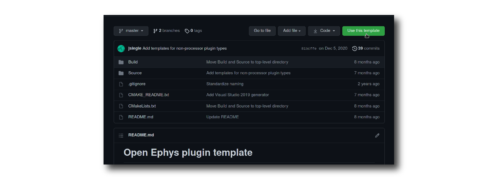
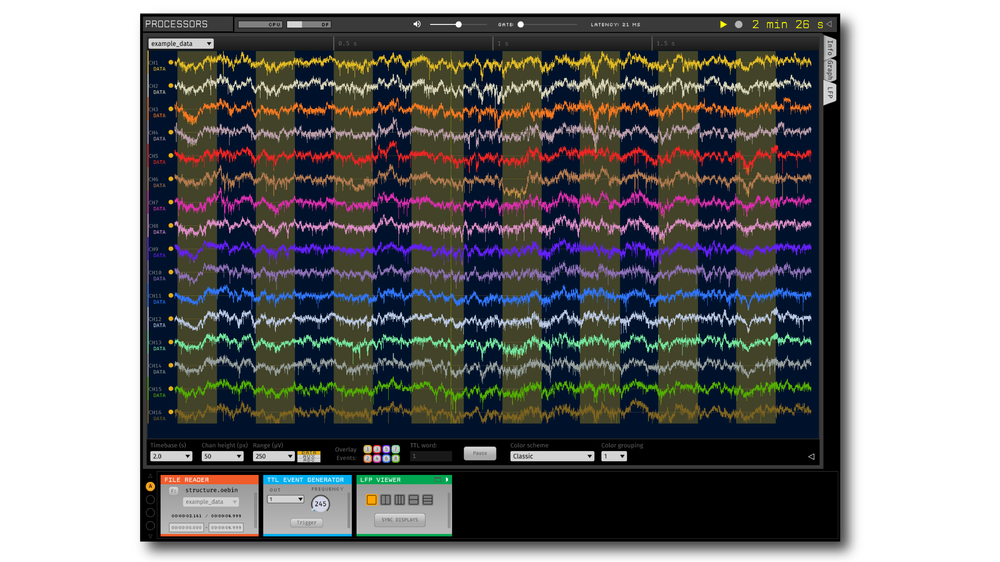

.. _howtomakeyourownplugin:
.. role:: raw-html-m2r(raw)
   :format: html

How To Make Your Own Plugin
============================

The Open Ephys GUI's plugin architecture allows it to be expanded with external modules (plugins) that can be developed independently of the main application. This is the primary way which we encourage users to add new functionality to the GUI.  

This tutorial will guide you through the steps of making a plugin from scratch by creating a "TTL Event Generator" plugin. :code:`TTL` events are one of three types of events that are supported by the GUI (along with :code:`TEXT` and :code:`BINARY` events). TTL events represent ON/OFF transitions that are traditionally associated with "Transistor-Transitor Logic" circuits. Within the GUI, TTL events are more general, and can also be generated in software. This plugin will add TTL events to a data stream, either at a specified frequency, or whenever a trigger button is pressed. Each TTL channel can change the state of up to 65536 (2^16) "bits," but for simplicity our plugin will only use the first 8 bits.

Along with explaining how to configure the plugin and set up the main :code:`process()` method, this tutorial will demonstrate how to create UI components for the plugin using the underlying `JUCE API <https://juce.com/>`__. These instructions assume you have already compiled the main application from source. If not, you should start by following the instructions on :ref:`this page <compilingthegui>`.

Creating a new plugin repository
#################################

The first step in creating a new plugin is to create a repository from the `OEPlugin <https://github.com/open-ephys-plugins/OEPlugin>`__ template.

1. Log in to your `GitHub <https://github.com/>`__ account.

2. Browse to the `Processor Plugin Template <https://github.com/open-ephys-plugins/processor-plugin-template>`__ repository.

.. note:: Templates for other type of plugins including Data Thread, File Source, Record Engine, and Visualizer plugins are also available. 

3. Click the green "Use this template" button.

4. Since the plugin will generate TTL events, lets name the repository as "TTLEventGenerator"

5. Click the green "Create repository from template" button.

.. image:: ../_static/images/tutorials/makeyourownplugin/makeyourownplugin-02.png
  :alt: Create TTLEventGenerator Repository

On your local machine, create an "OEPlugins" directory within the same directory that contains your :code:`plugin-GUI` repository: Then, using the command line or the `GitHub Desktop <https://desktop.github.com/>`__ app, clone the newly created plugin repository into this new folder. Your directory structure should look something like this:

.. code-block:: 

   code_directory/
      plugin-GUI/
      OEPlugins/
         TTLEventGenerator/
            Source/
            Build/
            CMakeLists.txt
            CMAKE_README.txt
            README.md

Editing :code:`OpenEphysLib.cpp` and other files
#################################################

Inside the "Source" directory, you'll find the :file:`OpenEphysLib.cpp` file that contains critical information about your plugin. Open it in your preferred text editor and make the following changes:

TTLEventGenerator plugin will be a "processor", meaning it implements the :code:`process()` method of the `GenericProcessor <https://github.com/open-ephys/plugin-GUI/blob/master/Source/Processors/GenericProcessor/GenericProcessor.h>`__ class. This method is called repeatedly during the GUI's acquisition loop, so each plugin has a chance to respond to incoming data (or, in this case, generate its own data). 

To specify that this is a processor plugin, edit the following lines in :code:`OpenEphysLib.cpp`:

.. code-block:: c++
   :caption: OpenEphysLib.cpp
   
   extern "C" EXPORT void getLibInfo(Plugin::LibraryInfo* info)
   {
      /* API version, defined by the GUI source.
      Should not be changed to ensure it is always equal to the one used in the latest codebase.
      The GUI refueses to load plugins with mismatched API versions */
      info->apiVersion = PLUGIN_API_VER;
      info->name = "TTL Event Generator"; // <---- UPDATE
      info->libVersion = "0.1.0"; // <---- UPDATE
      info->numPlugins = NUM_PLUGINS;
   }

   extern "C" EXPORT int getPluginInfo(int index, Plugin::PluginInfo* info)
   {
      switch (index)
      {
         //one case per plugin. This example is for a processor which connects directly to the signal chain
      case 0:
         //Type of plugin. See "Source/Processors/PluginManager/OpenEphysPlugin.h" for complete info about the different type structures
         info->type = Plugin::Type::PROCESSOR;

         //Processor name
         info->processor.name = "TTL Event Generator"; //Processor name shown in the GUI (UPDATE)

         //Type of processor. Can be FILTER, SOURCE, SINK or UTILITY. Specifies where on the processor list will appear
         info->processor.type = Processor::Type::FILTER;

         //Class factory pointer. Replace "ProcessorPluginSpace::ProcessorPlugin" with the namespace and class name.
         info->processor.creator = &(Plugin::createProcessor<TTLEventGenerator>); // <---- UPDATE
         break;
      default:
         return -1;
         break;
      }
      return 0;
   }

|
| Then, rename the :code:`ProcessorPlugin.cpp` & :code:`ProcessorPlugin.h` files to :code:`TTLEventGenerator.cpp` and :code:`TTLEventGenerator.h`, and find and replace the **ProcessorPlugin** class name with **TTLEventGenerator** in the .cpp and .h files.

Compiling your plugin
########################

At this point, you should be able to compile your plugin and load it into the GUI. We advise you to compile and test the plugin every time you make changes, so that it is easier for you to identify what changes broke the code, if it happens.

To compile the plugin, please follow the OS-specific instructions as mentioned on the :ref:`compiling plugins <compilingplugins>` page.

Setting up the Processor methods
##########################################

Right now, our plugin doesn't have any effect within the signal chain. Data passed into the :code:`process()` method will not be altered in any way, nor will any events be added to any of the data stream.

Let's change that by inserting code to add a TTL ON and OFF events at an interval of 1 second. For now, we will hard-code the relevant parameters. In the subsequent steps, we will make it possible to change these parameters via UI elements in the plugin's editor.

Before we can add events during acquisition, we need to announce to downstream processors that this plugin is capable of generating its own events. In the plugin's header file, update the declarations and add some private data members as follows :

.. code-block:: c++
   :caption: TTLEventGenerator.h

   public:
      /** The class constructor, used to initialize any members. */
      TTLEventGenerator();

      /** The class destructor, used to deallocate memory */
      ~TTLEventGenerator();

      /** If the processor has a custom editor, this method must be defined to instantiate it. */
      // AudioProcessorEditor* createEditor() override;

      /** Called every time the settings of an upstream plugin are changed.
         Allows the processor to handle variations in the channel configuration or any other parameter
         passed through signal chain. The processor can use this function to modify channel objects that
         will be passed to downstream plugins. */
      void updateSettings() override;

      /** Defines the functionality of the processor.
         The process method is called every time a new data buffer is available.
         Visualizer plugins typically use this method to send data to the canvas for display purposes */
      void process(AudioBuffer<float>& buffer) override;

      /** Called immediately prior to the start of data acquisition, once all processors in the signal chain have
        indicated they are ready to process data.
         
         Returns: true if processor is ready to acquire, false otherwise
     */
      bool startAcquisition() override;

   private:
      int counter; // counts the total number of incoming samples
      bool state; // holds the channel state (on or off)

This will allow us to create & add an event channel in the :code:`updateSettings()` method, which is automatically called whenever a plugin needs to update its settings.

Next, in the .cpp file, add the implementation:

.. code-block:: c++
   :caption: TTLEventGenerator.cpp

   void TTLEventGenerator::updateSettings()
   {
      // create and add a default TTL channel to the first data stream
      addTTLChannel("TTL Event Generator Output");
   }

Then we will make sure the appropriate variables get re-set at the start of acquisition:

.. code-block:: c++
   :caption: TTLEventGenerator.cpp

   bool TTLEventGenerator::startAcquisition()
   {
      counter = 0;
      state = false;

      return true;
   }

Now, we are ready to add events in our process function:

.. code-block:: c++
   :caption: TTLEventGenerator.cpp

   void TTLEventGenerator::process(AudioSampleBuffer* buffer)
   {

      // loop through the streams
      for (auto stream : getDataStreams())
      {
         // Only generate on/off event for the first data stream
         if(stream == getDataStreams()[0])
         {
            int totalSamples = getNumSamplesInBlock(stream->getStreamId());

            int eventIntervalInSamples = (int) stream->getSampleRate();

            for (int i = 0; i < totalSamples; i++)
            {
               counter++;
               
               if (counter == eventIntervalInSamples)
               {

                  state = !state;
                  setTTLState(i, 0, state);
                  counter = 0;

               }

               if (counter > eventIntervalInSamples)
                  counter = 0;
            }
         }
      }
   }

After recompiling the plugin, try dropping it into the signal chain after a :ref:`filereader`. Add an :ref:`lfpviewer` to the right of the plugin, and start acquisition. You should see the state of event line 1 flipping once per second.

Setting up the editor class
############################

This plugin is going to generate events during acquisition according to parameters such as event output line, event interval, and manual trigger. An editor interface is required to house these parameter interfaces. 

To create such an editor, rename the two editor class files called :code:`ProcessorPluginEditor.cpp` as :code:`TTLEventGeneratorEditor.cpp` and `ProcessorPluginEditor.h` as :code:`TTLEventGeneratorEditor.h`. 

After that, find and replace the **ProcessorPluginEditor** class name with **TTLEventGeneratorEditor** in the .cpp and .h files.

.. code-block:: c++
   :caption: TTLEventGeneratorEditor.h

   #include <EditorHeaders.h>
   #include "TTLEventGenerator.h"

   class TTLEventGeneratorEditor : public GenericEditor
   {
   public:

      /** Constructor */
      TTLEventGeneratorEditor(GenericProcessor* parentNode);

      /** Destructor */
      ~TTLEventGeneratorEditor() { }

   private:

      /** Generates an assertion if this class leaks */
      JUCE_DECLARE_NON_COPYABLE_WITH_LEAK_DETECTOR(TTLEventGeneratorEditor);
   };

.. code-block:: c++
   :caption: TTLEventGeneratorEditor.cpp

   #include "TTLEventGeneratorEditor.h"

   TTLEventGeneratorEditor::TTLEventGeneratorEditor(GenericProcessor* parentNode) 
      : GenericEditor(parentNode)
   {

      desiredWidth = 180;

   }

|
| Then, we need to let the GUI know that the plugin has a custom editor that needs to be created during runtime. To do that, uncomment the :code:`createEditor()` funtion declaration in the :code:`TTLEventGenerator.h` file...

.. code-block:: c++
   :caption: TTLEventGenerator.h

   AudioProcessorEditor* createEditor() override;

| ...and add the following lines of code to the :code:`TTLEventGenerator.cpp` file

.. code-block:: c++
   :caption: TTLEventGenerator.cpp

   AudioProcessorEditor* TTLEventGenerator::createEditor()
   {
      editor = std::make_unique<TTLEventGeneratorEditor>(this);
      return editor.get();
   }

Now, when you re-compile your plugin and load it into the GUI, it will use this custom editor class. The editor should appear slightly wider than the default as we modified the :code:`desiredWidth` value to 250.

Adding UI components to the editor
####################################

Now that our plugin is able to generate events in the process() method and has its own editor, lets add some UI components to the editor that allows the user to change various parameters of the plugin.

Create a custom parameter editor
---------------------------------

To allow triggering events manually, let's add a button to the editor that the user can click on to generate an event. First of all, create the following ParameterEditor class above the main editor class in the editor's header file.

.. code-block:: c++
   :caption: TTLEventGeneratorEditor.h

   class ManualTriggerButton : public ParameterEditor,
      public Button::Listener
   {
   public:

      /** Constructor */
      ManualTriggerButton(Parameter* param);

      /** Destructor*/
      virtual ~ManualTriggerButton() { }

      /** Respond to trigger button clicks*/
      void buttonClicked(Button* label) override;

      /** Update view of the parameter edtiro component*/
      void updateView() {};

      /** Sets component layout*/
      void resized() override;

   private:
      std::unique_ptr<TextButton> triggerButton;
   };

Then, in the custom parameter editor's constructor we'll initialize the button, add a button listener, set the bounds, and make it visible in the editor by adding the following lines of code to the :code:`TTLEventGeneratorEditor()` constructor:

.. code-block:: c++
   :caption: TTLEventGeneratorEditor.cpp

   ManualTriggerButton::ManualTriggerButton(Parameter* param)
	: ParameterEditor(param)
   {
      triggerButton = std::make_unique<UtilityButton>("Trigger", Font("Fira Code", "Regular", 12.0f)); // button text, font to use
      triggerButton->addListener(this); // add listener to the button
      addAndMakeVisible(triggerButton.get());  // add the button to the editor and make it visible

      setBounds(0, 0, 60, 20); // set the bounds of custom parameter editor
   }

To handle button clicks, implement the :code:`buttonClicked` method as below. Inside, we need to call :code:`setNextValue()` on the parameter as that will notfiy the processor about parameter value change. We aslo need to set bounds of the button in the :code:`resized()` method as follows:

.. code-block:: c++
   :caption: TTLEventGeneratorEditor.cpp

   void ManualTriggerButton::buttonClicked(Button* b)
   {
      param->setNextValue(triggerButton->getLabel());
   }

   void ManualTriggerButton::resized()
   {

      triggerButton->setBounds(0, 0, 60, 20);
   }

Now, we need to initialize the custom parameter editor inside the :code:`TTLEventGeneratorEditor` constructor by getting the pointer to the parameter that we will create inside the :code:`TTLEventGenerator` processor constrcutor, like this:

.. code-block:: c++
   :caption: TTLEventGeneratorEditor.cpp

   // custom button parameter editor
   Parameter* manualTrigger = getProcessor()->getParameter("manual_trigger");
   addCustomParameterEditor(new ManualTriggerButton(manualTrigger), 60, 95);

.. code-block:: c++
   :caption: TTLEventGenerator.cpp

    // Parameter for manually generating events
   addStringParameter(Parameter::GLOBAL_SCOPE, "manual_trigger", "Manually trigger TTL events", String());

.. note:: Since thhe custom button parameter editor is only used to tell the processor to trigger an event, we are creating the parameter to handle button click callbacks only. 

Compile and load the plugin into the GUI to see the newly added button.

Create a slider parameter editor
--------------------------------

To automatically generate events at certain intervals/frequency, lets add a slider with a range of event frequency between 5 ms to 5000 ms. We can easily create a slider inside the :code:`TTLEventGeneratorEditor` constructor using one of the built-in parameter editor generators

.. code-block:: c++
   :caption: TTLEventGeneratorEditor.cpp

   // event frequency slider
   addSliderParameterEditor("frequency", 25, 95); // (parameter name, x pos, y pos)

... and initilaize the corresponding parameter inside the :code:`TTLEventGenerator` processor constructor

.. code-block:: c++
   :caption: TTLEventGenerator.cpp

   // Event frequency
   addFloatParameter(Parameter::GLOBAL_SCOPE, "frequency", "Generate events at regaular intervals", 50.0f, 5.0f, 5000.0f, 5.0f);

Compile and load the plugin into the GUI to see the newly added slider.

.. image:: ../_static/images/tutorials/makeyourownplugin/makeyourownplugin-04.png
  :alt: Create a slider

Create a combobox parameter editor
----------------------------------

To select which output line to send events to, a ComboBox needs to be created. This will allow the user to select a TTL output bit from a drop-down menu. You can use the built-in combobox parameter editor generator as follows:

.. code-block:: c++
   :caption: TTLEventGeneratorEditor.cpp
   
   // event output line
   addComboBoxParameterEditor("out", 50, 35);

... and initilaize the corresponding parameter inside the :code:`TTLEventGenerator` processor constructor

.. code-block:: c++
   :caption: TTLEventGenerator.cpp

   StringArray outputs;
   for(int i = 1; i <= 8; i++)
      outputs.add(String(i));

   // Event output line
   addCategoricalParameter(Parameter::GLOBAL_SCOPE, "out", "Event output line", outputs, 0);

Compile and load the plugin into the GUI to see the newly added ComboBox.

Responding to parameter value changes
#####################################

Now, let's allow our UI elements to change the state of the plugin. To do this, we need to create variables inside the :code:`TTLEventGenerator` class that can be updated by our button, slider, and ComboBox parameter edtiors. The values of these variables *must* be updated through a special method, called :code:`parameterValueChanged()`, which responds to any parameter editor value changes. This is because the :code:`process()` method is called by a separate thread from the user interface, and the variables it needs to access can only be updated at specific times. Modifying variables via :code:`parameterValueChanged()` ensures that they are handled properly, and prevents unexpected behavior or segmentation faults.

First, let's update the :code:`TTLEventGenerator` header file as follows:

.. code-block:: c++
   :caption: TTLEventGenerator.h

   public:
      /** Called whenever a parameter's value is changed */
      void parameterValueChanged(Parameter* param) override;

   private:
      bool shouldTriggerEvent;
      bool eventWasTriggered;
      int triggeredEventCounter;

      float eventIntervalMs;
      int outputLine;
   
Next, let's initialize the parameters variables in the :code:`TTLEventGenerator()` constructor method.

.. code-block:: c++
   :caption: TTLEventGenerator.cpp

   shouldTriggerEvent = false;
   eventWasTriggered = false;
   triggeredEventCounter = 0;

   eventIntervalMs = 50.0f;
   outputLine = 0;

   // Parameter for manually generating events
   addStringParameter(Parameter::GLOBAL_SCOPE, "manual_trigger", "Manually trigger TTL events", String());

   // Event frequency
   addFloatParameter(Parameter::GLOBAL_SCOPE, "frequency", "Generate events at regaular intervals", 50.0f, 5.0f, 5000.0f, 5.0f);

   StringArray outputs;
   for(int i = 1; i <= 8; i++)
      outputs.add(String(i));

   // Event output line
   addCategoricalParameter(Parameter::GLOBAL_SCOPE, "out", "Event output line", outputs, 0);

.. important:: Always be sure to initialize all member variables, in order to avoid unexpected behavior.

Now, we can define how these variables are updated inside the :code:`parameterValueChanged()` method:

.. code-block:: c++
   :caption: TTLEventGenerator.cpp

   void TTLEventGenerator::parameterValueChanged(Parameter* param)
   {
      if (param->getName().equalsIgnoreCase("manual_trigger"))
      {   
         shouldTriggerEvent = true;
      }
      else if(param->getName().equalsIgnoreCase("frequency"))
      {
         eventIntervalMs = (float)param->getValue();
      }
      else if(param->getName().equalsIgnoreCase("out"))
      {
         outputLine = (int)param->getValue() - 1;
      }
   }

Finally, we need to update our process method to make use of these parameters:

.. code-block:: c++

   void TTLEventGenerator::process(AudioSampleBuffer& buffer)
   {
      // loop through the streams
      for (auto stream : getDataStreams())
      {
         // Only generate on/off event for the first data stream
         if(stream == getDataStreams()[0])
         {
            int totalSamples = getNumSamplesInBlock(stream->getStreamId());

            int eventIntervalInSamples = (int) stream->getSampleRate() * eventIntervalMs / 2 / 1000;

            if (shouldTriggerEvent)
            {

               // add an ON event at the first sample.
               setTTLState(0, outputLine, true);

               shouldTriggerEvent = false;
               eventWasTriggered = true;
               triggeredEventCounter = 0;
            }

            for (int i = 0; i < totalSamples; i++)
            {
               counter++;

               if (eventWasTriggered)
                  triggeredEventCounter++;

               if (triggeredEventCounter == eventIntervalInSamples)
               {
                  setTTLState(i, outputLine, false);

                  eventWasTriggered = false;
                  triggeredEventCounter = 0;
               }
               
               if (counter == eventIntervalInSamples)
               {

                  state = !state;
                  setTTLState(i, outputLine, state);
                  counter = 0;

               }

               if (counter > eventIntervalInSamples)
                  counter = 0;
            }
         }
      }
      
   }

And that's it! If you compile and test your plugin, the UI elements in the editor should now change the events that appear in the LFP Viewer.

Next steps
#############

This plugin are a number of ways this plugin could be enhanced. To practice creating different kinds of UI elements, you could try implementing some of the features below, or come up with your own!

- Ensure an "OFF" event is sent when the output bit is changed.

- Add a button that turns the plugin's output on and off.

- Add an editable label that can be used to define the time between ON/OFF events (currently the output bit flips at a 50% duty cycle).

- Make all the parameters stream specific and generate TTL events for each stream

|

