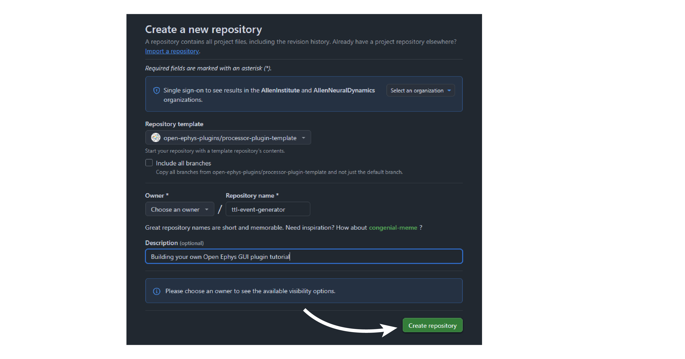

.. _howtomakeyourownplugin:
.. role:: raw-html-m2r(raw)
   :format: html

How To Make Your Own Plugin
============================

The Open Ephys GUI follows plugin architecture which allows it to be expanded with external modules (plug-ins) without the need to recompile the entire program every time a new feature is added. 

This tutorial will guide you through the steps of making a plugin from scratch by creating a TTL event generator plugin. Along with explaining how to setup the process logic for the plugin, this tutorial is also going to take a look at how to create UI components for the plugin using the underlying `JUCE API <https://juce.com/>`__. These instructions assume you have already compiled the main application from source. If not, follow the instructions on :ref:`this page <compilingthegui>`.

Creating a new plugin repository
#################################

The first step in creating a new plugin is to create a repository from the `OEPlugin <https://github.com/open-ephys-plugins/OEPlugin>`__ template.

1. Log in to your `GitHub <https://github.com/>`__ account.

2. Browse to the `OEPlugin <https://github.com/open-ephys-plugins/OEPlugin>`__ template repository.

3. Click the green "Use this template" button.

.. image:: ../_static/images/tutorials/makeyourownplugin/makeyourownplugin-01.png
  :alt: OEPlugin Template Repository

4. Since the plugin is supposed to generate TTL events, lets name the repository as "TTLEventGenerator"

5. Click the green "Create repository from template" button.

On your local machine, create an "OEPlugins" directory within the same directory that contains your :code:`plugin-GUI` repository: Then, using the command line or the `GitHub Desktop <https://desktop.github.com/>`__ app, clone the newly created plugin repository into this new folder. Your directory structure should look something like this:

.. code-block:: 

   code_directory/
      plugin-GUI/
      OEPlugins/
         TTLEventGenerator/
            Source/
            Build/
            CMakeLists.txt
            CMAKE_README.txt
            README.md

Removing unncessary files
#################################

Since :code:`TTL Events` is going to be a "Filter" processor, remove all the files from the :file:`Source` directory except :file:`OpenEphysLib.cpp`, :file:`ProcessorPlugin.cpp`, and :file:`ProcessorPlugin.h` files.

Editing :code:`OpenEphysLib.cpp` and other files
#################################################

Inside the "Source" directory, you'll find the :file:`OpenEphysLib.cpp` file that contains critical information about your plugin. Open it in your preferred text editor and make the following changes:

Since TTLEventGenerator plugin will be a "processor", meaning they implement the :code:`process()` method of `GenericProcessor.h <https://github.com/open-ephys/plugin-GUI/blob/master/Source/Processors/GenericProcessor/GenericProcessor.h>`__. This method is called repeatedly during the GUI's acquisition loop, so each plugin has a chance to respond to incoming data (or, in this case, generate its own). Uncomment and edit the following lines in :code:`OpenEphysLib.cpp`:

.. code-block:: c++
   
   // specifies that we are creating a Processor plugin
   info->type = PluginType::PLUGIN_TYPE_PROCESSOR;

   // edit to change how the plugin's name is displayed in the GUI
   info->processor.name = "TTL Events"; 

   // Select the type of processor
   info->processor.type = ProcessorType::FilterProcessor; 

   // Replace "ProcessorPluginSpace::ProcessorPlugin" with the class name of TTL Events plugin
   info->processor.creator = &(Plugin::createProcessor<TTLEventGenerator>);

|
| Then, rename the :code:`ProcessorPlugin.cpp` & :code:`ProcessorPlugin.h` files to :code:`TTLEventGenerator.cpp` and :code:`TTLEventGenerator.h`, and replace the **ProcessorPlugin** class name with **TTLEventGenerator** in the .cpp and .h files.

Creating editor class files
#################################

This plugin is going to generate events during acquisition according to settings such as event channel, event interval, manual trigger, etc. An editor interface is required to house these settings. To create such an editor, create two editor class files called :code:`TTLEventGeneratorEditor.cpp` and :code:`TTLEventGeneratorEditor.h`.

After that, open :code:`TTLEventGeneratorEditor.h` and add the following lines of code to the file. The :code:`EditorHeaders.h` file includes all the necessary headers required to create an editor for the plugin. The :code:`TTLEventGeneratorEditor` class inherits members of the `GenericEditor <https://github.com/open-ephys/plugin-GUI/blob/master/Source/Processors/Editors/GenericEditor.h>`__ class. 

.. code-block:: c++

   #include <EditorHeaders.h>
   #include "TTLEventGenerator.h"

   class TTLEventGenerator;

   class TTLEventGeneratorEditor : public GenericEditor
   {
   public:

      TTLEventGeneratorEditor(TTLEventGenerator* parentNode, bool useDefaultParameterEditors);
      ~TTLEventGeneratorEditor();

      void updateSettings() override;

   private:

      TTLEventGenerator* processor;

      JUCE_DECLARE_NON_COPYABLE_WITH_LEAK_DETECTOR(TTLEventGeneratorEditor);

   };

|
| Next, open :code:`TTLEventGeneratorEditor.cpp` and add the following lines of code to the file.

.. code-block:: c++

   #include "TTLEventGenerator.h"
   #include "TTLEventGeneratorEditor.h"

   TTLEventGeneratorEditor::TTLEventGeneratorEditor(TTLEventGenerator* parentNode, bool useDefaultParameterEditors = true)
      : GenericEditor(parentNode, useDefaultParameterEditors)

   {
      processor = parentNode;
   }

   TTLEventGeneratorEditor::~TTLEventGeneratorEditor(){}

   void TTLEventGeneratorEditor::updateSettings(){}

Adding UI components to the editor
####################################

TODO

Create a button
----------------

TODO

Create a slider
----------------

TODO

Create a combobox
------------------

TODO

Connecting these to parameters in the process method
#####################################################

TODO

|

