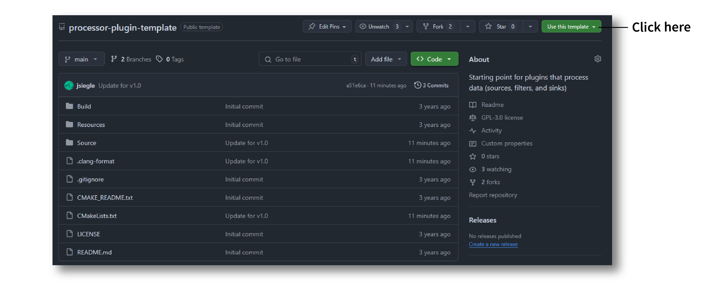

.. _howtomakeyourownplugin:
.. role:: raw-html-m2r(raw)
   :format: html

How To Make Your Own Plugin
============================

The Open Ephys GUI was designed to be extended via plugins that can be developed and shared independently of the main application. This is the primary way in which end users are encouraged to add new functionality to the GUI.  

This tutorial will guide you through the steps involved in making a plugin from scratch. At the end, you will have created a "TTL Event Generator" plugin, which can emit TTL events when a button is pressed, or continuously at a customizable interval. TTL events represent ON/OFF transitions that are traditionally associated with "Transistor-Transistor Logic" circuits. Within the Open Ephys GUI, TTL events are used to represent state transitions on both physical and virtual "lines." Each TTL channel can track the state of up to 256 lines, but for simplicity our plugin will only use the first 8 lines.

Along with explaining how to configure the plugin and set up the main :code:`process()` method, this tutorial will demonstrate how to create UI components for the plugin using the GUI's built-in parameter editors. 

If you get stuck, you can take a look at the finished plugin source code here to see if your version matches: https://github.com/open-ephys-plugins/ttl-event-generator

.. important:: These instructions assume you have already compiled the main application from source. If not, you should start by following the instructions on :ref:`this page <compilingthegui>`.

Creating a new plugin repository
#################################

The first step in creating a plugin is to create a new code repository from a template. There are five different types of plugins that include pre-defined templates: **Processor Plugins**, **Visualizer Plugins**, **Data Threads**, **Record Engines**, and **File Sources**. Since in this case we are creating a plugin that processes data, but does not include a separate canvas for visualization, we will use the **Processor Plugin** template:

1. Log in to your `GitHub <https://github.com/>`__ account.

2. Browse to the `Processor Plugin Template <https://github.com/open-ephys-plugins/processor-plugin-template>`__ repository.

3. Click the green "Use this template" button and select the "Create a new repository" option.

4. Name the repository **"ttl-event-generator"**, and optionally add a description.

5. Click the "Create repository from template" button to initialize a new repository.

.. image:: ../_static/images/tutorials/makeyourownplugin/makeyourownplugin-02.png
  :alt: Create TTLEventGenerator Repository

On your local machine, create an "OEPlugins" directory within the same directory that contains your :code:`plugin-GUI` repository. Then, using the `git <https://git-scm.com/>`__ command line interface or the `GitHub Desktop <https://desktop.github.com/>`__ app, clone the newly created plugin repository into this directory. Your directory structure should look something like this:

.. code-block:: 

   code_directory/
      plugin-GUI/
      OEPlugins/
         ttl-event-generator/
            Build/
            Resources/
            Source/
            CMakeLists.txt
            CMAKE_README.txt
            README.md

Editing :code:`OpenEphysLib.cpp` and other files
#################################################

Inside the "Source" directory, you'll find the :file:`OpenEphysLib.cpp` file that contains critical information about your plugin. Open it in your preferred text editor and make the following changes:

1. Change :code:`info->name` to :code:`TTL Event Generator`

2. Change :code:`info->processor.name` to :code:`TTL Event Generator`

3. Change :code:`info->processor.creator` to :code:`&(Plugin::createProcessor<TTLEventGenerator>);`

When you're finished, the file should look like this:

.. code-block:: c++
   :caption: OpenEphysLib.cpp
   
   extern "C" EXPORT void getLibInfo(Plugin::LibraryInfo* info)
   {
      /* API version, defined by the GUI source.
      Should not be changed to ensure it is always equal to the one used in the latest codebase.
      The GUI refuses to load plugins with mismatched API versions */
      info->apiVersion = PLUGIN_API_VER;
      info->name = "TTL Event Generator"; // <---- UPDATE
      info->libVersion = "0.1.0"; // <---- UPDATE
      info->numPlugins = NUM_PLUGINS;
   }

   extern "C" EXPORT int getPluginInfo(int index, Plugin::PluginInfo* info)
   {
      switch (index)
      {
         //one case per plugin. This example is for a processor which connects directly to the signal chain
      case 0:
         //Type of plugin. See "Source/Processors/PluginManager/OpenEphysPlugin.h" for complete info about the different type structures
         info->type = Plugin::Type::PROCESSOR;

         //Processor name
         info->processor.name = "TTL Event Generator"; //Processor name shown in the GUI (UPDATE)

         //Type of processor. Can be FILTER, SOURCE, SINK or UTILITY. Specifies where on the processor list will appear
         info->processor.type = Processor::Type::FILTER;

         //Class factory pointer. Replace "ProcessorPluginSpace::ProcessorPlugin" with the namespace and class name.
         info->processor.creator = &(Plugin::createProcessor<TTLEventGenerator>); // <---- UPDATE
         break;
      default:
         return -1;
         break;
      }
      return 0;
   }

|

Next, rename the source files to match the name of your plugin

* :code:`ProcessorPlugin.h` --> :code:`TTLEventGenerator.h`
* :code:`ProcessorPlugin.cpp` --> :code:`TTLEventGenerator.cpp`
* :code:`ProcessorPluginEditor.h` --> :code:`TTLEventGeneratorEditor.h`
* :code:`ProcessorPluginEditor.cpp` --> :code:`TTLEventGeneratorEditor.cpp`

and update the class names inside each file to match the new names:

* :code:`ProcessorPlugin` --> :code:`TTLEventGenerator`
* :code:`ProcessorPluginEditor` --> :code:`TTLEventGeneratorEditor`

Finally, update the include inside :code:`OpenEphysLib.cpp` from :code:`#include "ProcessorPlugin.h"` to :code:`#include "TTLEventGenerator.h"`.

Compiling your plugin
########################

At this point, you should be able to compile your plugin and load it into the GUI. We advise you to compile and test the plugin every time you make changes, so that it is easier for you to identify what changes broke the code, if it happens.

To compile the plugin, please follow the OS-specific instructions described on the :ref:`compiling plugins <compilingplugins>` page.

Setting up the Processor methods
##########################################

Right now, our plugin won't have any effect on incoming data when it's placed in the signal chain. Data passed into the :code:`process()` method will not be altered in any way, nor will any events be added to any of the data stream.

Let's change that by inserting code to add a TTL ON and OFF events at an interval of 1 second. For now, we will hard-code the relevant parameters. In the subsequent steps, we will make it possible to change these parameters via UI elements in the plugin's editor.

Before we can add events during acquisition, we need to announce to downstream processors that this plugin is capable of generating its own events. This is done by adding a TTL event channel in the :code:`updateSettings()` method, which is called whenever the signal chain is modified. 

In the plugin's :code:`.h` file, add the following lines after :code:`loadCustomParametersFromXml`:

.. code-block:: c++
   :caption: TTLEventGenerator.h

   private:
      EventChannel* ttlChannel; // local pointer to TTL output channel

In the plugin's :code:`.cpp` file, add the following lines to :code:`updateSettings()`:

.. code-block:: c++
   :caption: TTLEventGenerator.cpp

   void TTLEventGenerator::updateSettings()
   {
      // create and add a TTL channel to the first data stream
      EventChannel::Settings settings{
               EventChannel::Type::TTL,
               "TTL Event Generator Output",
               "Default TTL event channel",
               "ttl.events",
               dataStreams[0]
      };

      ttlChannel = new EventChannel(settings);
      eventChannels.add(ttlChannel); // this pointer is now owned by the eventChannels array
      ttlChannel->addProcessor(processorInfo.get()); // make sure the channel knows about this processor
   }

Now, if you re-compile the plugin and load it into the signal chain, you should see an extra TTL channel has been added to this plugin and all downstream plugins in the Graph View.

Next, we will add some internal variables to track the state of our TTL lines, as well as a method to ensure their state is reset at the start of acquisition.

In :code:`TTLEventGenerator.h`, add two variables, and also override the :code:`startAcquisition()` method, which will be used to reset their values:

.. code-block:: c++
   :caption: TTLEventGenerator.h

      bool startAcquisition() override;
   
   private:
      int counter = 0; // counts the total number of incoming samples
      bool state = false; // holds the state of the current TTL line (on or off)

Then, in :code:`TTLEventGenerator.cpp`, we will make sure the appropriate variables get re-set at the start of acquisition:

.. code-block:: c++
   :caption: TTLEventGenerator.cpp

   bool TTLEventGenerator::startAcquisition()
   {
      counter = 0;
      state = false;

      return true;
   }

Now, we are ready to add events to inside our :code:`process()` method. First, delete the call to :code:`checkForEvents()`, because this plugin doesn't care about incoming events. Then add the following code:

.. code-block:: c++
   :caption: TTLEventGenerator.cpp

   void TTLEventGenerator::process(AudioBuffer<float>& buffer)
   {

      // loop through the streams
      for (auto stream : getDataStreams())
      {
         // Only generate on/off event for the first data stream
         if(stream == getDataStreams()[0])
         {
            int totalSamples = getNumSamplesInBlock(stream->getStreamId());
            uint64 startSampleForBlock = getFirstSampleNumberForBlock(stream->getStreamId());

            int eventIntervalInSamples = (int) stream->getSampleRate();

            for (int i = 0; i < totalSamples; i++)
            {
               counter++;
               
               if (counter == eventIntervalInSamples)
               {

                  state = !state;

                  int outputLine = 0;

                  // add on or off event at the correct offset
                  TTLEventPtr eventPtr = TTLEvent::createTTLEvent(ttlChannel,
                   startSampleForBlock + i,
                   outputLine, 
                   state);

                  addEvent(eventPtr, i);
               
                  // reset counter
                  counter = 0;

               }

               // extra check
               if (counter > eventIntervalInSamples)
                  counter = 0;
            }
         }
      }
   }

After recompiling the plugin, try dropping it into the signal chain after a :ref:`filereader`. Add an :ref:`lfpviewer` to the right of the plugin, and start acquisition. You should see the state of TTL event line 1 flipping once per second.

Adding UI components to the editor
###################################

Currently, the TTL line and interval for generating events are hard-coded inside the :code:`process()` method. In order to make these parameters easy to change at runtime, we need to create a user interface for our plugin. This UI will be defined inside of the :code:`TTLEventGeneratorEditor` class.

You should have already modified the file and class names for the plugin's editor; make sure the editor's :code:`.h` and :code:`.cpp` files look like this:

.. code-block:: c++
   :caption: TTLEventGeneratorEditor.h

   #include <EditorHeaders.h>
   #include "TTLEventGenerator.h"

   class TTLEventGeneratorEditor : public GenericEditor
   {
   public:

      /** Constructor */
      TTLEventGeneratorEditor(GenericProcessor* parentNode);

      /** Destructor */
      ~TTLEventGeneratorEditor() { }

   private:

      /** Generates an assertion if this class leaks */
      JUCE_DECLARE_NON_COPYABLE_WITH_LEAK_DETECTOR(TTLEventGeneratorEditor);
   };

.. code-block:: c++
   :caption: TTLEventGeneratorEditor.cpp

   #include "TTLEventGeneratorEditor.h"

   TTLEventGeneratorEditor::TTLEventGeneratorEditor(GenericProcessor* parentNode) 
      : GenericEditor(parentNode)
   {

      desiredWidth = 150;

   }

Creating a slider parameter editor
-------------------------------------

To automatically generate events at certain intervals, let's add a slider with a range of event intervals from 0 ms (events disabled) to 5000 ms. We will create a slider inside the :code:`TTLEventGeneratorEditor` constructor using one of the built-in parameter editors.

First, we need to make sure the parameter is declared by the processor. This is very important! If a parameter editor tries to access a parameter that doesn't exist, it will lead to a crash:

.. code-block:: c++
   :caption: TTLEventGenerator.cpp

   TTLEventGenerator::TTLEventGenerator()
      : GenericProcessor("TTL Event Generator")
   {
         // Event frequency
         addFloatParameter(Parameter::GLOBAL_SCOPE,  // parameter scope
                     "interval",              // parameter name
                     "Interval (in ms) for automated event generation (0 ms = off)",  // parameter description
                     1000.0f,                  // default value
                     0.0f,                     // minimum value
                     5000.0f,                  // maximum value
                     50.0f);                   // step size
   }

Now, we can add the parameter editor to :code:`TTLEventGeneratorEditor.cpp`:

.. code-block:: c++
   :caption: TTLEventGeneratorEditor.cpp

   TTLEventGeneratorEditor::TTLEventGeneratorEditor(GenericProcessor* parentNode) 
      : GenericEditor(parentNode)
   {

      desiredWidth = 180;

      // event frequency slider
      addSliderParameterEditor("interval", 100, 25); // parameter name, x pos, y pos

   }
   
Note that we also changed the desired width of the plugin to 180, to allow more space for parameter editors.

Now, compile and load the plugin into the GUI to see the newly added slider.

.. image:: ../_static/images/tutorials/makeyourownplugin/makeyourownplugin-03.png
  :alt: Create a slider

Creating a ComboBox parameter editor
--------------------------------------

To select which TTL line to send events on, we will use a "ComboBox" or drop-down menu. First,  initialize the corresponding parameter inside the :code:`TTLEventGenerator` processor constructor:

.. code-block:: c++
   :caption: TTLEventGenerator.cpp

   // Array of selectable TTL lines
   StringArray outputs;
   for(int i = 1; i <= 8; i++)
      outputs.add(String(i));

   // Event output line
   addCategoricalParameter(Parameter::GLOBAL_SCOPE, // parameter scope
                           "ttl_line",              // parameter name
                           "Event output line",     // parameter description
                            outputs,                // available values
                            0);                     // index of default value

Next, add the associated editor:

.. code-block:: c++
   :caption: TTLEventGeneratorEditor.cpp
   
   // event output line
   addComboBoxParameterEditor("ttl_line", 10, 25); // parameter name, x pos, y pos

Compile and load the plugin into the GUI to see the newly added ComboBox.

Creating a custom parameter editor (optional)
-----------------------------------------------

To make it possible for the user to trigger TTL events manually, we will add a button to the editor that the user can click on to generate an event. Since there is no built-in parameter editor for this, we need to create a custom one. To do this, add a  :code:`ManualTriggerButton` class above the main editor class in the :code:`TTLEventGeneratorEditor.h` file:

.. code-block:: c++
   :caption: TTLEventGeneratorEditor.h

   class ManualTriggerButton : public ParameterEditor,
      public Button::Listener
   {
   public:

      /** Constructor */
      ManualTriggerButton(Parameter* param);

      /** Destructor*/
      virtual ~ManualTriggerButton() { }

      /** Respond to trigger button clicks*/
      void buttonClicked(Button* label) override;

      /** Update view of the parameter editor component*/
      void updateView() {};

      /** Sets component layout*/
      void resized() override;

   private:
      std::unique_ptr<UtilityButton> triggerButton;
   };

Then, in the custom parameter editor's constructor, we'll initialize the button, add a button listener, set the bounds, and make it visible in the editor by adding the following lines of code:

.. code-block:: c++
   :caption: TTLEventGeneratorEditor.cpp

   ManualTriggerButton::ManualTriggerButton(Parameter* param)
	: ParameterEditor(param)
   {
      triggerButton = std::make_unique<UtilityButton>("Trigger", Font("Fira Code", "Regular", 12.0f)); // button text, font to use
      triggerButton->addListener(this); // add listener to the button
      addAndMakeVisible(triggerButton.get());  // add the button to the editor and make it visible

      setBounds(0, 0, 70, 20); // set the bounds of custom parameter editor
   }

To handle button clicks, implement the :code:`buttonClicked` method as indicated below. Inside this method, we need to call :code:`setNextValue()` on the parameter as that will notify the processor about parameter value change. We also need to set the bounds of the button in the :code:`resized()` method as follows:

.. code-block:: c++
   :caption: TTLEventGeneratorEditor.cpp

   void ManualTriggerButton::buttonClicked(Button* b)
   {
      param->setNextValue(triggerButton->getLabel());
   }

   void ManualTriggerButton::resized()
   {

      triggerButton->setBounds(0, 0, 70, 20);
   }

Now, we need to initialize the custom parameter editor inside the :code:`TTLEventGeneratorEditor` constructor by getting the pointer to the parameter that we will create inside the :code:`TTLEventGenerator` processor constructor, like this:

.. code-block:: c++
   :caption: TTLEventGeneratorEditor.cpp

   #include "TTLEventGenerator.h"

.. code-block:: c++
   :caption: TTLEventGeneratorEditor.cpp

   // custom button parameter editor
   Parameter* manualTrigger = getProcessor()->getParameter("manual_trigger");
   addCustomParameterEditor(new ManualTriggerButton(manualTrigger), 60, 95);

.. code-block:: c++
   :caption: TTLEventGenerator.cpp

   // Parameter for manually generating events
   addStringParameter(Parameter::GLOBAL_SCOPE, // parameter scope
                      "manual_trigger",        // parameter name
                      "Used to notify processor of manually triggered TTL events",  // parameter description
                      String());               // default value

.. note:: Since the custom button parameter editor is only used to tell the processor to trigger an event, we are creating the parameter to handle button click callbacks only. 

Compile and load the plugin into the GUI to see the newly added button:

Responding to parameter value changes
#####################################

Now, let's allow our UI elements to change the state of the plugin. To do this, we need to create variables inside the :code:`TTLEventGenerator` class that can be updated by our button, slider, and ComboBox parameter editors. The values of these variables *must* be updated through a special method, called :code:`parameterValueChanged()`, which responds to any parameter editor value changes. This is because the :code:`process()` method is called by a separate thread from the user interface, and the variables it needs to access can only be updated at specific times. Modifying variables via :code:`parameterValueChanged()` ensures that they are handled properly, and prevents unexpected behavior or segmentation faults.

First, let's update the :code:`TTLEventGenerator` header file as follows:

.. code-block:: c++
   :caption: TTLEventGenerator.h

      /** Called whenever a parameter's value is changed */
      void parameterValueChanged(Parameter* param) override;

   private:
      bool shouldTriggerEvent = false; // true if an event should be manually triggered
      bool eventWasTriggered = false; // true if an event was manually triggered
      int triggeredEventCounter = 0; // counter for manually triggered events

      float eventIntervalMs = 1000.0f; // time between events
      int outputLine = 0; // TTL output line
   
.. important:: Always be sure to provide values for all member variables in the header file or class constructor in order to avoid unexpected behavior.

Now, we can define how these variables are updated inside the :code:`parameterValueChanged()` method:

.. code-block:: c++
   :caption: TTLEventGenerator.cpp

   void TTLEventGenerator::parameterValueChanged(Parameter* param)
   {
      if (param->getName().equalsIgnoreCase("manual_trigger"))
      {   
         shouldTriggerEvent = true;
         LOGD("Event was manually triggered"); // log message
      }
      else if(param->getName().equalsIgnoreCase("interval"))
      {
         eventIntervalMs = (float)param->getValue();
      }
      else if(param->getName().equalsIgnoreCase("ttl_line"))
      {
         outputLine = (int)param->getValue();
      }
   }

.. note:: We've added a logging output to demonstrate the recommended way to log information used for development/debugging. Calls to :code:`LOGD` will be printed to the console in debug mode, and written to the log file in debug and release mode. Calls to :code:`LOGC` will always be printed to the console and written to the log file. See the :ref:`openephyspluginAPI` documentation for more info on logging.

Finally, we need to update our process method to make use of these parameters:

.. code-block:: c++

   void TTLEventGenerator::process(AudioBuffer<float>& buffer)
   {
      // loop through the streams
      for (auto stream : getDataStreams())
      {
         // Only generate on/off event for the first data stream
         if(stream == getDataStreams()[0])
         {

            int totalSamples = getNumSamplesInBlock(stream->getStreamId());
            uint64 startSampleForBlock = getFirstSampleNumberForBlock(stream->getStreamId());

            int eventIntervalInSamples;

            if (eventIntervalMs > 0)
            eventIntervalInSamples = (int) stream->getSampleRate() * eventIntervalMs / 2 / 1000;
            else
               eventIntervalInSamples = (int)stream->getSampleRate() * 100 / 2 / 1000;

            if (shouldTriggerEvent)
            {

               // add an ON event at the first sample.
               TTLEventPtr eventPtr = TTLEvent::createTTLEvent(ttlChannel, 
                  startSampleForBlock,
                  outputLine, true);

               addEvent(eventPtr, 0);

               shouldTriggerEvent = false;
               eventWasTriggered = true;
               triggeredEventCounter = 0;
            }

            for (int i = 0; i < totalSamples; i++)
            {
               counter++;

               if (eventWasTriggered)
                  triggeredEventCounter++;

               if (triggeredEventCounter == eventIntervalInSamples)
               {
                  // add off event at the correct offset
                  TTLEventPtr eventPtr = TTLEvent::createTTLEvent(ttlChannel,
                     startSampleForBlock + i,
                     outputLine, false);

                  addEvent(eventPtr, i);

                  eventWasTriggered = false;
                  triggeredEventCounter = 0;
               }
               
               if (counter == eventIntervalInSamples && eventIntervalMs > 0)
               {

                  state = !state;

                  // add on or off event at the correct offset
                  TTLEventPtr eventPtr = TTLEvent::createTTLEvent(ttlChannel,
                     startSampleForBlock + i,
                     outputLine, state);

                  addEvent(eventPtr, i);
                  
                  counter = 0;

               }

               if (counter > eventIntervalInSamples)
                  counter = 0;
            }
         }
      }
      
   }

And that's it! If you compile and test your plugin, the UI elements in the editor should now change the events that appear in the LFP Viewer:

.. image:: ../_static/images/tutorials/makeyourownplugin/makeyourownplugin-06.png
  :alt: Plugin in signal chain

Next steps
#############

There are a number of ways this plugin could be enhanced. To practice creating different kinds of UI elements, you could try implementing some of the features below, or come up with your own!

- Ensure an "OFF" event is sent when the output bit is changed.

- Add a button that turns the plugin's output on and off.

- Add an editable label that can be used to define the time between ON/OFF events (currently the output bit flips at a 50% duty cycle).

- Make all the parameters stream-specific and generate TTL events for each input stream.

|

