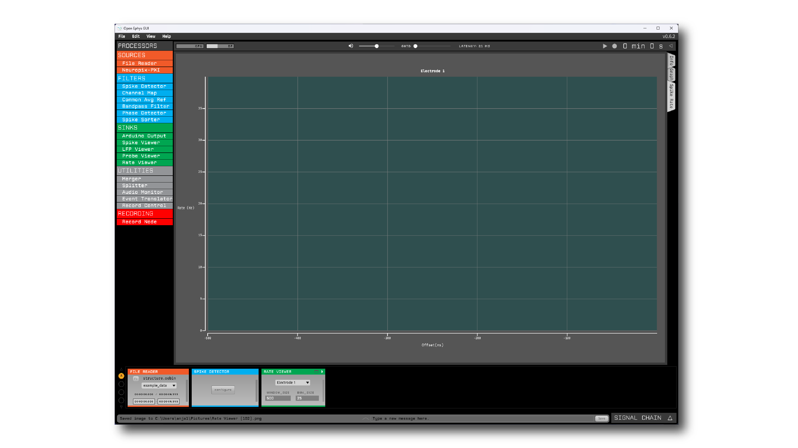
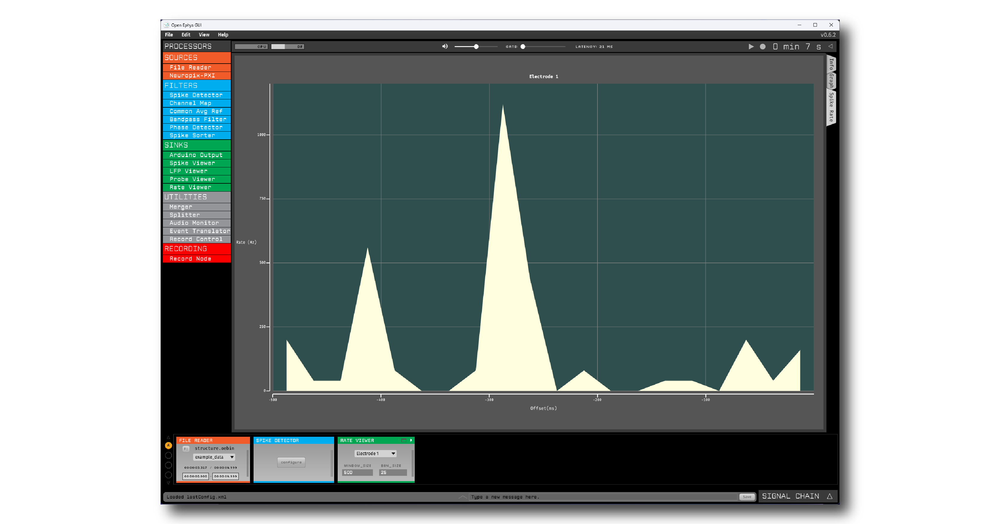

.. _makingyourownvisualizerplugin:
.. role:: raw-html-m2r(raw)
   :format: html

Making Your Own Visualizer Plugin
==================================

The Open Ephys GUI was designed to be extended via plugins that can be developed and shared independently of the main application. This is the primary way in which end users are encouraged to add new functionality to the GUI.  

This tutorial will guide you through the steps involved in making a Visualizer plugin from scratch. At the end, you will have created a "Rate Viewer" plugin, which displays the rate at which spikes coming in from upstream.

Along with explaining how to configure the plugin and set up the main :code:`process()` method, this tutorial will demonstrate how to create a Visualizer for the plugin using the GUI's built-in Interactive Plot class. 

.. important:: These instructions assume you have already compiled the main application from source. If not, you should start by following the instructions on :ref:`this page <compilingthegui>`.

Creating a new plugin repository
#################################

The first step in creating a plugin is to create a new code repository from a template. There are five different types of plugins that include pre-defined templates: **Processor Plugins**, **Visualizer Plugins**, **Data Threads**, **Record Engines**, and **File Sources**. Since we are creating a plugin that visualizes data by creating a separate canvas, we will use the **Visualizer Plugin** template:

1. Log in to your `GitHub <https://github.com/>`__ account.

2. Browse to the `Visualizer Plugin Template <https://github.com/open-ephys-plugins/visualizer-plugin-template>`__ repository.

3. Click the green "Use this template" button.

.. image:: ../_static/images/tutorials/makeyourownplugin/makeyourownplugin-01.png
  :alt: Visualizer Plugin Template Repository

4. Name the repository "rate-viewer", since the main purpose of this plugin is to visualize spike rate of an electrode.

5. Click the green "Create repository from template" button.

.. image:: ../_static/images/tutorials/makeyourownplugin/makeyourownplugin-02.png
  :alt: Create rate-viewer Repository

On your local machine, create an "OEPlugins" directory within the same directory that contains your :code:`plugin-GUI` repository. Then, using the `git <https://git-scm.com/>`__ command line interface or the `GitHub Desktop <https://desktop.github.com/>`__ app, clone the newly created plugin repository into this directory. Your directory structure should look something like this:

.. code-block:: 

   code_directory/
      plugin-GUI/
      OEPlugins/
         rate-viewer/
            Build/
            Resources/
            Source/
            CMakeLists.txt
            CMAKE_README.txt
            README.md

Editing :code:`OpenEphysLib.cpp` and other files
#################################################

Inside the "Source" directory, you'll find the :file:`OpenEphysLib.cpp` file that contains critical information about your plugin. Open it in your preferred text editor and make the following changes:

Rate Viewer plugin will be a "sink", meaning it creates a canvas to visualize the data by inheriting the `Visualizer <https://github.com/open-ephys/plugin-GUI/blob/master/Source/Processors/GenericProcessor/GenericProcessor.h>`__ class. This Visualizer is is owned by the plugin's editor which needs to inherit from the `VisualizerEditor <https://github.com/open-ephys/plugin-GUI/blob/main/Source/Processors/Editors/VisualizerEditor.h>`__ class. 

Now, we can provide the plugin's metadata (name, type, creator, etc.) to the GUI's Plugin Manager by editing the following lines in :code:`OpenEphysLib.cpp`:

1. Change :code:`info->name` to :code:`Rate Viewer`

2. Change :code:`info->processor.name` to :code:`Rate Viewer`

3. Change :code:`info->processor.creator` to :code:`&(Plugin::createProcessor<RateViewer>);`

When you're finished, the file should look like this:

.. code-block:: c++
   :caption: OpenEphysLib.cpp
   
   extern "C" EXPORT void getLibInfo(Plugin::LibraryInfo* info)
   {
      /* API version, defined by the GUI source.
      Should not be changed to ensure it is always equal to the one used in the latest codebase.
      The GUI refuses to load plugins with mismatched API versions */
      info->apiVersion = PLUGIN_API_VER;
      info->name = "Rate Viewer"; // Name of the plugin library <---- UPDATE
      info->libVersion = "0.1.0"; //Version of the plugin
      info->numPlugins = NUM_PLUGINS;
   }

   extern "C" EXPORT int getPluginInfo(int index, Plugin::PluginInfo* info)
   {
      switch (index)
      {
         //one case per plugin. This example is for a processor which connects directly to the signal chain
      case 0:

         //Type of plugin. See "Source/Processors/PluginManager/OpenEphysPlugin.h" for complete info about the different type structures
         info->type = Plugin::Type::PROCESSOR;

         //Processor name
         info->processor.name = "Rate Viewer"; // Processor name shown in the GUI <---- UPDATE

         //Type of processor. Visualizers are usually sinks, but they can also be SOURCE or FILTER processors.
         info->processor.type = Processor::Type::SINK;

         //Class factory pointer. Replace "ProcessorPluginSpace::ProcessorPlugin" with the namespace and class name.
         info->processor.creator = &(Plugin::createProcessor<RateViewer>); // <---- UPDATE
         break;

      default:
         return -1;
         break;
      }
      return 0;
   }

|

Next, rename the :code:`VisualizerPlugin.cpp` & :code:`VisualizerPlugin.h` files to :code:`RateViewer.cpp` and :code:`RateViewer.h`, and find and replace the **VisualizerPlugin** class name with **RateViewer** everywhere in the .cpp and .h files. Do the same with :code:`VisualizerPluginEditor.cpp`, :code:`VisualizerPluginEditor.h`, :code:`VisualizerPluginCanvas.cpp`, and :code:`VisualizerPluginCanvas.h`. 

Also, don't forget to update the include inside :code:`OpenEphysLib.cpp` from :code:`#include "VisualizerPlugin.h"` to :code:`#include "RateViewer.h"`.

Compiling your plugin
########################

At this point, you should be able to compile your plugin and load it into the GUI. We advise you to compile and test the plugin every time you make changes, so that it is easier for you to identify what changes broke the code, if it happens.

To compile the plugin, please follow the OS-specific instructions described on the :ref:`compiling plugins <compilingplugins>` page.

Setting up the Processor methods
##########################################

Right now, our plugin won't do anything with the incoming data when it's placed in the signal chain. Spike data passed into the :code:`process()` method will not be used in any way.

Let's change that by inserting code to grab all the available spike channels (electrodes) and store the channel metadata locally. This is necessary as we want the user to have the ability to change the electrode for spike rate visualization. For now, we will just save the electrode information. In the subsequent steps, we will make it possible to change the active electrode via a drop-down menu (ComboBox) in the plugin's editor.

To make sure all available electrodes' information is valid throughout the session, we need to update the electrode metadata in the :code:`updateSettings()` method, which is called whenever the signal chain is modified. Before overriding the :code:`updateSettings()` method, we need a something to store the electrode information, so we'll define a electrode :code:`struct` first.

In the plugin processor's :code:`.h` file, add the following lines under the :code:`private` specifier:

.. code-block:: c++
   :caption: RateViewer.h

   private:

      struct Electrode
      {
         String name;

         uint16 streamId;

         float sampleRate;

         bool isActive = false; // To keep track of which electrode is being visualized
      };

      OwnedArray<Electrode> electrodes;
      std::map<const SpikeChannel*, Electrode*> electrodeMap;

Note that we need to create an array of :code:`.h` to store information of all the incoming SpikeChannels as well as a :code:`std::map` to map all the electrodes to its respective SpikeChannel.

Next, inside the :code:`updateSettings()` method, we will loop through the available SpikeChannels and store its metadata.

In the plugin's :code:`.cpp` file, add the following lines 

.. code-block:: c++
   :caption: RateViewer.cpp

   void RateViewer::updateSettings()
   {
      electrodes.clear(); // clear previous entries first
      electrodeMap.clear();

      for(auto spikeChan : spikeChannels)
      {
         if(spikeChan->isValid())
         {
               Electrode* electrode = new Electrode();
               electrode->name = spikeChan->getName();
               electrode->streamId = spikeChan->getStreamId();
               electrode->sampleRate = spikeChan->getSampleRate();
               electrodes.add(electrode);
               electrodeMap[spikeChan] = electrode;
         }
      }
   }

Now, the processor is ready to receive spike events. Inside our process method, we need to enable checking for spike events. To do so, update the :code:`process()` method as follows:

.. code-block:: c++
   :caption: RateViewer.cpp

   void RateViewer::process(AudioBuffer<float>& buffer)
   {	
      checkForEvents(true); // true as plugin handle's spikes
   }

Next step for the processor is to handle the incoming spikes. But, before we can proceed with that, we need to add UI components to allow the user to interact with the plugin and change certain parameters.

Adding UI components to the editor
###################################

Currently, there is no active electrode set for which spike data needs to be processed. In order to change the active electrode during runtime, we need to create a user interface for our plugin. This UI will be defined inside of the :code:`RateViewerEditor` class.

You should have already modified the file and class names for the plugin's editor; make sure the editor's :code:`.h` and :code:`.cpp` files look like this:

.. code-block:: c++
   :caption: RateViewerEditor.h

   #include <VisualizerEditorHeaders.h>

   class RateViewerEditor  : public VisualizerEditor
   {
   public:

      /** Constructor */
      RateViewerEditor(GenericProcessor* parentNode);

      /** Destructor */
      ~RateViewerEditor() { }

      /** Creates the canvas */
      Visualizer* createNewCanvas();

   private:

      /** Generates an assertion if this class leaks */
      JUCE_DECLARE_NON_COPYABLE_WITH_LEAK_DETECTOR(RateViewerEditor);
   };

.. code-block:: c++
   :caption: RateViewerEditor.cpp

   #include "RateViewerEditor.h"

   #include "RateViewerCanvas.h"
   #include "RateViewer.h"

   RateViewerEditor::RateViewerEditor(GenericProcessor* p)
      : RateViewerEditor(p, "Spike Rate", 210) // second parameter is the tab name, third is the editor width
   {

   }

   Visualizer* RateViewerEditor::createNewCanvas()
   {
      return new RateViewerCanvas((RateViewerEditor*) getProcessor());
   }

Creating a ComboBox
--------------------

To allow changing the active electrode, we will create a ComboBox or a drop-down menu that will list all the available electrodes for the currently selected stream in the editor. We will create a JUCE::ComboBox inside the editor's constructor as follows: 

.. code-block:: c++
   :caption: RateViewerEditor.h

   class RateViewerEditor : public VisualizerEditor,
                            public ComboBox::Listener
   {
      public:
         
         ...

         /** ComboBox::Listener callback*/
         void comboBoxChanged(ComboBox* comboBox) override;

      private:

         std::unique_ptr<ComboBox> electrodeList;

         RateViewer* rateViewerNode;

.. code-block:: c++
   :caption: RateViewerEditor.cpp

   RateViewerEditor::RateViewerEditor(GenericProcessor* p)
      : VisualizerEditor(p, "Spike Rate", 210),
   {

      electrodeList = std::make_unique<ComboBox>("Electrode List");
      electrodeList->addListener(this);
      electrodeList->setBounds(50,40,120,20);
      addAndMakeVisible(electrodeList.get());

      rateViewerNode = (RateViewer*)p;
   }

   void RateViewerEditor::comboBoxChanged(ComboBox* comboBox)
   {
      /* Keep it empty for now
   }

Compile and load the plugin into the GUI to see the newly added ComboBox, which will be empty for now.

To add the available electrodes list to the ComboBox, we will have to ask the processor for the list. Since we want to make sure the list gets updated every time the signal chain is modified or a different stream is selected, we have to carry out the entire process inside the editor's :code:`selectedStreamHasChanged()` method. 

First, lets add a function in the processor that returns an array of electrode names for the specified stream.

.. code-block:: c++
   :caption: RateViewer.cpp

   Array<String> RateViewer::getElectrodesForStream(uint16 streamId)
   {
      Array<String> electrodesForStream;

      for (auto electrode : electrodes)
      {
         if (electrode->streamId == streamId)
               electrodesForStream.add(electrode->name);
      }

      return electrodesForStream;
   }

.. code-block:: c++
   :caption: RateViewer.h

   public:

      /** Returns an array of available electrodes*/
      Array<String> getElectrodesForStream(uint16 streamId);

Now, we can override the :code:`selectedStreamHasChanged()` method in the editor as follows:

.. code-block:: c++
   :caption: RateViewerEditor.cpp

   void RateViewerEditor::selectedStreamHasChanged()
   {
      electrodeList->clear();

      if (selectedStream == 0)
      {
         return;
      }

      currentElectrodes = rateViewerNode->getElectrodesForStream(selectedStream);

      int id = 0;

      for (auto electrode : currentElectrodes)
      {

         electrodeList->addItem(electrode, ++id);
               
      }

      electrodeList->setSelectedId(1, sendNotification);
   }

.. code-block:: c++
   :caption: RateViewerEditor.h

   public:

      /** Called when selected stream is updated*/
      void selectedStreamHasChanged() override;

Once compiled and loaded into the GUI, if there are any SpikeChannels, the ComboBox will be populated with the list of electrodes.

Creating TextBox parameter editors
--------------------------------------

To calculate the actual spike rate of an electrode, we need to define a window with a set size (in milliseconds) that encapsulates all the spikes in that time frame and then bin those spikes into smaller windows that allows us to gauge the rate of spikes in a specific bin. So, the user needs a way to change the window size as well as bin size. This can be done by creating a TextBox parameter editor for both of them inside the :code:`RateViewerEditor` constructor, like so:

.. code-block:: c++
   :caption: RateViewerEditor.cpp

   RateViewerEditor::RateViewerEditor(GenericProcessor* p)
    : VisualizerEditor(p, "Spike Rate", 210)
   {

      electrodeList = std::make_unique<ComboBox>("Electrode List");
      electrodeList->addListener(this);
      electrodeList->setBounds(50,40,120,20);
      addAndMakeVisible(electrodeList.get());

      addTextBoxParameterEditor("window_size", 15, 75); // <--------

      addTextBoxParameterEditor("bin_size", 120, 75); // <--------

      rateViewerNode = (RateViewer*)p;

   }

Since every parameter editor must refer to a parameter with the same name that’s declared in the plugin constructor, let’s initialize the corresponding parameter inside the :code:`RateViewer` constructor:

.. code-block:: c++
   :caption: RateViewer.cpp

   RateViewer::RateViewer() 
    : GenericProcessor("Rate Viewer"),
   {
      addIntParameter(Parameter::GLOBAL_SCOPE,
                     "window_size",
                     "Size of the window in ms",
                     1000, 100, 5000); // Default: 1000, Min: 100, Max: 5000
      
      addIntParameter(Parameter::GLOBAL_SCOPE,
                     "bin_size",
                     "Size of the bins in ms",
                     50, 25, 500); // Default: 50, Min: 25, Max: 500
   }

Compile and load the plugin into the GUI to see the newly added text boxes.

Responding to parameter value changes
#####################################

Now, let's allow our UI elements to change the state of the plugin. To do this, we need to declare member variables inside the :code:`RateViewer` processor class that can be updated by our TextBox parameter editors as well as add a function to the processor to update the active electrode as soon as the user changes it via the ComboBox . The values of these variables *must* be updated through a special method, called :code:`parameterValueChanged()`, which responds to any parameter editor value changes.

First, let's update the :code:`RateViewer` header file as follows:

.. code-block:: c++
   :caption: RateViewer.h

   public:
      /** Called whenever a parameter's value is changed */
      void parameterValueChanged(Parameter* param) override;

      /** Called whenever selected eletcrode is changed in the editor combobox */ 
      void setActiveElectrode(String name);

   private:

      int windowSize, binSize;

   
Next, let's initialize the parameter variables in the :code:`TTLEventGenerator()` constructor initializer list, like so:

.. code-block:: c++
   :caption: RateViewer.cpp

   RateViewer::RateViewer() 
      : GenericProcessor("Rate Viewer"),
         windowSize(1000),
         binSize(50)
   {
      ...
   }

.. important:: Always be sure to initialize all member variables in the class constructor in order to avoid unexpected behavior.

Now, we can define how these variables are updated inside the :code:`parameterValueChanged()` method:

.. code-block:: c++
   :caption: RateViewer.cpp

   void RateViewer::parameterValueChanged(Parameter* param)
   {
      if (param->getName().equalsIgnoreCase("window_size"))
      {
         windowSize = (int)param->getValue();
      }
      else if (param->getName().equalsIgnoreCase("bin_size"))
      {
         binSize = (int)param->getValue();
      }
   }

For responding to active electrode ComboBox changes, we need to go back to the editor and deine the :code:`comboBoxChanged()` method as follows:

.. code-block:: c++
   :caption: RateViewerEditor.cpp

   void RateViewerEditor::comboBoxChanged(ComboBox* comboBox)
   {
      if (comboBox == electrodeList.get())
      {
         if(currentElectrodes.size() == 0)
         {
               rateViewerNode->setActiveElectrode("None");
         }
         else
         {
               rateViewerNode->setActiveElectrode(
                  currentElectrodes[electrodeList->getSelectedId() - 1]);
         }
      }
   }

and then define the :code:`RateViewer::setActiveElectrode()` method to make sure the correct electrode is set active in the processor.

.. code-block:: c++
   :caption: RateViewer.cpp

   void RateViewer::setActiveElectrode(String name)
   {
      for (auto electrode : electrodes)
      {
         if (electrode->name.equalsIgnoreCase(name))
         {
               electrode->isActive = true; // activate the selected electrode
         }
         else
         {
               electrode->isActive = false; //de-activate all other electrodes
         }
      }
   }

Our editor UI is ready! 

Creating the Visualizer
########################

Now that out processor and editors are setup, we can move on to creating the Visualizer by defining the :code:`RateViewerCanvas` class. The Visualizer is going to use the GUI's built-in `InteractivePlot <https://open-ephys.github.io/gui-docs/Developer-Guide/Open-Ephys-Plugin-API/Visualizer-Plugins.html#interactive-plots>`__ class that provides all the functionalities for drawing 2D charts. The X-axis is going to be the spike offset time in milliseconds, and the Y-axis is going to be the spike rate in Hz. Lets create the plot as follows:

.. code-block:: c++
   :caption: RateViewerCanvas.h

   private:

      /** Pointer to the processor class */
      RateViewer* processor;

      /** Class for plotting data */
      InteractivePlot plt;

.. code-block:: c++
   :caption: RateViewerCanvas.cpp

   RateViewerCanvas::RateViewerCanvas(RateViewer* processor_)
	: processor(processor_),
   {
      // Initialize the plot
      plt.xlabel("Offset(ms)");
      plt.ylabel("Rate (Hz)");
      plt.setInteractive(InteractivePlotMode::OFF);
      plt.setBackgroundColour(Colours::darkslategrey);
      addAndMakeVisible(&plt);
      plt.setBounds(50, 50, 800, 500);
   }

Once compiled and loaded into the GUI, you can open the canvas via the editor and you should be able to see a blank 2D chart inside.

We also need to make sure the processor has a reference to the canvas to relay all the parameter updates onto the canvas. We can do by creating a RateViewerCanvas pointer winside the processor and the update the pointer inside the :code:`RateViewerEditor::createNewCanvas()` which is called by the editor every time to create a new canvas.

.. code-block:: c++
   :caption: RateViewer.h

   public:   
      
      ...

      RateViewerCanvas* canvas;

   private:

.. code-block:: c++
   :caption: RateViewerEditor.h

   Visualizer* RateViewerEditor::createNewCanvas()
   {
      rateViewerCanvas = new RateViewerCanvas(rateViewerNode);

      rateViewerNode->canvas = rateViewerCanvas;

      selectedStreamHasChanged();

      return rateViewerCanvas;
   }

Updating Canvas parameters
---------------------------

After that, we need to make sure all the parameters and their updates from the processor are passed on to the canvas to do the actual spike rate calculation. For that, we need to relay the window size, bin size and electrode name information to the canvas. We also need to send the sample rate of the currently active electrode to the canvas as we'll need that to convert the bins from milliseconds to sample number to compare it with the incoming spikes sample number. We can do that by first creating member variables to store those values and helper functions to modify them inside the canvas.

.. code-block:: c++
   :caption: RateViewerCanvas.h

   public:

      ...

      void setWindowSizeMs(int windowSize_);

	   void setBinSizeMs(int binSize_);

	   void setSampleRate(float sampleRate);

      void setPlotTitle(const String& title);

   private:

      ...

      float sampleRate = 0.0f;

	   int windowSize = 1000;
      int binSize = 50;

.. code-block:: c++
   :caption: RateViewerCanvas.cpp

   void RateViewerCanvas::setWindowSizeMs(int windowSize_)
   {
      windowSize = windowSize_;
   }

   void RateViewerCanvas::setBinSizeMs(int binSize_)
   {
      binSize = binSize_;
   }

   void RateViewerCanvas::setSampleRate(float sampleRate_)
   {
      sampleRate = sampleRate_;
   }

   void RateViewerCanvas::setPlotTitle(const String& title)
   {
      plt.title(title);
   }

and then update the processor to call those helper functions every time a prameter changes. Before we update any canvas values, we need to make sure the canvas actually exists as there can be cases where the canvas is not created while the plugin is loaded into the GUI resulting into segmentation faults.

.. code-block:: c++
   :caption: RateViewer.cpp

   void RateViewer::parameterValueChanged(Parameter* param)
   {
      if (param->getName().equalsIgnoreCase("window_size"))
      {
         windowSize = (int)param->getValue();

         if(canvas != nullptr)
               canvas->setWindowSizeMs(windowSize);  // Update window size in canvas
      }
      else if (param->getName().equalsIgnoreCase("bin_size"))
      {
         binSize = (int)param->getValue();

         if(canvas != nullptr)
               canvas->setBinSizeMs(binSize); // update bin size in canvas
      }
   }

   void RateViewer::setActiveElectrode(String name)
   {
      for (auto electrode : electrodes)
      {
         if (electrode->name.equalsIgnoreCase(name))
         {
               electrode->isActive = true;

               if(canvas != nullptr)
               {
                  // set the canvas's sample rate to electrode's sample rate
                  canvas->setSampleRate(electrode->sampleRate);

                  // set the canvas's plot tile to selected electrode's name
                  canvas->setPlotTitle(electrode->name);
               }

         }
         else
         {
               electrode->isActive = false;
         }
      }
   }

Adding spikes to the canvas
----------------------------

Since all the parameters are set-up, we can start adding spike sample numbers for each incoming spike handled by the processor. First, lets create an array of sample numbers inside the canvas to store all the incoming data and also create a function inside the canvas whcih will be used by the processor to send spike sample numbers to the canvas.

.. code-block:: c++
   :caption: RateViewerCanvas.h

   public:

      /** Adds a spike sample number */
      void addSpike(int64 sample_number);

   private:

      Array<int64> incomingSpikeSampleNums;
   

.. code-block:: c++
   :caption: RateViewerCanvas.cpp

   void RateViewerCanvas::addSpike(int64 sample_num)
   {
      incomingSpikeSampleNums.add(sample_num);
   }

Now, since the processor is already set to receive spike events, we need to handle the spikes by overriding the :code:`void handleSpike()` method which is called for every incoming spike. Inside this method we will get the spike sample number and pass it on to the canvas.

.. code-block:: c++
   :caption: RateViewer.cpp

   void RateViewer::handleSpike(SpikePtr spike)
   {
      if(spike->getStreamId() == getEditor()->getCurrentStream() // spike stream matches the current stream
         && electrodeMap.at(spike->getChannelInfo())->isActive // electrode is active
         && canvas != nullptr) // canvas exists
      {
         canvas->addSpike(spike->getSampleNumber());
      } 
   }
   

Since the :code:`process()` method brings the data in blocks / buffers, we need a way to ensure the incoming spikes fall in the window time-frame defined by the user. This can be done by passing the most recent sample number for the current buffer to the canvas every process loop. Update the :code:`process()` method as follows:

.. code-block:: c++
   :caption: RateViewer.cpp

   void RateViewer::process(AudioBuffer<float>& buffer)
   {	
      checkForEvents(true);

      for(auto stream : getDataStreams())
      {
         if(stream->getStreamId() == getEditor()->getCurrentStream())
         {
               int64 mostRecentSample = getFirstSampleNumberForBlock(stream->getStreamId()) + getNumSamplesInBlock(stream->getStreamId());

               if(canvas != nullptr)
                  canvas->setMostRecentSample(mostRecentSample);
         }
      }

   }

and add a member variable to store the most recent sample number as a function to update that number inside the canvas.

.. code-block:: c++
   :caption: RateViewerCanvas.h

   public:

      /** Sets the sample index for the latest buffer*/
      void setMostRecentSample(int64 sampleNum);

   private:

      int64 mostRecentSample = 0;

.. code-block:: c++
   :caption: RateViewerCanvas.cpp
   
   void RateViewerCanvas::setMostRecentSample(int64 sampleNum)
   {
      mostRecentSample = sampleNum;
   }

Calculating the spike rate
--------------------------

Now, we have all the required information for calculating the spike rate. To do the calculation, we first need to calculate the bin edges. The bin edges will allow us to bound the incoming spike sample numbers to specific bins, relative to the most recent sample number. We also need to make sure bin edges are updated every time the bin size changes and when the active electrode changes, so let's do the bin edge calculation insde a function called :code:`recomputeBinEdges()` which will be called every time we need to updated the bin edges.

First, declare the bin edges arrays to store the values in milliseconds and sample numbers:

.. code-block:: c++
   :caption: RateViewerCanvas.h

   private:

      /** Recomputes bin edges */
      void recomputeBinEdges();

      Array<double> binEdges;

then do the actual calculation whenever bin edges need to be updated:

.. code-block:: c++
   :caption: RateViewerCanvas.cpp

   void RateViewerCanvas::recomputeBinEdges()
   {

      binEdges.clear();
      counts.clear();

      if (binSize == 0 || windowSize == 0)
         return;

      double binEdge = (double) -windowSize;

      while (binEdge < 0)
      {
         binEdges.add(binEdge);
         binEdge += (double)binSize;
      }

      binEdges.add(0.0);

      counts.insertMultiple(0, 0, binEdges.size());
   }

   void RateViewerCanvas::setWindowSizeMs(int windowSize_)
   {
      windowSize = windowSize_;

      recomputeBinEdges(); // <--------
   }

   void RateViewerCanvas::setBinSizeMs(int binSize_)
   {
      binSize = binSize_;

      recomputeBinEdges(); // <--------
   }

   void RateViewerCanvas::setSampleRate(float sampleRate_)
   {
      sampleRate = sampleRate_;

      recomputeBinEdges(); // <--------
   }

Let's do the counting now. Since we have all the required information for counting the spikes it shoudl be pretty straightforward to bin and count the spikes, like so:

.. code-block:: c++
   :caption: RateViewerCanvas.h

   private:

      /** Recounts spikes/bin; returns true if a new bin is available */
      bool countSpikes();

      Array<int> counts;
      int64 sampleOnLastRedraw = 0;
	   int maxCount = 1;

.. code-block:: c++
   :caption: RateViewerCanvas.cpp

   bool RateViewerCanvas::countSpikes()
   {
      
      int elapsedSamples = mostRecentSample - sampleOnLastRedraw;
      float elapsedTimeMs = float(elapsedSamples) / sampleRate * 1000.0f;

      // Only count spikes when time since last count is more than bin size
      if (elapsedTimeMs < binSize)
         return false;

      counts.remove(0); // remove oldest count

      int newSpikeCount = incomingSpikeSampleNums.size();

      if (newSpikeCount > maxCount)
         maxCount = newSpikeCount;

      counts.add(newSpikeCount); // add most recent count

      incomingSpikeSampleNums.clear();

      sampleOnLastRedraw = mostRecentSample;

      return true;
   }

Note that we are using the :code:`maxCount` value to keep track of the maximum number if spikes counted in a bin which will then be used to se the plot range. We need to update the plot range whenever the window size is updated or the :code:`maxCount` value is updated.

.. code-block:: c++
   :caption: RateViewerCanvas.h

   private:

      void updatePlotRange();

.. code-block:: c++
   :caption: RateViewerCanvas.cpp

   void RateViewerCanvas::updatePlotRange()
   {
      XYRange range;
      range.xmin = (float)-windowSize;
      range.xmax = 0.0f;
      range.ymin = 0.0f;
      range.ymax = (float)maxCount * 1000 / binSize;

      plt.setRange(range);
   }

   void RateViewerCanvas::setWindowSizeMs(int windowSize_)
   {
      windowSize = windowSize_;

      recomputeBinEdges();

      updatePlotRange(); // <--------
   }

   void RateViewerCanvas::setBinSizeMs(int binSize_)
   {
      binSize = binSize_;

      recomputeBinEdges();

      maxCount = 1; // <--------
   }

   void RateViewerCanvas::countSpikes()
   {
      ...

      incomingSpikeSampleNums.clear();

      updatePlotRange(); // <--------

      sampleOnLastRedraw = mostRecentSample;

	   return true;
   }

Lastly, we need to do the actual plotting. We need to make sure the spikes are counted and plot is updated at regular intervals. To do that, we will override the canvas' :code:`refresh()` method which is called by the canvas Visualizer on a timer callback. This allows us to recount the spike and animate the plotting. First lets implement the :code:`refresh()` method, where we will use the center of the bins in milliseconds as X values and spike rate in HZ (number of spikes per bin) as Y-values.

.. code-block:: c++
   :caption: RateViewerCanvas.cpp

   void RateViewerCanvas::refresh()
   {
      if (countSpikes())
      {
         std::vector<float> x, y;

         for (int i = 0; i < binEdges.size() - 1; i++)
         {
            x.push_back(binEdges[i]);
            y.push_back(counts[i] * 1000 / binSize);
         }

         plt.clear();
         plt.plot(x, y, Colours::lightyellow, 1.0, 1.0f, PlotType::FILLED);
      }
   }

Then, update the processor to notify the editor to begin animation (timer callbacks) on the canvas as soon as acquisition starts and stop animation as soon as acquisition stops.

.. code-block:: c++
   :caption: RateViewer.h

   public:

      /** Enables the editor */
      bool startAcquisition() override;

      /** Disables the editor*/
      bool stopAcquisition() override;

.. code-block:: c++
   :caption: RateViewer.h

   bool RateViewer::startAcquisition()
   {
      ((RateViewerEditor*)getEditor())->enable();
      return true;
   }

   bool RateViewer::stopAcquisition()
   {
      ((RateViewerEditor*)getEditor())->disable();
      return true;
   }

And that’s it! If you compile and test your plugin, the canvas should start plotting the spike rate of the selected electrode, and modifying any of the UI prameters will have its related effects.

Next steps
-----------

|

