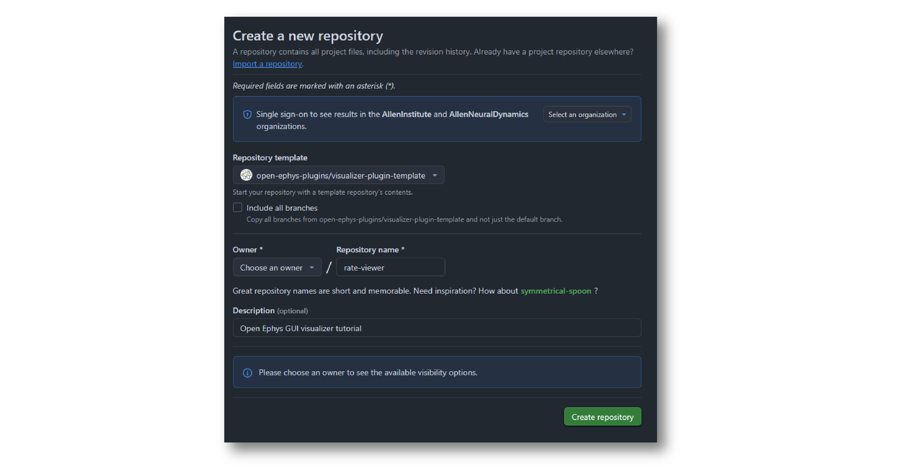

.. _makingyourownvisualizerplugin:
.. role:: raw-html-m2r(raw)
   :format: html

Making Your Own Visualizer Plugin
==================================

All processor plugins within the Open Ephys GUI have the option of creating a "Visualizer" that appears as a tab in the Viewport or in a separate window. Visualizers can be used to hold parameter-setting interfaces that are too bit to fit inside the plugin's editor, or they can display real-time animations of the data being handled by the plugin.

This tutorial will guide you through the steps involved in making a Visualizer plugin from scratch. At the end, you will have created a "Rate Viewer" plugin that displays the rate at which spikes are occurring on an upstream electrode. Along with explaining how to configure the plugin and set up the main :code:`process()` method, this tutorial will demonstrate how to create a real-time data display using the GUI's built-in Interactive Plot class. 

If you get stuck, you can take a look at the finished plugin source code here to see if your version matches: https://github.com/open-ephys-plugins/rate-viewer

.. important:: These instructions assume you have already compiled the main application from source. If not, you should start by following the instructions on :ref:`this page <compilingthegui>`.

.. note:: On Linux, you'll need to make a small change to the GUI's source code to get the Rate Viewer plugin to work. Change line 208 of :code:`InteractivePlot.h` to :code:`class PLUGIN_API DrawComponent : public Component`. This change has been added to the **development** branch, and will be merged into the **main** branch soon.

Creating a new plugin repository
#################################

The first step in creating a plugin is to create a new code repository from a template. There are five different types of plugins that include pre-defined templates: **Processor Plugins**, **Visualizer Plugins**, **Data Threads**, **Record Engines**, and **File Sources**. Since in this case we are creating a plugin with a built-in Visualizer, we will use the **Visualizer Plugin** template:

1. Log in to your `GitHub <https://github.com/>`__ account.

2. Browse to the `Visualizer Plugin Template <https://github.com/open-ephys-plugins/visualizer-plugin-template>`__ repository.

3. Click the green "Use this template" button and select the "Create a new repository" option.

4. Name the repository "rate-viewer", since this plugin will be used to visualize the spike rate of an electrode.

5. Set the Description to "Open Ephys GUI visualizer tutorial".

6. Click the green "Create repository from template" button.

On your local machine, create an "OEPlugins" directory within the same directory that contains your :code:`plugin-GUI` repository. Then, using the `git <https://git-scm.com/>`__ command-line interface or the `GitHub Desktop <https://desktop.github.com/>`__ app, clone the newly created plugin repository into this directory. 

Your directory structure should look something like this:

.. code-block:: 

   code_directory/
      plugin-GUI/
      OEPlugins/
         rate-viewer/
            Build/
            Resources/
            Source/
            CMakeLists.txt
            CMAKE_README.txt
            README.md

Editing :code:`OpenEphysLib.cpp` and other files
#################################################

Inside the "Source" directory, you'll find the :file:`OpenEphysLib.cpp` file that contains critical information about your plugin. Open it in your preferred text editor and make the following changes:

1. Change the library :code:`info->name` on line 46 from :code:`VisualizerPlugin` to :code:`Rate Viewer`

2. Change :code:`info->processor.name` on line 62 to from :code:`VisualizerPlugin` to :code:`Rate Viewer`

3. Change :code:`info->processor.creator` to :code:`&(Plugin::createProcessor<RateViewer>);`

When you're finished, the file should look like this:

.. code-block:: c++
   :caption: OpenEphysLib.cpp
   
   extern "C" EXPORT void getLibInfo(Plugin::LibraryInfo* info)
   {
      /* API version, defined by the GUI source.
      Should not be changed to ensure it is always equal to the one used in the latest codebase.
      The GUI refuses to load plugins with mismatched API versions */
      info->apiVersion = PLUGIN_API_VER;
      info->name = "Rate Viewer"; // Name of the plugin library <---- UPDATE
      info->libVersion = "0.1.0"; //Version of the plugin
      info->numPlugins = NUM_PLUGINS;
   }

   extern "C" EXPORT int getPluginInfo(int index, Plugin::PluginInfo* info)
   {
      switch (index)
      {
         //one case per plugin. This example is for a processor which connects directly to the signal chain
      case 0:

         //Type of plugin. See "Source/Processors/PluginManager/OpenEphysPlugin.h" for complete info about the different type structures
         info->type = Plugin::Type::PROCESSOR;

         //Processor name
         info->processor.name = "Rate Viewer"; // Processor name shown in the GUI <---- UPDATE

         //Type of processor. Visualizers are usually sinks, but they can also be SOURCE or FILTER processors.
         info->processor.type = Processor::Type::SINK;

         //Class factory pointer. Replace "ProcessorPluginSpace::ProcessorPlugin" with the namespace and class name.
         info->processor.creator = &(Plugin::createProcessor<RateViewer>); // <---- UPDATE
         break;

      default:
         return -1;
         break;
      }
      return 0;
   }

|

Note that we'll keep the processor type for the Rate Viewer plugin as a :code:`SINK` (line 65), since it won't modify the underlying data at all. However, Visualizer plugins can also be Sources (if they generate data) or Filters (if they modify data).

Next, rename the :code:`VisualizerPlugin.cpp` & :code:`VisualizerPlugin.h` files to :code:`RateViewer.cpp` and :code:`RateViewer.h`, and find and replace all instances of the **VisualizerPlugin** class name to **RateViewer** in the .cpp and .h files. Do the same with :code:`VisualizerPluginEditor.cpp`, :code:`VisualizerPluginEditor.h`, :code:`VisualizerPluginCanvas.cpp`, and :code:`VisualizerPluginCanvas.h`. 

Next, change the "display name" of the plugin on line 30 of :code:`RateViewer.h` from :code:`Visualizer` to :code:`Rate Viewer`.

Finally, update the include inside :code:`OpenEphysLib.cpp` from :code:`#include "VisualizerPlugin.h"` to :code:`#include "RateViewer.h"`.

Compiling your plugin
########################

At this point, you should be able to compile your plugin and load it into the GUI. We advise you to compile and test the plugin every time you make changes, so that it is easier for you to identify what changes caused crashes, if they happen.

To compile the plugin, please follow the OS-specific instructions described on the :ref:`compiling plugins <compilingplugins>` page.

Setting up the Processor methods
##########################################

Right now, our plugin won't do anything with the incoming data when it's placed in the signal chain. Spikes passed into the :code:`RateViewer::handleSpike()` method will not be used in any way.

There are a few steps required before we implement this :code:`handleSpike()` method. The first is to take metadata about available spike channels (also called electrodes) and store it locally. This is necessary as we want the user to have the ability to select which electrode to use for spike rate visualization.

To make sure the most up-to-date information about incoming electrodes is available, we need to update the electrode metadata each time the :code:`updateSettings()` method is called, which happens whenever the signal chain is modified. Before adding code to the :code:`updateSettings()` method, we need somewhere to store the electrode information, so we'll define an "Electrode" :code:`struct` first.

In the plugin's :code:`RateViewer.h` file, add the following lines under the :code:`private` specifier:

.. code-block:: c++
   :caption: RateViewer.h

   private:

      struct Electrode
      {
         String name;

         uint16 streamId;

         float sampleRate;

         bool isActive = false; // To keep track of which electrode is being visualized
      };

      OwnedArray<Electrode> electrodes;
      std::map<const SpikeChannel*, Electrode*> electrodeMap;

This defines a :code:`struct` to hold relevant information about each upstream electrode, and creates an :code:`OwnedArray` (from the JUCE library) to store them. In addition, we'll create a :code:`std::map` object to make it simple to associate each :code:`SpikeChannel` pointer (one of the GUI's built-in classes) with our custom Electrode :code:`structs`.

Next, inside the :code:`updateSettings()` method in :code:`RateViewer.cpp`, we will loop through the available :code:`SpikeChannel` pointers and store their metadata locally. Before :code:`updateSettings()` is called, the :code:`spikeChannels` array will be automatically updated to hold the latest information about upstream spike channel objects.

In the plugin's :code:`.cpp` file, add the following lines:

.. code-block:: c++
   :caption: RateViewer.cpp

   void RateViewer::updateSettings()
   {
      electrodes.clear(); // clear previous entries first
      electrodeMap.clear();

      for(auto spikeChan : spikeChannels)
      {
         if(spikeChan->isValid())
         {
               Electrode* electrode = new Electrode();
               electrode->name = spikeChan->getName();
               electrode->streamId = spikeChan->getStreamId();
               electrode->sampleRate = spikeChan->getSampleRate();
               electrodes.add(electrode);
               electrodeMap[spikeChan] = electrode;
         }
      }
   }

Now, the plugin can hold onto information about the incoming spike channels. Next, we will add UI components to allow the user to select the active electrode and change visualizer parameters.

Adding UI components to the editor
###################################

In order to change the active electrode during runtime, we will use a :code:`ComboBox` (or drop-down menu) inside the plugin's editor.

You should have already modified the file and class names for the plugin's editor; make sure :code:`RateViewerEditor.h` and :code:`RateViewerEditor.cpp` files look like this:

.. code-block:: c++
   :caption: RateViewerEditor.h

   #ifndef RATEVIEWEREDITOR_H_DEFINED
   #define RATEVIEWEREDITOR_H_DEFINED

   #include <VisualizerEditorHeaders.h>

   class RateViewerEditor  : public VisualizerEditor
   {
   public:

      /** Constructor */
      RateViewerEditor(GenericProcessor* parentNode);

      /** Destructor */
      ~RateViewerEditor() { }

      /** Creates the canvas */
      Visualizer* createNewCanvas();

   private:

      /** Generates an assertion if this class leaks */
      JUCE_DECLARE_NON_COPYABLE_WITH_LEAK_DETECTOR(RateViewerEditor);
   };

   #endif // RateViewerEDITOR_H_DEFINED

.. code-block:: c++
   :caption: RateViewerEditor.cpp

   #include "RateViewerEditor.h"

   #include "RateViewerCanvas.h"
   #include "RateViewer.h"

   RateViewerEditor::RateViewerEditor(GenericProcessor* p)
      : RateViewerEditor(p, "Visualizer", 200)
   {
      //addSelectedChannelsParameterEditor("Channels", 20, 105);
   }

   Visualizer* RateViewerEditor::createNewCanvas()
   {
      return new RateViewerCanvas((RateViewerEditor*) getProcessor());
   }

We will make a small change to :code:`RateViewerEditor.cpp`, which is to change the tab text from "Visualizer" to "Spike Rate", and increase the width of the editor by 10 pixels. After making these changes, the :code:`RateViewerEditor` constructor should look like this"

.. code-block:: c++
   :caption: RateViewerEditor constructor

   RateViewerEditor::RateViewerEditor(GenericProcessor* p)
      : RateViewerEditor(p, "Spike Rate", 210)
   {
      //addSelectedChannelsParameterEditor("Channels", 20, 105);
   }

Creating a Combo Box
--------------------

To make it possible to change the active electrode, we will create a selectable list of all the available electrodes for the currently selected stream in the editor. Create a :code:`ComboBox`` in the editor by making the following changes in :code:`RateViewerEditor.h`:

1. Have the :code:`RateViewerEditor` class inherit from :code:`ComboBox::Listener`, in addition to :code:`VisualizerEditor`:

.. code-block:: c++

   class RateViewerEditor : public VisualizerEditor,
                            public ComboBox::Listener

2. Declare the :code:`comboBoxChanged()` method in the "public" section of :code:`RateViewerEditor`:

.. code-block:: c++

   /** ComboBox::Listener callback*/
   void comboBoxChanged(ComboBox* comboBox) override;

3. Declare a :code:`ComboBox` in the "private" section of :code:`RateViewerEditor` using a :code:`std::unique_ptr`:

.. code-block:: c++

   std::unique_ptr<ComboBox> electrodeList;

The declaration of the :code:`RateViewer.h` class should now look like this:

.. code-block:: c++
   :caption: RateViewerEditor.h

   class RateViewerEditor : public VisualizerEditor,
                            public ComboBox::Listener
   {
      public:
         
         /** Constructor */
         RateViewerEditor(GenericProcessor* parentNode);

         /** Destructor */
         ~RateViewerEditor() { }

         /** Creates the canvas */
         Visualizer* createNewCanvas() override;

         /** ComboBox::Listener callback*/
         void comboBoxChanged(ComboBox* comboBox) override;

      private:

         std::unique_ptr<ComboBox> electrodeList;

         /** Generates an assertion if this class leaks */
	      JUCE_DECLARE_NON_COPYABLE_WITH_LEAK_DETECTOR(RateViewerEditor);
   };

Next, in :code:`RateViewerEditor.cpp`, delete the existing comment from the class constructor and add the following lines:

.. code-block:: c++

   electrodeList = std::make_unique<ComboBox>("Electrode List");
   electrodeList->addListener(this);
   electrodeList->setBounds(50,40,120,20);
   addAndMakeVisible(electrodeList.get());

This creates the electrode list, sets the :code:`RateViewerEditor` as a listener, specifies its position, and adds it to the editor.

Now, create an empty implementation of the :code:`comboBoxChanged()` method:

.. code-block:: c++

   void RateViewerEditor::comboBoxChanged(ComboBox* comboBox)
   {
      // Keep it empty for now
   }

At this point, you should compile the plugin and launch the GUI. You should see the newly added Combo Box, which will be empty for now.

Populating the Combo Box
------------------------

To add the available electrodes to the editor, we will have to request the list of the electrodes that's stored in the processor. We'll want to do this every time the signal chain is modified or a different stream is selected, so that the electrodes and always up-to-date. The easiest way to do this is to override the editor's :code:`selectedStreamHasChanged()` method. 

First, lets add a public method to the processor that returns an array of electrode names for the specified stream:

.. code-block:: c++
   :caption: RateViewer.h

   public:

      /** Returns the names of available electrodes */
      Array<String> getElectrodesForStream(uint16 streamId);

.. code-block:: c++
   :caption: RateViewer.cpp

   Array<String> RateViewer::getElectrodesForStream(uint16 streamId)
   {
      Array<String> electrodesForStream;

      for (auto electrode : electrodes)
      {
         if (electrode->streamId == streamId)
               electrodesForStream.add(electrode->name);
      }

      return electrodesForStream;
   }

Now, we can override the :code:`selectedStreamHasChanged()` method in the editor as follows:

.. code-block:: c++
   :caption: RateViewerEditor.h

   public:

      /** Called when selected stream is updated*/
      void selectedStreamHasChanged() override;

.. code-block:: c++
   :caption: RateViewerEditor.cpp

   void RateViewerEditor::selectedStreamHasChanged()
   {

      RateViewer* rateViewerNode = (RateViewer*) getProcessor();

      electrodeList->clear();

      if (selectedStream == 0)
      {
         return;
      }

      Array<Electrode> currentElectrodes = rateViewerNode->getElectrodesForStream(selectedStream);

      int id = 0;

      for (auto electrode : currentElectrodes)
      {

         electrodeList->addItem(electrode, ++id);
               
      }

      electrodeList->setSelectedId(1, sendNotification);
   }

Once the plugin has been re-compiled and loaded into the GUI, if there any spike channels created by an upstream :ref:`spikedetector` plugin, these will be will be automatically added to the Combo Box:

Defining plugin parameters
--------------------------------------

To calculate the spike rate of an electrode, we need to define a window of interest and then count the spikes within smaller windows (or bins). We'd like to make it possible for the user to customize the window size as well as the bin size. This can be done by creating an :code:`IntParameter` for each of these inside the :code:`RateViewer` constructor, as well as Text Box parameter editors inside the :code:`RateViewerEditor` constructor:

.. code-block:: c++
   :caption: RateViewer.cpp

   RateViewer::RateViewer() 
    : GenericProcessor("Rate Viewer"),
   {
      addIntParameter(Parameter::GLOBAL_SCOPE,
                     "window_size",
                     "Size of the window in ms",
                     1000, 100, 5000); // Default: 1000, Min: 100, Max: 5000
      
      addIntParameter(Parameter::GLOBAL_SCOPE,
                     "bin_size",
                     "Size of the bins in ms",
                     50, 25, 500); // Default: 50, Min: 25, Max: 500
   }

.. code-block:: c++
   :caption: RateViewerEditor.cpp

   RateViewerEditor::RateViewerEditor(GenericProcessor* p)
    : VisualizerEditor(p, "Spike Rate", 210)
   {

      electrodeList = std::make_unique<ComboBox>("Electrode List");
      electrodeList->addListener(this);
      electrodeList->setBounds(50,40,120,20);
      addAndMakeVisible(electrodeList.get());

      addTextBoxParameterEditor("window_size", 15, 75); // <--------

      addTextBoxParameterEditor("bin_size", 120, 75); // <--------
   }

.. important:: Be sure the parameter names match exactly between the processor and the editor, otherwise it will lead to a crash!

Compile and load the plugin into the GUI to see the newly added text boxes.

Responding to parameter value changes
#####################################

Now, let's allow our UI elements to change the state of the plugin. To do this, we will have our plugin override the :code:`parameterValueChanged()` method, which is called whenever one of the parameters is updated via the editor.

First, let's add the declaration to :code:`RateViewer.h`:

.. code-block:: c++
   :caption: RateViewer.h

   public:
      /** Called whenever a parameter's value is changed */
      void parameterValueChanged(Parameter* param) override;

   
Next, add the function definition inside :code:`RateViewer.cpp`:

.. code-block:: c++
   :caption: RateViewer.cpp

   void RateViewer::parameterValueChanged(Parameter* param)
   {
      if (param->getName().equalsIgnoreCase("window_size"))
      {
         int windowSize = (int)param->getValue();
      }
      else if (param->getName().equalsIgnoreCase("bin_size"))
      {
         int binSize = (int)param->getValue();
      }
   }

For now, this only extracts the new value of each parameter. Later, we will send these values to the Visualizer in order to update our rate plot.

In order to allow the Combo Box to be used to select which electrode to display, we need to go back to the editor and define the :code:`comboBoxChanged()` method:

.. code-block:: c++
   :caption: RateViewerEditor.cpp

   void RateViewerEditor::comboBoxChanged(ComboBox* comboBox)
   {
      if (comboBox == electrodeList.get() && comboBox->getNumItems() > 0)
      {
       
         RateViewer* rateViewerNode = (RateViewer*) getProcessor();
    
         rateViewerNode->setActiveElectrode(selectedStream, comboBox->getText());
      }
   }

This calls the :code:`setActiveElectrode()` method which doesn't exist yet, so let's define it in the processor:

.. code-block:: c++
   :caption: RateViewer.h

   /** Changes the electrode that's used to calculate spike rate */
    void setActiveElectrode(uint16 streamId, String name);

.. code-block:: c++
   :caption: RateViewer.cpp

   void RateViewer::setActiveElectrode(String name)
   {
      for (auto electrode : electrodes)
      {
         if (electrode->name.equalsIgnoreCase(name) && electrode->streamId == streamId)
         {
               electrode->isActive = true; // activate the selected electrode
         }
         else
         {
               electrode->isActive = false; //de-activate all other electrodes
         }
      }
   }

Our editor UI is now complete!

Creating the Visualizer
########################

Now that out processor and editor have been set up, we can move on to creating the Visualizer by adding code to the :code:`RateViewerCanvas` class. The Visualizer is going to use the GUI's built-in `InteractivePlot <https://open-ephys.github.io/gui-docs/Developer-Guide/Open-Ephys-Plugin-API/Visualizer-Plugins.html#interactive-plots>`__ class that provides some basic functionality for drawing 2D charts. The X-axis for our plot will be the bin offset from the current time in milliseconds, and the Y-axis is going to be the spike rate in Hz. Lets create the plot as follows:

.. code-block:: c++
   :caption: RateViewerCanvas.cpp

   RateViewerCanvas::RateViewerCanvas(RateViewer* processor_)
	: processor(processor_),
   {
      // Initialize the plot
      plt.xlabel("Offset (ms)");
      plt.ylabel("Rate (Hz)");
      plt.setInteractive(InteractivePlotMode::OFF);
      plt.setBackgroundColour(Colours::darkslategrey);
      addAndMakeVisible(&plt);
      plt.setBounds(50, 50, 800, 500);
   }

Once compiled and loaded into the GUI, you can open the canvas via the editor and you should be able to see a blank 2D chart inside.

Next, let's give the processor a pointer to the canvas so it can relay the relevant parameter updates:

.. code-block:: c++
   :caption: RateViewer.h

   class RateViewerCanvas; // <--- need to declare this class at the top of the file

   /** 
      A plugin that includes a canvas for displaying incoming data
      or an extended settings interface.
   */

   class RateViewer : public GenericProcessor
   {
   public:

      ...

      /** Pointer to the Visualizer -- initialize to nullptr*/
      RateViewerCanvas* canvas = nullptr;

.. code-block:: c++
   :caption: RateViewer.cpp

   #include "RateViewer.h"

   #include "RateViewerEditor.h"
   #include "RateViewerCanvas.h" // <--- add a new include

This pointer will get updated by :code:`RateViewerEditor::createNewCanvas()`:

.. code-block:: c++
   :caption: RateViewerEditor.cpp

   Visualizer* RateViewerEditor::createNewCanvas()
   {

      RateViewer* rateViewerNode = (RateViewer*) getProcessor();

      RateViewerCanvas* rateViewerCanvas = new RateViewerCanvas(rateViewerNode);

      rateViewerNode->canvas = rateViewerCanvas;

      selectedStreamHasChanged();

      return rateViewerCanvas;
   }

Updating Canvas parameters
---------------------------

Now, we can have the processor notify the visualizer whenever parameters have changed, so the visualizer can use these parameters to do the actual spike rate calculation. For that, we need to relay the window size, bin size, and electrode name information to the canvas. We also need to send the sample rate of the currently active electrode to the canvas as we'll need that to convert the spike sample numbers to times in milliseconds. 

First, let's create the relevant member variables in the :code:`RateViewerCanvas` class, as well as helper functions to allow the processor to modify their values.

.. code-block:: c++
   :caption: RateViewerCanvas.h

   public:

      ...

      /** Set the window size for spike rate calculation */
      void setWindowSizeMs(int windowSize_);

      /** Set the bin size for spike rate calculation */
	   void setBinSizeMs(int binSize_);

      /** Set the sample rate for the active electrode */
	   void setSampleRate(float sampleRate);

      /** Change the plot title*/
      void setPlotTitle(const String& title);

   private:

      ...

      float sampleRate = 0.0f;

	   int windowSize = 1000;
      int binSize = 50;

.. code-block:: c++
   :caption: RateViewerCanvas.cpp

   void RateViewerCanvas::setWindowSizeMs(int windowSize_)
   {
      windowSize = windowSize_;
   }

   void RateViewerCanvas::setBinSizeMs(int binSize_)
   {
      binSize = binSize_;
   }

   void RateViewerCanvas::setSampleRate(float sampleRate_)
   {
      sampleRate = sampleRate_;
   }

   void RateViewerCanvas::setPlotTitle(const String& title)
   {
      plt.title(title);
   }

Next, we'll have the processor to call those helper functions every time a parameter changes. Note that before we update any canvas values, we need to make sure the canvas actually exists as there can be cases where the canvas is not created while the plugin is loaded into the GUI resulting into segmentation faults.

.. code-block:: c++
   :caption: RateViewer.cpp

   void RateViewer::parameterValueChanged(Parameter* param)
   {
      if (param->getName().equalsIgnoreCase("window_size"))
      {
         int windowSize = (int)param->getValue();

         if (canvas != nullptr)
               canvas->setWindowSizeMs(windowSize);  // Update window size in canvas
      }
      else if (param->getName().equalsIgnoreCase("bin_size"))
      {
         int binSize = (int)param->getValue();

         if (canvas != nullptr)
               canvas->setBinSizeMs(binSize); // update bin size in canvas
      }
   }

   void RateViewer::setActiveElectrode(String name)
   {
      for (auto electrode : electrodes)
      {
         if (electrode->name.equalsIgnoreCase(name))
         {
               electrode->isActive = true;

               if (canvas != nullptr)
               {
                  // set the canvas's sample rate to electrode's sample rate
                  canvas->setSampleRate(electrode->sampleRate);

                  // set the canvas's plot tile to selected electrode's name
                  canvas->setPlotTitle(electrode->name);
               }

         }
         else
         {
               electrode->isActive = false;
         }
      }
   }

We also need to make sure the parameter values are updated in the :code:`updateSettings()` method, if the canvas has been initialized:

.. code-block:: c++
   :caption: RateViewer.cpp

   void RateViewer::updateSettings()
   {
      // initialize electrodes array, then...

      if (canvas != nullptr)
      {
         parameterValueChanged(getParameter("window_size"));
         parameterValueChanged(getParameter("bin_size"));
      }
      
   }

Finally, we need to make sure the settings are initialized properly when the canvas is created (since the canvas doesn't exist until it's opened in a tab or window):

.. code-block:: c++
   :caption: RateViewerEditor.cpp

   Visualizer* RateViewerEditor::createNewCanvas()
   {

      RateViewer* rateViewerNode = (RateViewer*) getProcessor();

      RateViewerCanvas* rateViewerCanvas = new RateViewerCanvas(rateViewerNode);

      rateViewerNode->canvas = rateViewerCanvas;

      // make sure the parameters get updated
      rateViewerCanvas->setWindowSizeMs(rateViewerNode->getParameter("window_size")->getValue());
      rateViewerCanvas->setBinSizeMs(rateViewerNode->getParameter("bin_size")->getValue());

      // update list of available electrodes
      selectedStreamHasChanged();

      return rateViewerCanvas;
   }

Pushing spikes to the canvas
----------------------------

Now that all the parameters have been created, we can start pushing information about each incoming spike received by the processor. First, let's create a function for sending sample numbers to the canvas, and an array to store them.

.. code-block:: c++
   :caption: RateViewerCanvas.h

   public:

      /** Adds a spike sample number */
      void addSpike(int64 sample_number);

   private:

      Array<int64> incomingSpikeSampleNums;
   

.. code-block:: c++
   :caption: RateViewerCanvas.cpp

   void RateViewerCanvas::addSpike(int64 sample_num)
   {
      incomingSpikeSampleNums.add(sample_num);
   }

Next, we can push spikes to the visualizer inside the processor's :code:`void handleSpike()` method, which is called for every incoming spike. Inside this method we will get the spike sample number and pass it on to the canvas. Note that this function is automatically called because :code:`checkForEvents(true);` has been added to the :code:`process()` method.

.. code-block:: c++
   :caption: RateViewer.cpp

   void RateViewer::handleSpike(SpikePtr spike)
   {
      if(spike->getStreamId() == getEditor()->getCurrentStream() // spike stream matches the current stream
         && electrodeMap.at(spike->getChannelInfo())->isActive // electrode is active
         && canvas != nullptr) // canvas exists
      {
         canvas->addSpike(spike->getSampleNumber());
      } 
   }
   

Since the :code:`process()` method brings in data in blocks (buffers), we need a way to ensure the display only shows spikes that fall within the window defined by the user. This can be done by passing the most recent sample number for the current buffer to the canvas within every process loop. Update the :code:`process()` method as follows:

.. code-block:: c++
   :caption: RateViewer.cpp

   void RateViewer::process(AudioBuffer<float>& buffer)
   {	
      checkForEvents(true);

      for (auto stream : getDataStreams())
      {
         if(stream->getStreamId() == getEditor()->getCurrentStream())
         {
               int64 mostRecentSample = getFirstSampleNumberForBlock(stream->getStreamId()) + getNumSamplesInBlock(stream->getStreamId());

               if(canvas != nullptr)
                  canvas->setMostRecentSample(mostRecentSample);
         }
      }

   }

Since the :code:`setMostRecentSample` function doesn't exist yet, we need to create it inside :code:`RateViewerCanvas` class:

.. code-block:: c++
   :caption: RateViewerCanvas.h

   public:

      /** Sets the sample index for the latest buffer*/
      void setMostRecentSample(int64 sampleNum);

   private:

      int64 mostRecentSample = 0;

.. code-block:: c++
   :caption: RateViewerCanvas.cpp
   
   void RateViewerCanvas::setMostRecentSample(int64 sampleNum)
   {
      mostRecentSample = sampleNum;
   }

Calculating the spike rate
--------------------------

Now, we have all the required information for calculating the spike rate. To do the calculation, we first need to calculate the bin edges. The bin edges will allow us to group the incoming spike sample numbers to specific bins, relative to the most recent sample number. We also need to make sure bin edges are updated every time the bin size changes or whenever the active electrode changes. Let's implement the bin edge calculation inside a function called :code:`recomputeBinEdges()`, which will be called every time we need to update the bin edges:

.. code-block:: c++
   :caption: RateViewerCanvas.h

   private:

      /** Recomputes bin edges */
      void recomputeBinEdges();

      Array<double> binEdges;
      Array<int> spikeCounts;

.. code-block:: c++
   :caption: RateViewerCanvas.cpp

   void RateViewerCanvas::recomputeBinEdges()
   {

      binEdges.clear();
      spikeCounts.clear();

      if (binSize == 0 || windowSize == 0)
         return;

      double binEdge = (double) -windowSize;

      while (binEdge < 0)
      {
         binEdges.add(binEdge);
         binEdge += (double)binSize;
      }

      binEdges.add(0.0);

      spikeCounts.insertMultiple(0, 0, binEdges.size());
   }

   void RateViewerCanvas::setWindowSizeMs(int windowSize_)
   {
      windowSize = windowSize_;

      recomputeBinEdges(); // <-------- add function call here
   }

   void RateViewerCanvas::setBinSizeMs(int binSize_)
   {
      binSize = binSize_;

      recomputeBinEdges(); // <-------- add function call here
   }

   void RateViewerCanvas::setSampleRate(float sampleRate_)
   {
      sampleRate = sampleRate_;

      recomputeBinEdges(); // <-------- add function call here
   }

Now we can count the spikes in each bin:

.. code-block:: c++
   :caption: RateViewerCanvas.h

   private:

      /** Recounts spikes/bin; returns true if a new bin is available */
      bool countSpikes();

      int64 sampleOnLastRedraw = 0;
	   int maxCount = 1;

.. code-block:: c++
   :caption: RateViewerCanvas.cpp

   bool RateViewerCanvas::countSpikes()
   {
      
      int elapsedSamples = mostRecentSample - sampleOnLastRedraw;
      float elapsedTimeMs = float(elapsedSamples) / sampleRate * 1000.0f;

      // Only count spikes when the time since the last count is greater than the bin size
      if (elapsedTimeMs < binSize)
         return false;

      counts.remove(0); // remove oldest count

      int newSpikeCount = incomingSpikeSampleNums.size();

      if (newSpikeCount > maxCount)
         maxCount = newSpikeCount;

      counts.add(newSpikeCount); // add most recent count

      incomingSpikeSampleNums.clear();

      sampleOnLastRedraw = mostRecentSample;

      return true;
   }

Note that we are using the :code:`maxCount` value to keep track of the maximum number of spikes counted in a bin, which will then be used to se the plot range. We need to update the plot range whenever the window size is updated or the :code:`maxCount` value is updated:

.. code-block:: c++
   :caption: RateViewerCanvas.h

   private:

      /** Change the XY range of the spike rate plot */
      void updatePlotRange();

.. code-block:: c++
   :caption: RateViewerCanvas.cpp

   void RateViewerCanvas::updatePlotRange()
   {
      XYRange range;
      range.xmin = (float)-windowSize;
      range.xmax = 0.0f;
      range.ymin = 0.0f;
      range.ymax = (float)maxCount * 1000 / binSize;

      plt.setRange(range);
   }

   void RateViewerCanvas::setWindowSizeMs(int windowSize_)
   {
      windowSize = windowSize_;

      recomputeBinEdges();

      updatePlotRange(); // <--------
   }

   void RateViewerCanvas::setBinSizeMs(int binSize_)
   {
      binSize = binSize_;

      recomputeBinEdges();

      maxCount = 1; // <--------
   }

   void RateViewerCanvas::countSpikes()
   {
      ...

      incomingSpikeSampleNums.clear();

      updatePlotRange(); // <--------

      sampleOnLastRedraw = mostRecentSample;

	   return true;
   }

Lastly, we need to do the actual plotting. We need to make sure the spikes are counted and plot is updated at regular intervals. To do that, we will use the canvas' :code:`refresh()` method which is called at regular intervals. This allows us to recount the incoming spikes and animate the plot. First, lets implement the :code:`refresh()` method, where we will use the center of the bins in milliseconds as X values and spike rate in Hz as Y-values:

.. code-block:: c++
   :caption: RateViewerCanvas.cpp

   void RateViewerCanvas::refresh()
   {
      if (countSpikes()) // returns true if a new bin is available
      {
         std::vector<float> x, y;

         for (int i = 0; i < binEdges.size() - 1; i++)
         {
            x.push_back(binEdges[i]);
            y.push_back(spikeCounts[i] * 1000 / binSize);
         }

         plt.clear();
         plt.plot(x, y, Colours::lightyellow, 1.0, 1.0f, PlotType::FILLED);
      }
   }

Then, update the processor class to notify the editor to begin animation on the canvas as soon as acquisition starts and stop animation as soon as acquisition stops.

.. code-block:: c++
   :caption: RateViewer.h

   public:

      /** Enables the editor */
      bool startAcquisition() override;

      /** Disables the editor*/
      bool stopAcquisition() override;

.. code-block:: c++
   :caption: RateViewer.h

   bool RateViewer::startAcquisition()
   {
      ((RateViewerEditor*)getEditor())->enable();
      return true;
   }

   bool RateViewer::stopAcquisition()
   {
      ((RateViewerEditor*)getEditor())->disable();
      return true;
   }

And that’s it! If you compile and test your plugin, the canvas should start plotting the spike rate of the selected electrode. Modifications to the window size or bin size parameters should be immediately reflected in the plot.

|

