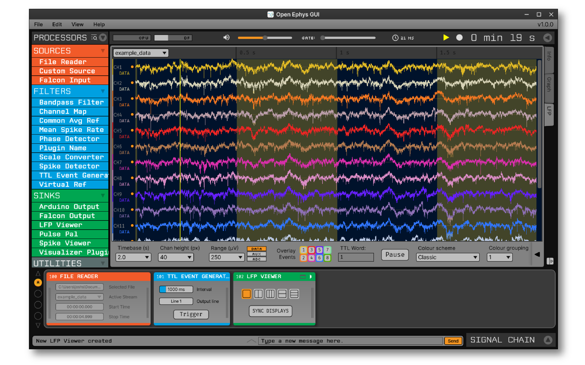

.. _makingyourownvisualizerplugin:
.. role:: raw-html-m2r(raw)
   :format: html

Making Your Own Visualizer Plugin
==================================

The Open Ephys GUI was designed to be extended via plugins that can be developed and shared independently of the main application. This is the primary way in which end users are encouraged to add new functionality to the GUI.  

This tutorial will guide you through the steps involved in making a Visualizer plugin from scratch. At the end, you will have created a "Rate Viewer" plugin, which displays the rate at which spikes coming in from upstream.

Along with explaining how to configure the plugin and set up the main :code:`process()` method, this tutorial will demonstrate how to create a Visualizer for the plugin using the GUI's built-in Interactive Plot class. 

.. important:: These instructions assume you have already compiled the main application from source. If not, you should start by following the instructions on :ref:`this page <compilingthegui>`.

Creating a new plugin repository
#################################

The first step in creating a plugin is to create a new code repository from a template. There are five different types of plugins that include pre-defined templates: **Processor Plugins**, **Visualizer Plugins**, **Data Threads**, **Record Engines**, and **File Sources**. Since we are creating a plugin that visualizes data by creating a separate canvas, we will use the **Visualizer Plugin** template:

1. Log in to your `GitHub <https://github.com/>`__ account.

2. Browse to the `Processor Plugin Template <https://github.com/open-ephys-plugins/visualizer-plugin-template>`__ repository.

3. Click the green "Use this template" button.

.. image:: ../_static/images/tutorials/makeyourownplugin/makeyourownplugin-01.png
  :alt: Visualizer Plugin Template Repository

4. Name the repository "rate-viewer", since the main purpose of this plugin is to visualize spike rate of an electrode.

5. Click the green "Create repository from template" button.

.. image:: ../_static/images/tutorials/makeyourownplugin/makeyourownplugin-02.png
  :alt: Create rate-viewer Repository

On your local machine, create an "OEPlugins" directory within the same directory that contains your :code:`plugin-GUI` repository. Then, using the `git <https://git-scm.com/>`__ command line interface or the `GitHub Desktop <https://desktop.github.com/>`__ app, clone the newly created plugin repository into this directory. Your directory structure should look something like this:

.. code-block:: 

   code_directory/
      plugin-GUI/
      OEPlugins/
         rate-viewer/
            Build/
            Resources/
            Source/
            CMakeLists.txt
            CMAKE_README.txt
            README.md

Editing :code:`OpenEphysLib.cpp` and other files
#################################################

Inside the "Source" directory, you'll find the :file:`OpenEphysLib.cpp` file that contains critical information about your plugin. Open it in your preferred text editor and make the following changes:

Rate Viewer plugin will be a "sink", meaning it creates a canvas to visualize the data by inheriting the `Visualizer <https://github.com/open-ephys/plugin-GUI/blob/master/Source/Processors/GenericProcessor/GenericProcessor.h>`__ class. This Visualizer is is owned by the plugin's editor which needs to inherit from the `VisualizerEditor <https://github.com/open-ephys/plugin-GUI/blob/main/Source/Processors/Editors/VisualizerEditor.h>`__ class. 

Now, we can provide the plugin's metadata (name, type, creator, etc.) to the GUI's Plugin Manager by editing the following lines in :code:`OpenEphysLib.cpp`:

1. Change :code:`info->name` to :code:`Rate Viewer`

2. Change :code:`info->processor.name` to :code:`Rate Viewer`

3. Change :code:`info->processor.creator` to :code:`&(Plugin::createProcessor<RateViewer>);`

When you're finished, the file should look like this:

.. code-block:: c++
   :caption: OpenEphysLib.cpp
   
   extern "C" EXPORT void getLibInfo(Plugin::LibraryInfo* info)
   {
      /* API version, defined by the GUI source.
      Should not be changed to ensure it is always equal to the one used in the latest codebase.
      The GUI refuses to load plugins with mismatched API versions */
      info->apiVersion = PLUGIN_API_VER;
      info->name = "Rate Viewer"; // Name of the plugin library <---- UPDATE
      info->libVersion = "0.1.0"; //Version of the plugin
      info->numPlugins = NUM_PLUGINS;
   }

   extern "C" EXPORT int getPluginInfo(int index, Plugin::PluginInfo* info)
   {
      switch (index)
      {
         //one case per plugin. This example is for a processor which connects directly to the signal chain
      case 0:

         //Type of plugin. See "Source/Processors/PluginManager/OpenEphysPlugin.h" for complete info about the different type structures
         info->type = Plugin::Type::PROCESSOR;

         //Processor name
         info->processor.name = "Rate Viewer"; // Processor name shown in the GUI <---- UPDATE

         //Type of processor. Visualizers are usually sinks, but they can also be SOURCE or FILTER processors.
         info->processor.type = Processor::Type::SINK;

         //Class factory pointer. Replace "ProcessorPluginSpace::ProcessorPlugin" with the namespace and class name.
         info->processor.creator = &(Plugin::createProcessor<RateViewer>); // <---- UPDATE
         break;

      default:
         return -1;
         break;
      }
      return 0;
   }

|

Next, rename the :code:`VisualizerPlugin.cpp` & :code:`VisualizerPlugin.h` files to :code:`RateViewer.cpp` and :code:`RateViewer.h`, and find and replace the **VisualizerPlugin** class name with **RateViewer** everywhere in the .cpp and .h files. Do the same with :code:`VisualizerPluginEditor.cpp`, :code:`VisualizerPluginEditor.h`, :code:`VisualizerPluginCanvas.cpp`, and :code:`VisualizerPluginCanvas.h`. 

Also, don't forget to update the include inside :code:`OpenEphysLib.cpp` from :code:`#include "VisualizerPlugin.h"` to :code:`#include "RateViewer.h"`.

Compiling your plugin
########################

At this point, you should be able to compile your plugin and load it into the GUI. We advise you to compile and test the plugin every time you make changes, so that it is easier for you to identify what changes broke the code, if it happens.

To compile the plugin, please follow the OS-specific instructions described on the :ref:`compiling plugins <compilingplugins>` page.

Setting up the Processor methods
##########################################

Right now, our plugin won't do anything with the incoming data when it's placed in the signal chain. Spike data passed into the :code:`process()` method will not be used in any way.

Let's change that by inserting code to grab all the available spike channels (electrodes) and store the channel metadata locally. This is necessary as we want the user to have the ability to change the electrode for spike rate visualization. For now, we will just save the electrode information. In the subsequent steps, we will make it possible to change the active electrode via a drop-down menu (ComboBox) in the plugin's editor.

To make sure all available electrodes' information is valid throughout the session, we need to update the electrode metadata in the :code:`updateSettings()` method, which is called whenever the signal chain is modified. Before overriding the :code:`updateSettings()` method, we need a something to store the electrode information, so we'll define a electrode :code:`struct` first.

In the plugin processor's :code:`.h` file, add the following lines under the :code:`private` specifier:

.. code-block:: c++
   :caption: RateViewer.h

   private:

      struct Electrode
      {
         String name;

         uint16 streamId;

         float sampleRate;

         bool isActive = false; // To keep track of which electrode is being visualized
      };

      OwnedArray<Electrode> electrodes;
      std::map<const SpikeChannel*, Electrode*> electrodeMap;

Note that we need to create an array of :code:`.h` to store information of all the incoming SpikeChannels as well as a :code:`std::map` to map all the electrodes to its respective SpikeChannel.

Next, inside the :code:`updateSettings()` method, we will loop through the available SpikeChannels and store its metadata.

In the plugin's :code:`.cpp` file, add the following lines 

.. code-block:: c++
   :caption: RateViewer.cpp

   void RateViewer::updateSettings()
   {
      electrodes.clear(); // clear previous entries first
      electrodeMap.clear();

      for(auto spikeChan : spikeChannels)
      {
         if(spikeChan->isValid())
         {
               Electrode* electrode = new Electrode();
               electrode->name = spikeChan->getName();
               electrode->streamId = spikeChan->getStreamId();
               electrode->sampleRate = spikeChan->getSampleRate();
               electrodes.add(electrode);
               electrodeMap[spikeChan] = electrode;
         }
      }
   }

Now, the processor is ready to receive spike events. Inside our process method, we need to enable checking for spike events. To do so, update the :code:`process()` method as follows:

.. code-block:: c++
   :caption: RateViewer.cpp

   void RateViewer::process(AudioBuffer<float>& buffer)
   {	
      checkForEvents(true); // true as plugin handle's spikes
   }

Adding UI components to the editor
###################################

Currently, there is no active electrode set for which spike data needs to be processed. In order to change the active electrode during runtime, we need to create a user interface for our plugin. This UI will be defined inside of the :code:`RateViewerEditor` class.

You should have already modified the file and class names for the plugin's editor; make sure the editor's :code:`.h` and :code:`.cpp` files look like this:

.. code-block:: c++
   :caption: RateViewerEditor.h

   #include <VisualizerEditorHeaders.h>

   class RateViewerEditor  : public VisualizerEditor
   {
   public:

      /** Constructor */
      RateViewerEditor(GenericProcessor* parentNode);

      /** Destructor */
      ~RateViewerEditor() { }

      /** Creates the canvas */
      Visualizer* createNewCanvas();

   private:

      /** Generates an assertion if this class leaks */
      JUCE_DECLARE_NON_COPYABLE_WITH_LEAK_DETECTOR(RateViewerEditor);
   };

.. code-block:: c++
   :caption: RateViewerEditor.cpp

   #include "RateViewerEditor.h"

   #include "RateViewerCanvas.h"
   #include "RateViewer.h"

   RateViewerEditor::RateViewerEditor(GenericProcessor* p)
      : RateViewerEditor(p, "Spike Rate", 210) // second parameter is the tab name, third is the editor width
   {

   }

   Visualizer* RateViewerEditor::createNewCanvas()
   {
      return new RateViewerCanvas((RateViewerEditor*) getProcessor());
   }

Creating a ComboBox
--------------------

To allow changing the active electrode, we will create a ComboBox or a drop-down menu that will list all the available electrodes for the currently selected stream in the editor. We will create a JUCE::ComboBox inside the editor's constructor as follows: 

.. code-block:: c++
   :caption: RateViewerEditor.cpp

   RateViewerEditor::RateViewerEditor(GenericProcessor* p)
      : VisualizerEditor(p, "Spike Rate", 210),
        rateViewerCanvas(nullptr)
   {

      electrodeList = std::make_unique<ComboBox>("Electrode List");
      electrodeList->addListener(this);
      electrodeList->setBounds(50,40,120,20);
      addAndMakeVisible(electrodeList.get());

      rateViewerNode = (RateViewer*)p;
   }

.. code-block:: c++
   :caption: RateViewerEditor.h

   private:

      std::unique_ptr<ComboBox> electrodeList;

      RateViewerCanvas* rateViewerCanvas;
      RateViewer* rateViewerNode;

Compile and load the plugin into the GUI to see the newly added ComboBox, which will be empty for now.

To add the available electrodes list to the ComboBox, we will have to ask the processor for the list. Since we want to make sure the list gets updated every time the signal chain is modified or a different stream is selected, we have to carry out the entire process inside the editor's :code:`selectedStreamHasChanged()` method. 

First, lets add a function in the processor that returns an array of electrode names for the specified stream.

.. code-block:: c++
   :caption: RateViewer.cpp

   Array<String> RateViewer::getElectrodesForStream(uint16 streamId)
   {
      Array<String> electrodesForStream;

      for (auto electrode : electrodes)
      {
         if (electrode->streamId == streamId)
               electrodesForStream.add(electrode->name);
      }

      return electrodesForStream;
   }

.. code-block:: c++
   :caption: RateViewer.h

   public:

      /** Returns an array of available electrodes*/
      Array<String> getElectrodesForStream(uint16 streamId);

Now, we can override the :code:`selectedStreamHasChanged()` method as follows:

.. code-block:: c++
   :caption: RateViewerEditor.cpp

   void RateViewerEditor::selectedStreamHasChanged()
   {
      electrodeList->clear();

      if (selectedStream == 0)
      {
         return;
      }

      currentElectrodes = rateViewerNode->getElectrodesForStream(selectedStream);

      int id = 0;

      for (auto electrode : currentElectrodes)
      {

         electrodeList->addItem(electrode, ++id);
               
      }

      electrodeList->setSelectedId(1, sendNotification);
   }

.. code-block:: c++
   :caption: RateViewerEditor.h

   public:

      /** Called when selected stream is updated*/
      void selectedStreamHasChanged() override;

Once compiled and loaded into the GUI, if there are any SpikeChannels, then the ComboBox will be populated with the list of electrodes.

.. image:: ../_static/images/tutorials/makeyourownplugin/makeyourownplugin-03.png
  :alt: Create a slider

Creating a TextBox parameter editors
--------------------------------------

To calculate the actual spike rate of an electrode, we need to define a window with a set size (in milliseconds) that encapsulates all the spikes in that time frame and then bin those spikes into smaller windows that allows us to gauge the rate of spikes in a specific bin.

.. code-block:: c++
   :caption: TTLEventGeneratorEditor.cpp
   
   // event output line
   addComboBoxParameterEditor("out", 50, 35);

Also be sure to initialize the corresponding parameter inside the :code:`TTLEventGenerator` processor constructor:

.. code-block:: c++
   :caption: TTLEventGenerator.cpp

   StringArray outputs;
   for(int i = 1; i <= 8; i++)
      outputs.add(String(i));

   // Event output line
   addCategoricalParameter(Parameter::GLOBAL_SCOPE, "out", "Event output line", outputs, 0);

Compile and load the plugin into the GUI to see the newly added ComboBox.

.. image:: ../_static/images/tutorials/makeyourownplugin/makeyourownplugin-04.png
  :alt: Create a combobox

Creating a custom parameter editor (optional)
-----------------------------------------------

To make it possible for the user to trigger TTL events manually, we will add a button to the editor that the user can click on to generate an event. Since there is no built-in parameter editor for this, we need to create a custom one. To do this, add a  :code:`ManualTriggerButton` class above the main editor class in the :code:`TTLEventGeneratorEditor.h` file:

.. code-block:: c++
   :caption: TTLEventGeneratorEditor.h

   class ManualTriggerButton : public ParameterEditor,
      public Button::Listener
   {
   public:

      /** Constructor */
      ManualTriggerButton(Parameter* param);

      /** Destructor*/
      virtual ~ManualTriggerButton() { }

      /** Respond to trigger button clicks*/
      void buttonClicked(Button* label) override;

      /** Update view of the parameter editor component*/
      void updateView() {};

      /** Sets component layout*/
      void resized() override;

   private:
      std::unique_ptr<TextButton> triggerButton;
   };

Then, in the custom parameter editor's constructor, we'll initialize the button, add a button listener, set the bounds, and make it visible in the editor by adding the following lines of code:

.. code-block:: c++
   :caption: TTLEventGeneratorEditor.cpp

   ManualTriggerButton::ManualTriggerButton(Parameter* param)
	: ParameterEditor(param)
   {
      triggerButton = std::make_unique<UtilityButton>("Trigger", Font("Fira Code", "Regular", 12.0f)); // button text, font to use
      triggerButton->addListener(this); // add listener to the button
      addAndMakeVisible(triggerButton.get());  // add the button to the editor and make it visible

      setBounds(0, 0, 60, 20); // set the bounds of custom parameter editor
   }

To handle button clicks, implement the :code:`buttonClicked` method as indicated below. Inside this method, we need to call :code:`setNextValue()` on the parameter as that will notify the processor about parameter value change. We also need to set the bounds of the button in the :code:`resized()` method as follows:

.. code-block:: c++
   :caption: TTLEventGeneratorEditor.cpp

   void ManualTriggerButton::buttonClicked(Button* b)
   {
      param->setNextValue(triggerButton->getLabel());
   }

   void ManualTriggerButton::resized()
   {

      triggerButton->setBounds(0, 0, 60, 20);
   }

Now, we need to initialize the custom parameter editor inside the :code:`TTLEventGeneratorEditor` constructor by getting the pointer to the parameter that we will create inside the :code:`TTLEventGenerator` processor constructor, like this:

.. code-block:: c++
   :caption: TTLEventGeneratorEditor.cpp

   // custom button parameter editor
   Parameter* manualTrigger = getProcessor()->getParameter("manual_trigger");
   addCustomParameterEditor(new ManualTriggerButton(manualTrigger), 60, 95);

.. code-block:: c++
   :caption: TTLEventGenerator.cpp

    // Parameter for manually generating events
   addStringParameter(Parameter::GLOBAL_SCOPE, "manual_trigger", "Manually trigger TTL events", String());

.. note:: Since the custom button parameter editor is only used to tell the processor to trigger an event, we are creating the parameter to handle button click callbacks only. 

Compile and load the plugin into the GUI to see the newly added button:

.. image:: ../_static/images/tutorials/makeyourownplugin/makeyourownplugin-05.png
  :alt: Create a custom parameter editor

Responding to parameter value changes
#####################################

Now, let's allow our UI elements to change the state of the plugin. To do this, we need to create variables inside the :code:`TTLEventGenerator` class that can be updated by our button, slider, and ComboBox parameter editors. The values of these variables *must* be updated through a special method, called :code:`parameterValueChanged()`, which responds to any parameter editor value changes. This is because the :code:`process()` method is called by a separate thread from the user interface, and the variables it needs to access can only be updated at specific times. Modifying variables via :code:`parameterValueChanged()` ensures that they are handled properly, and prevents unexpected behavior or segmentation faults.

First, let's update the :code:`TTLEventGenerator` header file as follows:

.. code-block:: c++
   :caption: TTLEventGenerator.h

   public:
      /** Called whenever a parameter's value is changed */
      void parameterValueChanged(Parameter* param) override;

   private:
      bool shouldTriggerEvent;
      bool eventWasTriggered;
      int triggeredEventCounter;

      float eventIntervalMs;
      int outputLine;
   
Next, let's initialize the parameters variables in the :code:`TTLEventGenerator()` constructor method.

.. code-block:: c++
   :caption: TTLEventGenerator.cpp

   shouldTriggerEvent = false;
   eventWasTriggered = false;
   triggeredEventCounter = 0;

   eventIntervalMs = 50.0f;
   outputLine = 0;

.. important:: Always be sure to initialize all member variables in the class constructor in order to avoid unexpected behavior.

Now, we can define how these variables are updated inside the :code:`parameterValueChanged()` method:

.. code-block:: c++
   :caption: TTLEventGenerator.cpp

   void TTLEventGenerator::parameterValueChanged(Parameter* param)
   {
      if (param->getName().equalsIgnoreCase("manual_trigger"))
      {   
         shouldTriggerEvent = true;
      }
      else if(param->getName().equalsIgnoreCase("frequency"))
      {
         eventIntervalMs = (float)param->getValue();
      }
      else if(param->getName().equalsIgnoreCase("out"))
      {
         outputLine = (int)param->getValue() - 1;
      }
   }

Finally, we need to update our process method to make use of these parameters:

.. code-block:: c++

   void TTLEventGenerator::process(AudioSampleBuffer& buffer)
   {
      // loop through the streams
      for (auto stream : getDataStreams())
      {
         // Only generate on/off event for the first data stream
         if(stream == getDataStreams()[0])
         {
            int totalSamples = getNumSamplesInBlock(stream->getStreamId());

            int eventIntervalInSamples = (int) stream->getSampleRate() * eventIntervalMs / 2 / 1000;

            if (shouldTriggerEvent)
            {

               // add an ON event at the first sample.
               setTTLState(0, outputLine, true);

               shouldTriggerEvent = false;
               eventWasTriggered = true;
               triggeredEventCounter = 0;
            }

            for (int i = 0; i < totalSamples; i++)
            {
               counter++;

               if (eventWasTriggered)
                  triggeredEventCounter++;

               if (triggeredEventCounter == eventIntervalInSamples)
               {
                  setTTLState(i, outputLine, false);

                  eventWasTriggered = false;
                  triggeredEventCounter = 0;
               }
               
               if (counter == eventIntervalInSamples)
               {

                  state = !state;
                  setTTLState(i, outputLine, state);
                  counter = 0;

               }

               if (counter > eventIntervalInSamples)
                  counter = 0;
            }
         }
      }
      
   }

And that's it! If you compile and test your plugin, the UI elements in the editor should now change the events that appear in the LFP Viewer.

Next steps
#############

There are a number of ways this plugin could be enhanced. To practice creating different kinds of UI elements, you could try implementing some of the features below, or come up with your own!

- Ensure an "OFF" event is sent when the output bit is changed.

- Add a button that turns the plugin's output on and off.

- Add an editable label that can be used to define the time between ON/OFF events (currently the output bit flips at a 50% duty cycle).

- Make all the parameters stream-specific and generate TTL events for each input stream.

|

