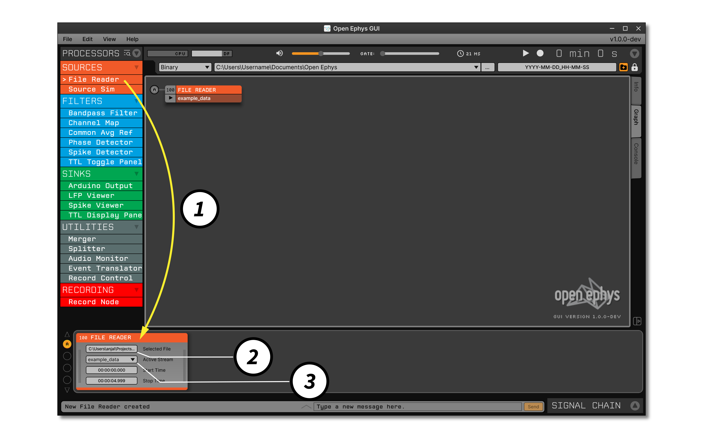
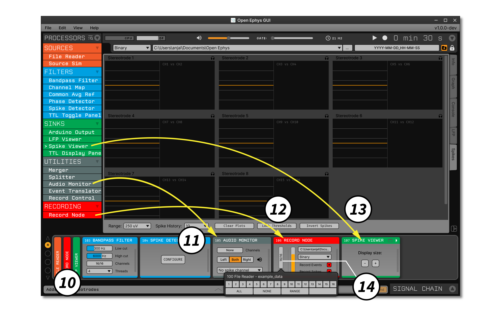
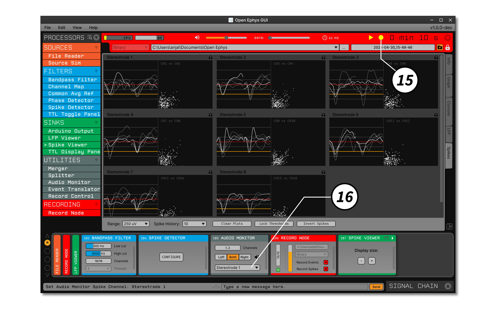
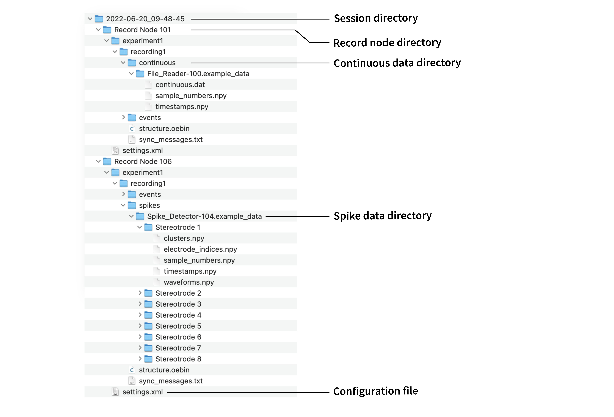

.. _buildingasignalchain:
.. role:: raw-html-m2r(raw)
   :format: html

########################
Building a signal chain
########################

The Open Ephys GUI provides a great deal of flexibility by allowing the user to mix and match different plugins. However, this freedom can be daunting when you're just starting out. This section will guide you through the steps required to build a standard signal chain for extracellular electrophysiology, which allows you to acquire, record, and visualize continuous signals and spikes. It assumes you're already familiar with the :ref:`general layout of the user interface <exploringtheui>`, so we recommend reading through the previous section if you haven't already.

Adding a data source
=====================

|

1. Drag the :ref:`filereader` from the Processor List, and drop it on the Signal Chain. In an actual experiment, this would be substituted with the data source of your choice, such as the :ref:`rhythmfpga` or :ref:`neuropixelspxi`.

2. Press the buttoned labeled :code:`F` to select a file to read in. The :ref:`filereader` accepts :code:`.oebin` files, which contain information about one or more continuous data files in :ref:`binaryformat`. If you downloaded the GUI as a :code:`.zip` file, the example files are available in the *DataFiles* folder. If you downloaded the GUI's source code, the example files can be found in *Resources/DataFiles*. Alternatively, the files can be downloaded via `this link <https://dl.bintray.com/open-ephys-gui/SampleData/:DataFiles.zip>`__.

3. Select the subprocessor to stream data from (one of several available continuous data files indexed by the :code:`.oebin` file that was loaded). In this example, we'll be using :code:`data_stream_16ch_cortex`, which contains data from 8 stereotrodes implanted in mouse somatosensory cortex, sampled at 40 kHz.

Adding a Record Node
=====================

.. image:: ../_static/images/buildingasignalchain/buildingasignalchain-02.png
  :alt: Adding a Record Node

|

4. Scroll to the bottom of the Processor List, then drag and drop a Record Node onto the Signal Chain. This will record all data that comes out of the plugin directly to the left of it. The orange bar on the left indicates the fraction of disk space available in your default data directory. To change the location where data will be saved, click the ellipsis (:code:`...`) button in the upper right of the Record Node.

Visualizing continuous signals
===============================

.. image:: ../_static/images/buildingasignalchain/buildingasignalchain-03.png
  :alt: Visualizing continuous signals

|

5. Drag and drop a :ref:`splitter` to the right of the Record Node, to allow signals to be processed as two independent data streams.

6. Drag and drop a :ref:`lfpviewer` to the right of the :ref:`splitter`.

7. Click the "tab" button in the upper right of the :ref:`lfpviewer`, to open the visualizer in the Viewport.

Acquiring data
=====================

.. image:: ../_static/images/buildingasignalchain/buildingasignalchain-04.png
  :alt: Acquiring data

|

8. Click the "play" button to begin data acquisition. Once you've confirmed that the data appears in the LFP Viewer visualization, click the "play" button again to stop acquisition.

Detecting spikes
=====================

.. image:: ../_static/images/buildingasignalchain/buildingasignalchain-05.png
  :alt: Detecting spikes

|

9. Click the lower arrow button of the :ref:`splitter` to continue building the signal chain.

10. Drag and drop a :ref:`bandpassfilter` to the right of the :ref:`splitter`. With the default settings, this will filter data in a range that's appropriate for detecting action potential waveforms.

11. Drag and drop a :ref:`spikesorter` to the right of the :ref:`bandpassfilter`. The :ref:`spikesorter`'s functionality is a superset of the :ref:`spikedetector`.

12. Use the arrow buttons to increase the number of electrodes to 8. Then, press the :code:`+` button to add 8 stereotrodes. This will automatically create 8 pairs of channels that capture spike waveforms whenever the signal on one of the two channels crosses a threshold. It's also possible to create single electrodes (1 linked channel) or tetrodes (4 linked channels).

Visualizing spikes
==================================

|

13. Double-click on the names of the :ref:`filereader`, Record Node, and :ref:`bandpassfilter` to collapse their plugin editors. Alternatively, you can use the arrow buttons on the far right side of the Signal Chain to browse through active plugin editors.

14. Drag and drop another Record Node to the right of the :ref:`spikesorter`. This will be used to save the spikes coming out of this plugin, which are not accessible to the first Record Node.

15. Click on the vertical bars on the *left* of the new Record Node to expose the subprocessor configuration interface. This Record Node only has one subprocessor (a set of synchronously sampled continuous data channels). Clicking on the vertical bar labeled :code:`SPO` will show 16 channels highlighted in red. Click the "NONE" button to deselect these channels, since they are already being recorded by the original Record Node. Next, click the red button labeled "RECORD EVENTS" to disable event saving. Importantly, though, the "RECORD SPIKES" button should still be red, to indicate that any incoming spikes will be saved by this Record Node. Lastly, if you changed the data directory for the previous Record Node, you should do so again.

16. Drag and drop a :ref:`spikeviewer` to the right of the Record Node.

17. Click the tab button in the upper right of the :ref:`spikeviewer` to open the visualizer in the Viewport.

18. Click the "play" button to re-start acquisition. Now, you should see spikes being displayed by the :ref:`spikeviewer`.

Listening to and recording spikes
==================================

|

13. While acquisition remains active, press the "MONITOR" button in the :ref:`spikesorter` to listen to the spikes from the selected electrode. If you can't hear anything, check that the volume slider in the Control Panel is activated.

14. Now, press the record button (circle) in the Control Panel to being writing data. This will create a new directory with the following internal structure:

|

Note that each Record Node saves its own set of files, to avoid any conflicts. The first Record Node saved continuous data from the :ref:`filereader`, while the second Record Node saves spikes that were detected by the :ref:`spikesorter`. More details about :ref:`recordingdata` can be found in the next section.

