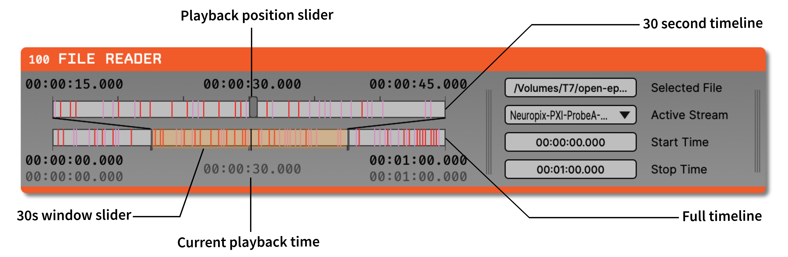

.. _filereader:
.. role:: raw-html-m2r(raw)
   :format: html

File Reader
=====================

|

.. csv-table:: Reads data from a local file.
   :widths: 18, 80

   "*Plugin Type*", "Source"
   "*Platforms*", "Windows, Linux, macOS"
   "*Built in?*", "Yes"
   "*Key Developers*", "Aarón Cuevas López"
   "*Source Code*", "https://github.com/open-ephys/plugin-GUI/tree/master/Source/Processors/FileReader"

The File Reader is currently compatible with files saved in the :ref:`binaryformat` (indexed with a :code:`structure.oebin` file), which can either be saved directly from the Open Ephys GUI or from another program. Each :code:`.oebin` file can point to multiple continuous files, known as subprocessors.

You can play back a subset of a recorded file by changing the "start" and "end" times at the bottom of the File Reader editor.

.. tip:: Acquisition won't start until the File Reader knows where it's data is coming from. Make sure you select a file before hitting the "play" button.

There are four example files included in the GUI repository that can be used with the File Reader, found in the `Resource/DataFiles` directory (source code download) or the `DataFiles` directory (executable download):

* :code:`data_stream_16ch_cortex` - data from 8 stereotrodes (16 channels total) recorded from barrel cortex of an awake mouse. The signals contain many action potentials, and are useful for test spike detection pipelines.

* :code:`data_stream_16ch_hippocampus` - one channel of data recorded from mouse CA1, copied across 16 channels. The signals have large-amplitude theta oscillations, and can be used to test phase-triggered stimulation.

* :code:`data_stream_sine_wave` - 16 channels of a simple, 1000-microvolt sine wave. There's a small glitch near the end.

* :code:`chirps_16_channels_At40kHz` - 16 channels of frequency sweeps at 40 kHz

.. note:: These example files can also be downloaded via `this link <https://dl.bintray.com/open-ephys-gui/SampleData/DataFiles.zip>`__.

