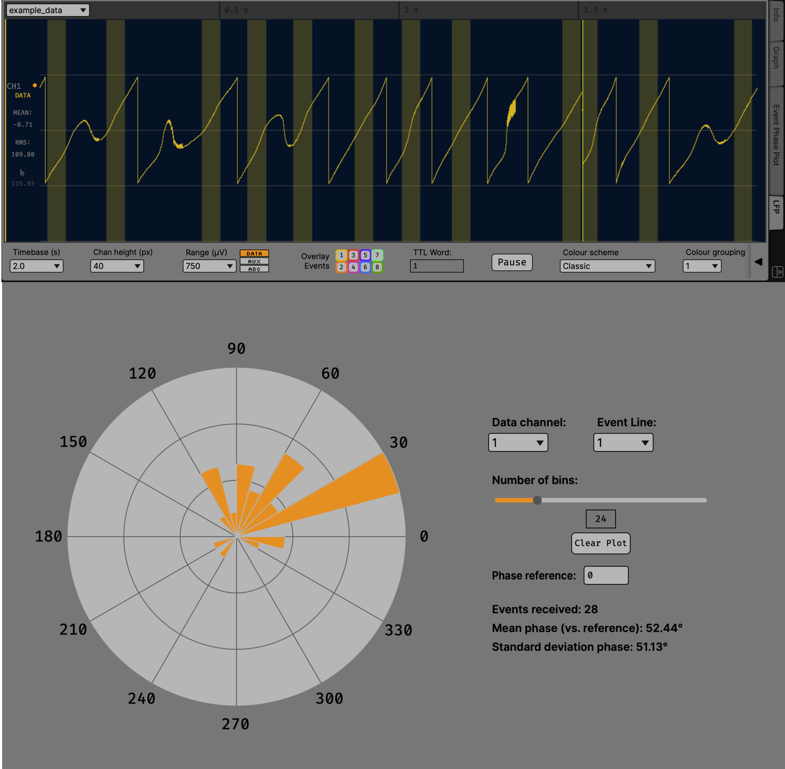

.. _phasecalculator:
.. role:: raw-html-m2r(raw)
   :format: html

################
Phase Calculator
################

.. image:: ../../_static/images/plugins/phasecalculator/phasecalculator-01.png
  :alt: Phase Calculator plugin settings interface

|

.. csv-table:: This plugin estimates the phase of inputs an input signal within a specified passband in real time. Its primary purpose is to enable closed-loop stimulation, typically in combination with the Crossing Detector and either the Pulse Pal or an external stimulation system that receives ZeroMQ events (for example, the `LabVIEW implementation here <https://github.com/tne-lab/closed-loop-stim>`__). It can also output the magnitude or imaginary component of the band-limited analytic signal instead of the phase. (The "PH+MAG" mode outputs both phase and magnitude, in separate channels.) Finally, the visualization tab or window can receive TTL events and display the delayed but precise phase of a specified input at the event onset samples in a rose plot. This allows real-time monitoring of stimulation accuracy.
   :widths: 18, 80

   "*Plugin Type*", "Filter"
   "*Platforms*", "Windows, Linux, macOS"
   "*Built in?*", "No"
   "*Key Developers*", "Ethan Blackwood, Mark Schatza"
   "*Source Code*", "https://github.com/open-ephys-plugins/phase-calculator"

Plugin configuration
######################

* **Important!** Since the phase estimation algorithm is somewhat processor-intensive, by default all input channels are disabled. To enable the channels you would like to estimate the phase (or other component) of, select them in the "PARAM" section of the drawer. If "PH+MAG" is selected as the output, this will also create the additional magnitude outputs for each selected input.

* In the FREQ RANGE drop-down menu, choose a range of frequencies that includes the band you want to filter to. This determines which of the pre-designed Hilbert transformer filters is used internally (since if we tried to use one filter for all frequencies, it would end up with terrible performance everywhere). Note that the delta band is just too low to get a reasonably accurate phase estimate, even when downsampling to 500 Hz as this plugin does (before interpolating the output).

* Use the LOW and HIGH parameters to select the desired frequency passband. (Inputs should be unfiltered; the Phase Calculator uses its own bandpass filter internally.) Changing the frequency range will automatically set a default high and low cut, but they can be changed to filter to any band within the range.

* AR REFRESH and ORDER control the auto-regressive model used to predict the "future" portion of the Hilbert buffer. AR parameters are estimated using Burg's method. The default settings seem to work well, but other settings (particularly lower orders) may also work well.

* OUTPUT allows selection of which component(s) of the analytic signal to output (for all enabled channels). If PH+MAG is selected, a magnitude (amplitude envelope) output channel is added to the outputs for each selected input channel; they appear in the ascending numerical order of their corresponding input/phase output channels. See image below for an example of outputting both phase and magnitude.

.. image:: ../../_static/images/plugins/phasecalculator/phase_calculator_demo.png
  :alt: Phase Calculator demo

|

* Clicking the tab or window button opens the "event phase plot" view. This allows non-real-time plotting of the precise phase of received TTL events on a channel of interest. The data channel must be one that is selected for processing in the Phase Calculator "params" drawer, as the filtering step is shared between real-time phase estimation and event phase visualization. All plot controls can be used while acquisition is running. "Phase reference" subtracts the input (in degrees) from all phases (in both the rose plot and the statistics).

|
|
