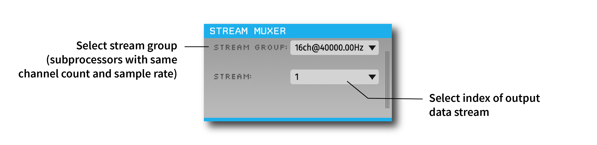

.. _streammuxer:
.. role:: raw-html-m2r(raw)
   :format: html

################
Stream Muxer
################

|

.. csv-table:: Multiplexes data streams with multiple subprocessors.
   :widths: 18, 80

   "*Plugin Type*", "Filter"
   "*Platforms*", "Windows, Linux, macOS"
   "*Built in?*", "No"
   "*Key Developers*", "Aarón Cuevas López"
   "*Source Code*", "https://github.com/open-ephys-plugins/StreamMuxer"

Plugin configuration
######################

Description goes here

