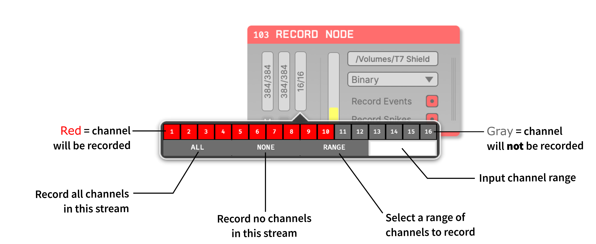

.. _recordingdata:

Recording data
===============

The GUI provides a great deal of flexibility when it comes to recording data. It's possible to write data from any point in the signal chain, using separate data directories or even different data formats. However, it's important to be sure that your recording settings are configured properly, to ensure that you don't lose valuable data.

As of version 0.5.0, the GUI won’t save data unless you have at least one Record Node in your signal chain. This is somewhat different from how things work previously, when every plugin had its own recording selection tab, and all data was streamed to a central data writing interface. This centralization created some unwanted inefficiencies and bottlenecks, which is why the Record Node now behaves like a separate plugin.

Just like any Filter processor, the Record Node can be placed after any Source, Filter, Splitter or Merger processor in your signal chain. However, Record Nodes do not modify the data passing through them, but instead copy and redirect the data to memory using a background thread. Individual Record Nodes inherit settings from the global recording options in the GUI's control panel, but these settings can be overridden locally.

Global recording options
#########################

.. image:: ../../_static/images/recordingdata/global_record_options-01.png
  :alt: The global recording options interface

The GUI's main control panel contains a collapsible panel with the global recording options. These include:

* The data format (see next section for more information)

* An interface for configuring individual data formats (**R** button)

* The default location for recording data (can be overridden by individual Record Nodes)

* Text to prepend to the data directory name (default: blank)

* The current date string used for naming the data directory (will display :code:`YYYY-MM-DD_HH-MM-SS` if recording hasn't started yet)

* Text to append to the data directory name (default: blank)

* A button for starting a new data directory

.. note:: To prevent data from being overwritten, files are grouped by "experiments" and "recordings". Whenever acquisition is stopped, the GUI begins a new experiment; whenever recording is stopped (without stopping acquisition), the GUI begins a new recording. Pressing the **+** button will reset both of these counters to 1.

Available data formats
#######################

The GUI currently supports the following data formats:

* :ref:`binaryformat` stores the data as an array of samples in the following order: ch1 sample1, ch2 sample 1, ch3 sample 1, ..., chN sample 1, ch1 sample 2, ch2 sample 2, etc. It's the most compact format, and therefore can be loaded very quickly. Extra data, like timestamps or events are stored in `NumPy`_ format, which can be easily read and converted to raw binary by stripping the header. Metadata about the recording, such as sample rates or channel counts are stored in an easy-to-parse JSON file.

* :ref:`openephysformat` stores data in files that contains both the data samples and markers that allow data to be recovered if any part of the file becomes corrupted. Each channel is stored in a separate file, which can be convenient or inconvenient for analysis, depending on what you need to do. It's the first format that was used by the GUI, so it's been the most extensively tested. However, it's specific to Open Ephys, and will likely need to be converted to be compatible with most analysis tools. If you're unsure about which format to use, or you're running the GUI on a potentially unstable system, we'd recommend using this.

* :ref:`nwbdataformat` stores data inside an HDF5 file, according to the specification defined by the `Neurodata Without Borders`_ project. It's based on a one-file-per-experiment philosophy, and aims to ensure that the data is self-documenting and easy to share. It comes with all the baggage of HDF5, including the need for a large library to access the data, and the inability to read any of the data if the file becomes corrupted. The Open Ephys NWB format is currently based on the deprecated v1.0 specification, but an up-to-date 2.0 format is coming soon.

* :ref:`kwikdataformat` designed for use with the `KlustaKwik`_ spike sorting package, and is also based on HDF5. It has since been abandoned by the developers of KlustaKwik, for the `reasons outlined here`_. We'll continue to support the KWIK format for Open Ephys data, but we'd recommend moving away from it if you can.

Using the Record Node
#####################

The Record Node, found in the "Recording" section of the Processor List, controls how data is written to disk. Every signal chain requires at least one Record Node in order to save data.

Adding a Record Node into a signal chain brings up the following interface:

.. image:: ../../_static/images/recordingdata/recordnode-01.png
  :alt: The Record Node interface

General Configuration
---------------------

On the top-right of the editor is the **write path selector** which opens up an explorer window to navigate to the desired write directory. Use this to set the root path of where the data files generated from this RecordNode will be stored. 

Directly below, the **engine selector** pull-down lists the available recording formats. Both the write path selector and the engine selector default to the values shown in the Control Panel.

To the left of the engine selector is the **disk space monitor**, which indicates the amount of free space available at the path shown by the write path selector.  

Recording Continuous Channels 
-----------------------------

The continuous channel configuration interfaces are hidden by default, so you will need to use the **show/hide subprocessors** toggle to access them. This displays a set of **continuous channel buffer monitors** and **sync monitors** for every subprocessor. Each subprocessor contains channels that are guaranteed to be sampled synchronously. If there are blocks of channels with different sample rates (for example, from different Neuropixels probes), they will each belong to a separate subprocessor.

The continuous channel buffer monitors track the state of the recording buffer for each subprocessor. If these start to fill up, it indicates that your computer can't keep up with disk writing. In that case, you can try reducing the number of channels being recorded, or split the disk writing duties across multiple record nodes (see below).

Clicking on one of the continuous channel buffer monitors opens up a **channel selector interface** as shown below. By default, the interface has every channel set to record. Through the interface, you can toggle individual channels on/off, select ALL or NONE, or indicate a custom range of channels using Matlab-style slicing:

.. image:: ../../_static/images/recordingdata/EVERY_OTHER.png
  :alt: Selecting every other channel

|

Click and drag multi-channel selection is also available:

.. image:: ../../_static/images/recordingdata/FREE_SELECT.png
  :alt: Selecting every other channel

|

Click anywhere outside the channel selector or use the ESC key to exit. 

Recording Events
-----------------

Below the engine selector is the **toggle event recording** button, which determines whether this Record Node will save incoming events. This will be turned on by default, and should only be turned off if you're sure events are being saved by another Record Node. Regardless of the toggle state, underlying events will not be modified by the Record Node.

Recording Spikes
------------------

The **toggle spikes recording** button will enable/disable recording of any spike data coming into this Record Node. In order for spikes to be detected by the Record Node, you must have a spike-generating processor somewhere upstream of the Record Node in your signal chain. 

Multiple Record Nodes
----------------------

A Record Node can be placed after any Source, Filter, Sink, Splitter, or Merger in your signal chain. In the example below, we are able to record the raw data coming from Neuropixels probes while simultaneously recording the same data after it has passed through a :ref:`bandpassfilter`. In this case, we have configured the first Record Node to write the raw data in the Binary format, while the second Record Nodes will write the filtered data in NWB format.

Synchronizer
-------------

The Record Node has a built-in synchronizer module which can perform real-time alignment of timestamps from asynchronous data sources. The synchronizer only works if each data stream has a TTL channel connected to the same physical digital input line. Each time a new event comes in (either a rising or falling edge), the synchronizer will update its estimate of the true sample rate of each subprocessor, based on the total number of samples that have been received since the first event. The Record Node will generate a :code:`sychronized_timestamps.npy` file containing the timestamps (in seconds) relative to the time of the first event.

Below each continuous channel buffer monitor is a **sync channel monitor** which provides an interface for designating an input subprocessor as the master clock, as well as selecting a digital input channel for each subprocessor to serve as a sync channel. Again, all of the TTL channels used for synchronization must be connected to the same physical digital input line in order for the synchronizer to work properly. There can only be one sync channel per data source and the active sync channel is always indicated with an orange background.

The active master subprocessor will be indicated by a letter ‘M' on its sync channel monitor. This subprocessor will be used as the reference clock, to which all other subprocessors will be synchronized. 

|

.. image:: ../../_static/images/recordingdata/SynchronizerInterface.png
  :alt: View of the synchronizer interface

|

Once the synchronizer has been configured, starting data acquisition as normal will automatically start the synchronizer. Each sync channel monitor will change from gray to orange to indicate the synchronizer is running. Once a subprocessor has been synchronized with the master, the corresponding sync channel monitor will turn green. Data sources with higher sample rates will generally synchronize more quickly than those with lower sample rates.

|

.. image:: ../../_static/images/recordingdata/recordnode-03.png
  :alt: Another view of the synchronizer interface

|

Currently, the synchronizer will only generate outputs when using the Binary data format for recording. The result is a :code:`synchronized_timestamps.npy` file that contains a double (:code:`float64`) timestamp for each :code:`int64` timestamp found in the original, unsynchronized timestamps.npy file for each data source. 

.. note:: The synchronizer is a quick-and-easy way to generate aligned timestamps with ~0.1 ms resolution (for 30 kHz inputs). However, it will never be as accurate as synchronization performed offline, especially for recordings longer than one hour. Offline synchronization is recommended for any analysis that requires fine temporal precision.

.. _NumPy: https://numpy.org/
.. _Neurodata Without Borders: https://www.nwb.org/
.. _KlustaKwik: https://github.com/klusta-team/klustakwik
.. _reasons outlined here: https://cyrille.rossant.net/moving-away-hdf5/

.. toctree::
    :hidden:
    :maxdepth: 5

    Binary format (default)
    Open Ephys format
    NWB format
    KWIK format

.. role:: raw-html-m2r(raw)
   :format: html

