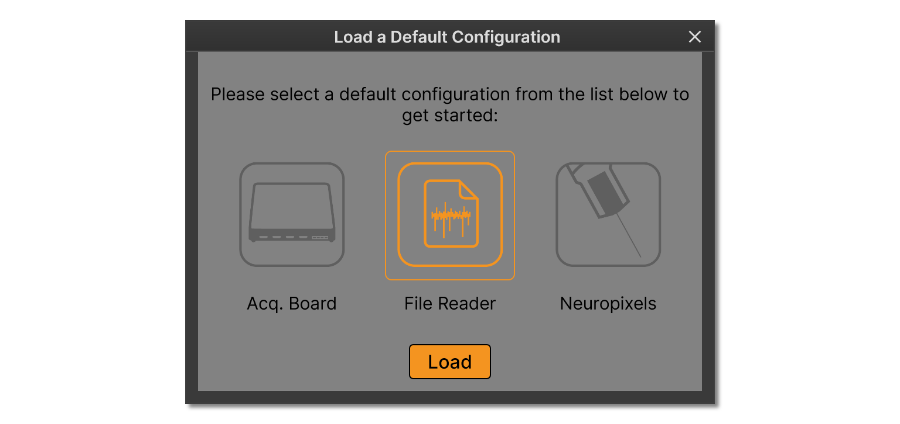
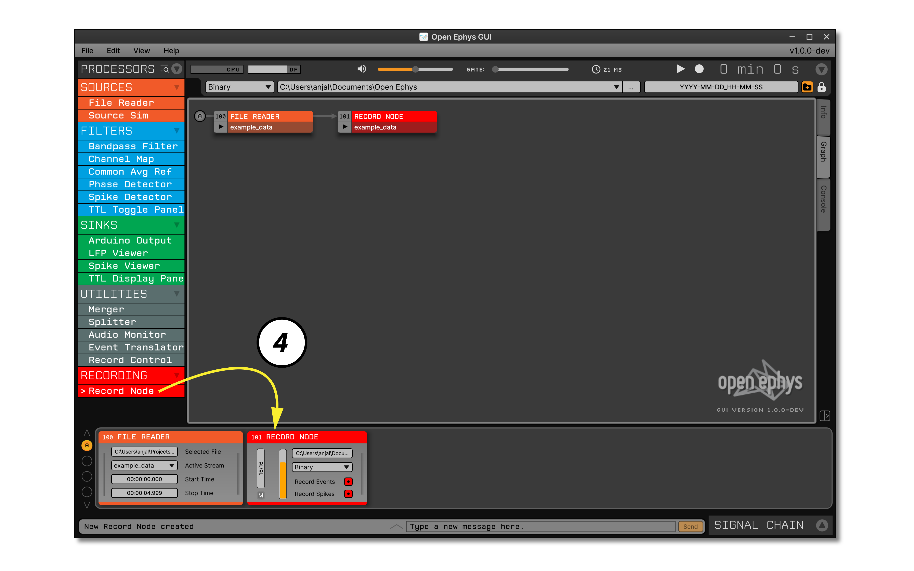
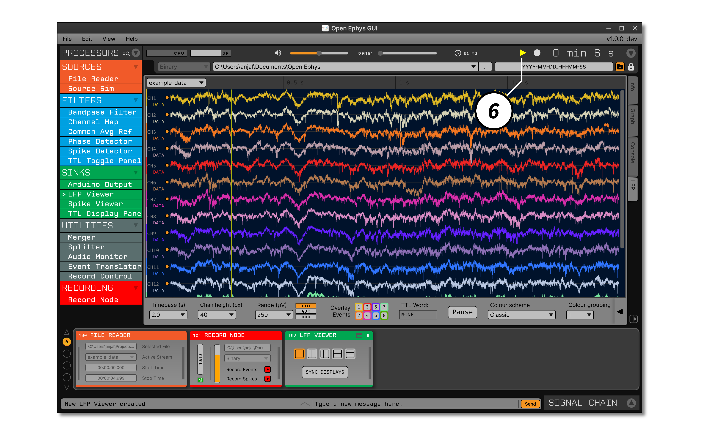
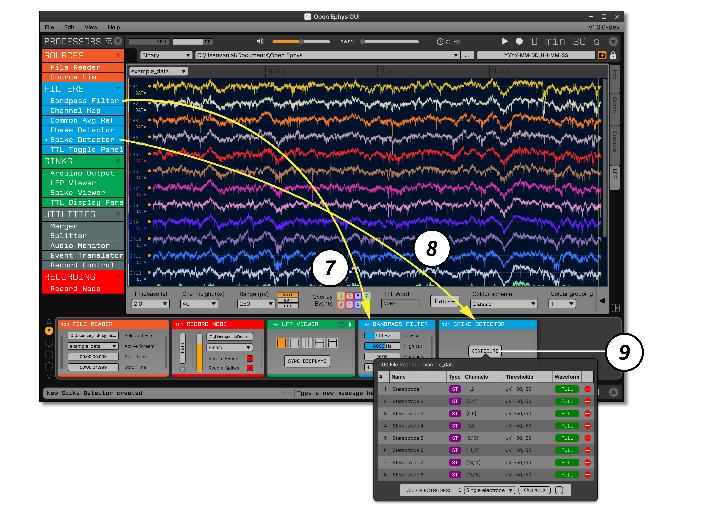

.. _buildingasignalchain:
.. role:: raw-html-m2r(raw)
   :format: html

########################
Building a signal chain
########################

The Open Ephys GUI provides a great deal of flexibility by allowing the user to mix and match different plugins. However, this freedom can be daunting when you're just starting out. This section will guide you through the steps required to build a standard signal chain for extracellular electrophysiology, which allows you to acquire, record, and visualize continuous signals and spikes. It assumes you're already familiar with the :ref:`general layout of the user interface <exploringtheui>`, so we recommend reading through the previous section if you haven't already.

Default configurations
======================

The first time you launch the GUI, you'll be given the opportunity to select a default configuration file. The default configuration window can also be accessed at a later time by selecting **Load a default config** from the **File** menu.

If the selected configuration depends on a plugin that you don't have installed, the required plugins will be downloaded and installed automatically.

The default configuration window currently displays three possible configurations:

- The **Acq. Board** configuration is meant to work with the Open Ephys Acquisition Board. If you don't have an Acquisition Board connected to your computer, you won't be able to acquire data with this signal chain.

- The **File Reader** configuration can be used to test out the GUI when you don't have an external data source available.

- The **Neuropixels** configuration (Windows only) will allow you to record and visualize data from Neuropixels probes. If you don't have Neuropixels PXI hardware available, this configuration can be used in simulation mode.

To start the GUI with a blank signal chain, simply close the default configuration window using the "X" in the upper left.

Adding a data source
=====================

.. image:: ../_static/images/buildingasignalchain/buildingasignalchain-01.png
  :alt: Adding a data source

1. Drag the :ref:`filereader` from the Processor List, and drop it on the Signal Chain. By default, the File Reader loads previously saved data from an experiment in which 8 stereotrodes were implanted in mouse somatosensory cortex. In an actual experiment, this would be substituted with a data source that works with external hardware.

2. (Optional) To load data from a different experiment, press the buttoned labeled :code:`F` to select a file to read in. The :ref:`filereader` accepts :code:`.oebin` files, which contain information about one or more continuous data files in :ref:`binaryformat`. If you downloaded the GUI's source code, additional example files can be found in *Resources/DataFiles*.

3. (Optional) Select the data stream to read in (if there are multiple streams that have been indexed by the :code:`.oebin` file that was loaded).

Adding a Record Node
=====================

4. Scroll to the bottom of the Processor List, then drag and drop a Record Node onto the Signal Chain. This will record all data that comes out of the plugin directly to the left of it. The yellow bar in the Record Node indicates the fraction of disk space available in your default data directory. To change the location where data will be saved, click the ellipsis (:code:`...`) button in the upper right of the Record Node.

Visualizing continuous signals
===============================

5. Drag and drop a :ref:`lfpviewer` to the right of the Record Node.

6. Click the "tab" button in the upper right of the :ref:`lfpviewer`, to open the visualizer in the Viewport.

Acquiring data
=====================

7. Click the "play" button to begin data acquisition. Once you've confirmed that the data appears in the LFP Viewer visualization, click the "play" button again to stop acquisition.

Detecting spikes
=====================

8. Drag and drop a :ref:`bandpassfilter` to the right of the :ref:`lfpviewer`. With the default settings, this will filter data in a range that's appropriate for detecting action potential waveforms.

.. note:: Prior to GUI version 0.5.0, it was not possible to continue a signal chain after a "Sink" processor such as the :ref:`lfpviewer`. This restriction has now been lifted, in order to simplify the creation of complex signal chains. Data will pass through Sinks the same way it passes through Filters, except it will not be modified in any way.

9. Drag and drop a :ref:`spikedetector` to the right of the :ref:`bandpassfilter`.

10. Press the "configure" button on the :ref:`spikedetector` editor and add 8 stereotrodes. This will automatically create 8 pairs of channels that capture spike waveforms whenever the signal on one of the two channels crosses a threshold. It's also possible to create single electrodes (1 linked channel) or tetrodes (4 linked channels).

Visualizing spikes
==================================

.. image:: ../_static/images/buildingasignalchain/buildingasignalchain-06.png
  :alt: Visualizing spikes

11. Double-click on the names of the :ref:`filereader`, Record Node, and :ref:`lfpviewer` to collapse their plugin editors. This is done for visualization purposes only, and will not change anything about the underlying signal chain.

12. Drag and drop an :ref:`audiomonitor` to the right of the :ref:`spikedetector`. This will allow you to listen to the signals from individual electrodes.

13. Drag and drop another Record Node to the right of the :ref:`audiomonitor`. This will be used to save the spikes coming out of the :ref:`spikedetector`. These spikes are not accessible to the first Record Node, since they are generated by a downstream plugin.

14. Drag and drop a :ref:`spikeviewer` to the right of the Record Node.

15. Click the tab button in the upper right of the :ref:`spikeviewer` to open the visualizer in the Viewport.

16. Click the vertical bar on the *left* of the new Record Node to expose the stream configuration interface. This Record Node only has one stream (a set of synchronously sampled continuous data channels). Clicking on the vertical bar for this stream will show 16 channels highlighted in red. Click the "NONE" button to deselect these channels, since they are already being recorded by the original Record Node. Importantly, though, the "RECORD SPIKES" button should still be red, to indicate that any incoming spikes will be saved by this Record Node. Lastly, if you changed the data directory for the previous Record Node, you should do so again.

Recording and listening to spikes
==================================

.. image:: ../_static/images/buildingasignalchain/buildingasignalchain-07.png
  :alt: Listening to and recording spikes

17. Click the "record" button to start acquisition and recording simultaneously. You should now see spikes being displayed by the :ref:`spikeviewer`.

18. Select an electrode from the drop-down menu in the :ref:`audiomonitor` to listen to spikes. If you can't hear anything, check that the volume slider in the Control Panel is set to a value other than zero and that your computer's speakers are not muted.

Finally, press the play button to stop acquisition and recording. To see the files that were saved, browse to the data directory listed in the GUI's control panel (unless you updated the data directory for each Record Node). You should see files organized like this:

.. image:: ../_static/images/buildingasignalchain/buildingasignalchain-08.png
  :alt: Open Ephys data directory structure

Note that each Record Node saves its own set of files, to avoid any conflicts. The first Record Node saved continuous data from the :ref:`filereader`, while the second Record Node saves spikes that were detected by the :ref:`spikedetector`. More details about available data formats can be found in the :ref:`recordingdata` section.

|

