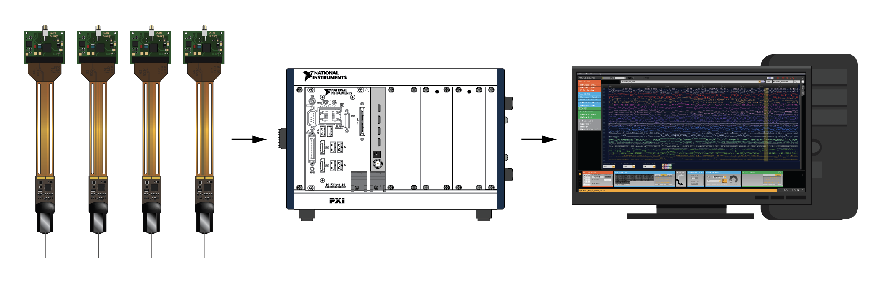
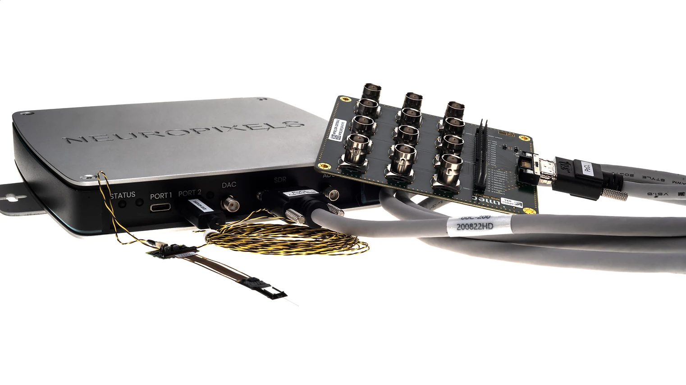

.. _compatiblehardware:
.. role:: raw-html-m2r(raw)
   :format: html

Compatible hardware
======================

Although the GUI was originally developed for use with the Open Ephys Acquisition Board, its plugin architecture has made it straightforward to integrate with several other widely used electrophysiology recording systems. Using the GUI with a different acquisition system is simply a matter of installing the appropriate "Source" plugin—assuming you already have access to the necessary hardware. 

This page summarizes the components you will need to buy to use the GUI with four types of acquisition systems that are officially supported by the Open Ephys development team: the :ref:`acquisition-board-hardware`, :ref:`open-ephys-onix`, :ref:`imec-neuropixels-pxi`, and :ref:`imec-neuropixels-onebox`. Be sure to read the documentation specific to each system for the most up-to-date information about hardware requirements and compatibility.

The GUI can also be used with other acquisition systems, such as Intan RHD USB Interface Boards, Intan RHD Recording Controllers, and XDAQ ONE and Core. The GUI has also been tested with EEG headsets that use Lab Streaming Layer (LSL) for data transfer. For a complete list of all the devices that the GUI can use as data sources, check out the Sources in the :ref:`plugins` section. You can browse the Sinks in the :ref:`plugins` section to see what other hardware the GUI can control (e.g. Arduino boards and Sanworks PulsePal)

.. _acquisition-board-hardware:

Open Ephys Acquisition Board
-------------------------------------

.. image:: ../_static/images/compatiblehardware/acq-board-3d.png
  :alt: Acquisition board hardware

Thousands of `Open Ephys acquisition boards <https://open-ephys.org/acq-board>`__ have been produced and shipped to labs on every continent. This cost-effective, open-source device can easily scale from 16 channels to 512 channels just by adding more headstages and cables. It's a very flexible way to acquire data from a wide variety of passive electrodes, including wires, tetrodes, silicon probes, and EMG arrays.

To get up and running with the Acquisition Board, you will need the following hardware:

* **Open Ephys Acquisition Board** (available from the `Open Ephys Store <https://open-ephys.org/acquisition-system/oeps-9029>`__). The 3rd Generation of the board can acquire absolute head orientation data, includes performance improvements, and is Harp-enabled.

* **I/O boards** for interfacing with auxiliary analog and digital signals (available from the `Open Ephys Store <https://open-ephys.org/acquisition-system/io-board-pcb>`__)

* **RHD Headstages and SPI tethers** (headstages with 3D capabilities are available individually from the `Open Ephys Store <https://open-ephys.org/acquisition-system>`__, in monopolar vertical-profile 32ch, monopolar low-profile 32ch and bipolar vertical profile 16ch variants). Low-profile headstages are recommended for reducing torque and bipolar for use with impedance-matched paired electrodes such as EMG arrays. Other compatible RHD headstages from `Intan Technologies <https://intantech.com/RHD_headstages.html>`__ work with our acquisition board even if they do not provide 3D orientation.

* **Electrodes** - there is lots of flexibility here, as long as you have some way to interface between your electrodes and a compatible headstage. For tetrodes, we recommend the `ShuttleDrive <https://open-ephys.org/drive-implant>`__.

These are the minimum requirements for getting up and running. If you are conducting chronic recordings, we recommend leveraging the absolute orientation sensor on our 3D-capable headstages to drive our commutator:

* One **torque-free SPI commutator** for automatic compensation of tether twists when interfacing 3D-capable headstages (available from the `Open Ephys Store <https://open-ephys.org/commutators/oeps-7761>`__)

You will likely need additional hardware for a full experiment (e.g. reward ports, mazes, commutators, light for optogenetic stimulation). We have some options in our store such as pyControl and Harp behavioral devices, Cyclops for optogenetic stimulation and StimJim for electrical stimulation.

See the :ref:`acquisitionboard` plugin page for more details.

.. _open-ephys-onix:

Open Ephys ONIX
-------------------------------------

.. image:: ../_static/images/compatiblehardware/onix_neuropixels.png
  :alt: ONIX for Neuropixels

ONIX is a powerful and versatile recording system designed to support high channel counts while having a minimal impact on behavior. It can acquire data from passive electrodes (tetrodes, silicon probes), active probes (e.g., Neuropixels), and Miniscopes. ONIX headstages can perform on-board electrical and optogenetic stimulation, absolute head orientation acquisition, and 3D positional tracking. It can acquire data from 2 headstage ports, 12 analog inputs (up to 100 kHz sampling rate), 8 digital Inputs, and 6 user-programmable buttons. It can control 12 analog outputs and 8 digital outputs, and boasts sub-ms closed-loop latencies. This makes it integrate seamlessly into complex behavioral setups, in particular those controlled through `Bonsai <https://bonsai-rx.org/>`__, and syncs natively with `Harp behavioral devices <https://harp-tech.org/articles/about.html>`__.

Some ONIX functionality can be accessed with the Open Ephys GUI. The :ref:`onixsource` plugin can acquire continuous data and digital and analog events from the breakout board. It is primarily focused on acquisition of Neuropixels headstage data (ephys and absolute orientation) and will gradually be expanded to other ONIX data streams.

All of ONIX data streams and capabilities can be accessed through the `Bonsai package OpenEphys.Onix1 <https://open-ephys.github.io/bonsai-onix1-docs/index.html>`__, and you can use this in combination with the Open Ephys GUI via the Ephys Socket plugin. This allows you to visualize data in the :ref:`lfpviewer` or :ref:`probeviewer` as if it were being acquired within the Open Ephys GUI. Follow this `tutorial <https://open-ephys.github.io/bonsai-onix1-docs/articles/tutorials/ephys-socket.html>`__ to set up Neuropixels acquisition in Bonsai and stream data to the GUI for visualization.

The following hardware is recommended for experiments that use ONIX:

* One **PCIe Acquisition System** which includes a **PCIe Interface Card** and a **Breakout Board** (available from the `Open Ephys Store <https://open-ephys.org/onix/oeps-9006>`__)

* For Neuropixels, one **ONIX NeuropixelsV1.0e Headstage** or **ONIX NeuropixelsV2.0e Headstage** (includes one 0.3mm diameter micro-coax tether, available from the `Open Ephys Store <https://open-ephys.org/onix/oeps-7745>`__)

* For passive electrodes, one **ONIX Headstage 64** (includes one 0.3mm diameter micro-coax tether, available from the `Open Ephys Store <https://open-ephys.org/onix/oeps-7741>`__)

* One **torque-free coaxial commutator** for automatic compensation of tether twists (available from the `Open Ephys Store <https://open-ephys.org/commutators/coaxial-commutator>`__)

See the :ref:`onixsource` and :ref:`ephyssocket` plugin pages for more details.

.. _imec-neuropixels-pxi:

IMEC Neuropixels PXI basestations
-------------------------------------------------------------------------

Neuropixels have become a new standard for electrophysiology, given their ability to record from hundreds to thousands of neurons across many brain regions in parallel. All probe types (including 1.0, 2.0, Ultra, Opto, and NHP) are compatible with the Open Ephys GUI. The Neuropixels PXI acquisition system consists of one or more basestations mounted in a chassis (usually from NI). Each basestation can acquire data from four Neuropixels headstages, and multiple basestations can be used inside the same chassis.

General questions about Neuropixels can be directed to the Neuropixels Group Slack (sign up `here <https://neuropixelsgroup.slack.com/join/shared_invite/zt-2zbcrd3dw-nr_Z6iYA8nSEERpLRqAwTA#/shared-invite/email>`__).

The following hardware is recommended for experiments with Neuropixels PXI basestations:

* PXI basestations, headstages, and probes can be ordered from `neuropixels.org <https://www.neuropixels.org>`__. Other PXI components are available from NI.

* One **PXI chassis** (so far we've tested National Instruments PXIe-1071, PXIe-1082, and PXIe-1083 and ADLINK PXES-2301)

* *(optional)* One **PXI-based analog and digital I/O module** (see the :ref:`NI-DAQmx` page for a list of hardware we've tested)

For chassis without a built-in controller (e.g. PXIe-1071, PXIe-1082), you'll need:

* One **PXI remote control module** (we've tested NI PXIe-8381 and PXIe-8398)

* One **PCIe interface card** (we've tested NI PCIe-8381, PCIe-8382, and PCIe-8398)

* **MXI-Express Cables** to connect the remote control module to the PCIe card

For chassis with a built-in Thunderbolt controller (e.g. PXIe-1083):

* One **Thunderbolt interface card** that's compatible with your motherboard

* One sufficiently long **Thunderbolt cable**

See the :ref:`neuropixelspxi` plugin page for more details.

.. _imec-neuropixels-onebox:

IMEC Neuropixels OneBox
--------------------------

IMEC recently developed an alternative to the PXI basestation called the OneBox. This is a compact, portable device that can be used to acquire data from Neuropixels probes over a USB connection. It supports any type of Neuropixels probe, but only up to two headstages at a time. Multiple OneBoxes can be used in parallel by inserting more than one :ref:`onebox` plugin into the signal chain.

The following hardware is recommended for experiments that use OneBox (all ordered from `neuropixels.org <https://www.neuropixels.org>`__):

* **OneBox** with included power supply and USB 3.0 cable

* Neuropixels probes, headstages, and cables 

* One **breakout board** with SDR cable (for auxiliary I/O)

See the :ref:`onebox` plugin page for more details.

|