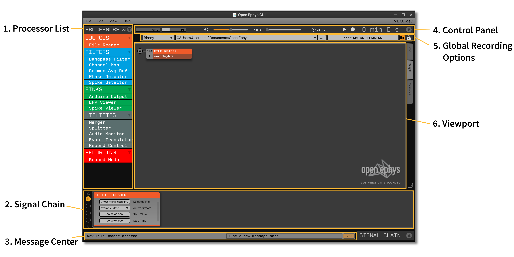

.. _exploringtheui:
.. role:: raw-html-m2r(raw)
   :format: html

Exploring the user interface
==================================

Functionally, the GUI is very similar to traditional programs for acquiring extracellular electrophysiology data. It allows you to control input sources, adjust filter settings, visualize spikes and LFPs, and save all of your data to disk. Conceptually, however, the GUI is more similar to audio processing applications, such as `Ableton Live`_. Rather than hard-coding the signal chain, the processing pathway can be created dynamically by the user. This feature will hopefully make the GUI easier to comprehend, less painful to modify, and more enjoyable to use. While most open-loop electrophysiology experiments require roughly the same signal chain, closed-loop experiments rarely do. A more flexible user-interface will allow neuroscientists to build up a library of modules that can be re-used and shared, rather than relying on purpose-built code in Matlab or LabVIEW that's used for one experiment then scrapped.

Main components
##########################

The GUI is designed to ensure all of the most important elements are accessible from a single window, to keep everything organized. However, many components can be collapsed when they are not in use.

These are the components you'll be interacting with most often:

1. Processor List
------------------

Here you'll find all the available modules for building the signal chain, organized by type. "Sources" bring data into the application, either by communicating with an external device, reading data from a file, or generating samples on the fly. "Filters" alter the data in some way, either by modifying continuous signals or creating new events. "Sinks" send data outside the signal chain, for example to a USB device or a display. "Utilities" are used to construct the signal chain or control recording, but they don't modify data in any way. Finally, "Recording" processors are used for saving data. For the most part, "processors" and synonymous with "plugins," although some processors are currently built into the GUI, so are not technically plugins.

2. Signal Chain
----------------

The processing pipeline is configured by dragging modules from the Processor List and dropping them in the appropriate order onto the Signal Chain. Once a processor has been added to the Signal Chain, its settings will be accessible through a custom interface. The buttons on the left-hand side of the Signal Chain allow you to toggle between different branches of your signal chain (if it contains multiple sources).

3. Message Center
-----------------

At the bottom of the user interface, there is a component for sending and receiving messages. The left side displays important notifications that come from the GUI or its plugins, while the right side allows you to record custom messages during an experiment.

4. Control Panel
------------------

The top of the user interface contains a number of components for controlling the overall behavior of the software, as well as displaying critical status information.

From left to right:

* **CPU Meter**. Displays the fraction of available time that the signal chain takes to complete one processing cycle. The values in this display will differ from your computer's built-in CPU monitor, and are a better indicator of whether you are hitting your machine's performance limits. Ideally, the CPU meter should stay below 20% at all times. If it's spiking to over 50%, it indicates that you are attempting to acquire more channels than your computer can handle, or your signal chain is too complex.

* **Disk Space Meter**. Displays the fraction of available disk space used by the default recording directory. Keep an eye on this meter to ensure that you don't run out of space for recording data.

* **Volume Slider**. Used to adjust the volume of the GUI's built-in audio monitor.

* **Gate Slider**. Used to adjust the "gate" of the audio monitor, which enhances the sound of individual spikes while suppressing background noise.

* **Audio Settings**. This button (which displays the audio buffer size in milliseconds) opens the Audio Settings interface. Data acquisition is driven by your computer's audio card. If you have multiple audio cards installed, this interface can be used to select which one to use. It can also be used to change the size of the audio buffer, which determines the amount of time it takes to complete one processing cycle. If the CPU meter is jumping around a lot, increasing the size of the audio buffer can smooth it out, by giving the GUI more time to process each chunk of data that comes in. However, this will increase the average time it takes for the GUI to deliver closed-loop feedback, if your signal chain includes plugins for trigger stimulation based on incoming neural data.

* **Play**. This button is used to start and stop data acquisition. If there are no processors present in the signal chain, it won't do anything.

* **Record**. This button is used to start and stop recording. If the play button hasn't been pressed yet, the record button will also start data acquisition.

* **Clock**. The clock displays the amount of time elapsed since data acquisition started. Or, if data is being recorded, it turns red and displays the amount of time since the current recording began.

5. Global Recording Options
----------------------------

Below the control panel is a collapsible interface for changing recording options. For more information about this component, see the :ref:`recordingdata` page.

6. Viewport
------------

The center of the user interface is used for a variety of different displays, each contained in a separate tab. By default, the viewport shows a high-level overview of the signal chain that allows you to jump to the configuration interfaces for each processor. It also larger visualizations that do not fit inside the Signal Chain view at the bottom of the window.

Menu items
##########################

Below you'll find documentation for all of the commands available from the GUI's menu:

File
-----
* **Open**: browse for a previously saved signal chain XML file, and load it into the GUI.

* **Save**: save the current signal chain to an XML file.

* **Save as...**: select a new location to store the current signal chain.

* **Reload on startup**: if checked, the GUI will automatically re-load the signal chain that was active the last time the GUI was closed.

* **Plugin Installer**: open the Plugin Installer interface. See the :ref:`plugins` page for more details.

Edit
-----
* **Undo**: *[not implemented]* undo the most recent action.

* **Redo**: *[not implemented]* redo the action that was most recently undone.

* **Copy**: *[not implemented]* copy the currently selected processor.

* **Paste**: *[not implemented]* paste the most recently copied processor to the right of the currently selected processor.

* **Clear signal chain**: removes all processors from the signal chain.

* **Timestamp source**: opens an interface for selecting the global timestamp source. Processors that do not generate their own timestamps will inherit them from the global source.

View
-----

* **Processor List**: shows/hides the Processor List interface.

* **Signal Chain**: shows/hides the Signal Chain interface.

* **File Info**: shows/hides the Record Options interface.

* **Reset window bounds**: restores the GUI window to the default size and location (helpful if the window gets lost offscreen).

Debug console
###############

The GUI is able to send debug messages to a console. In many cases, the information displayed there can help locate and solve an issue. The way to access the debug console varies depending on the operating system.

Linux
-------

To display the debug console on Linux, just run the :code:`open-ephys` application in a console terminal, and the output will be displayed there.

macOS
-------

To display the debug console on MacOS, open a terminal, navigate to the directory where the GUI application is located and run it inside the console.

Due to the structure of MacOS app bundles, the whole command to run the GUI would be :code:`./open-ephys.app/Contents/MacOS/open-ephys`. Run this command from the directory which contains the App bundle. Do not access the internal App directories and run :code:`./open-ephys` from there, as some features will not be available that way.

Windows
---------

Debug console is automatically displayed on Windows when you run the :code:`open-ephys` application.

.. _Ableton Live: https://www.ableton.com/en/live/

