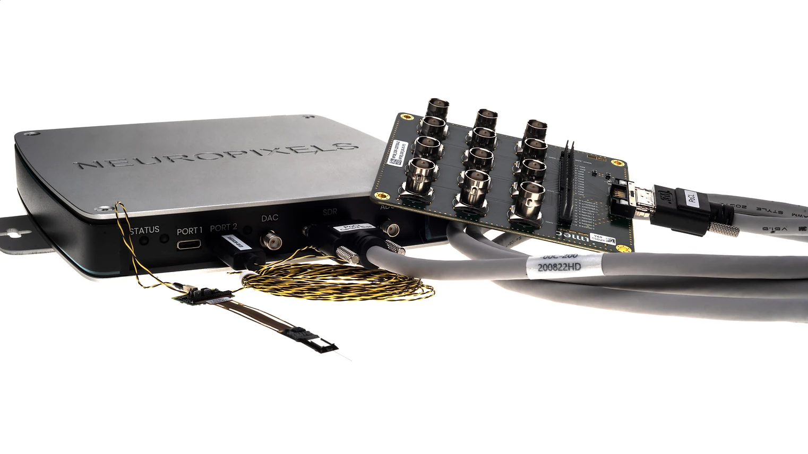

.. _hardwarerequirements:
.. role:: raw-html-m2r(raw)
   :format: html

Hardware requirements
======================

You can demo the Open Ephys GUI on any computer using the :ref:`filereader` to read in data that's already been saved. But if you are planning to run experiments, you'll need to make sure your system is capable enough to keep up with data acquisition. In general, the minimum requirements will depend on how many channels you'd like to acquire simultaneously, and whether you need low-latency closed-loop feedback. Below, we provide some guidelines for configuring your data acquisition machine.

.. important:: The most important thing you can do to improve performance is use a solid-state drive (ideally NVMe) for writing data. And if you need to record ≥128 channels simultaneously, an SSD is required.

The Open Ephys GUI has expanded from its origins as the software for the Open Ephys Acquisition Board to acquiring extracellular electrophysiology data from a variety of different acquisition systems, such as Open Ephys ONIX, IMEC Neuropixels OneBox, Intan RHD USB, Intan RHD Rec Controller, National Instruments Neuropixels PXI, National Instruments NI-DAQmx, etc. For a complete list of all the devices that the GUI can use as data sources, check out the Sources in the :ref:`plugins` section. You can browse the Sinks in the :ref:`plugins` section to see what other hardware the GUI can control (e.g. Arduino boards and Sanworks PulsePal)

In this section, we detail the main hardware options currently being used for data acquisition with the GUI and what requirements are needed to set them up.
Please refer to each system's documentation for specific information about the hardware.

Open Ephys Acquisition Board
-------------------------------------

.. image:: ../_static/images/hardwarerequirements/acq-board-3d.png
  :alt: Acquisition board hardware

Thousands of `Open Ephys acquisition boards <https://open-ephys.org/acq-board>`__ have been produced and shipped to labs on every continent. This cost-effective, open-source device can easily scale from 16 channels to 512 channels just by adding more headstages and cables. It's a very flexible way to acquire data from a wide variety of passive electrodes, including wires, tetrodes, silicon probes, and EMG arrays.

The following hardware is recommended for experiments that use the acquisition board:

.. _computer-specs-open-ephys:

Computer specs
#####################

* **Operating system** - the acquisition board works equally well on macOS, Windows, and Linux (all distros).

* **Processor** - A 4-core, 3.0+ GHz processor is fine for most recordings. In general, having a faster processor will allow you to build more complex signal chains without worrying about CPU overload. The GUI uses multithreading for data acquisition and recording, so having more cores can also help reduce CPU load.

* **Memory** - at least 1 GB of memory per 32 channels.

* **Data storage** - a solid state drive for writing data is *strongly* recommended for all configurations, and required for any recordings involving at least 128 channels.

* **Graphics card** - the GUI doesn't rely much on the GPU for processing, so a good graphics card is not critical for data acquisition. However, consider upgrading your graphics card to speed up offline analysis steps (such as spike sorting).

* **Connections** - At least one USB 3.0 port

Additional hardware
######################

* **Open Ephys Acquisition Board** (available from the `Open Ephys Store <https://open-ephys.org/acquisition-system/oeps-9029>`__). The 3rd Generation of the board can acquire absolute head orientation data, includes performance improvements and is Harp enabled.

* **I/O boards** for interfacing with auxiliary analog and digital signals (available from the `Open Ephys Store <https://open-ephys.org/acquisition-system/io-board-pcb>`__)

* **RHD Headstages and SPI tethers** (headstages with 3D capabilities are available individually from the `Open Ephys Store <https://open-ephys.org/acquisition-system>`__, in monopolar vertical-profile 32ch, monopolar low-profile 32ch and bipolar vertical profile 16ch variants. Low-profile headstages are recommended for reducing torque and bipolar for use with impedance-matched paired electrodes such as EMG arrays. Other compatible RHD headstages from `Intan Technologies <https://intantech.com/RHD_headstages.html>`__ work with our acquisition board even if they do not provide 3D orientation.

* **Electrodes** - there is lots of flexibility here, as long as you have some way to interface between your electrodes and a compatible headstage. For tetrodes, we recommend the `ShuttleDrive <https://open-ephys.org/drive-implant>`__.

These are the minimum requirements for getting up and running. If you are conducting chronic recordings, we recommend leveraging the absolute orientation sensor on our 3d capable headstages to drive our commutator:

* One **torque-free SPI commutator** for automatic compensation of tether twists when interfacing 3D capable headstages (available from the `Open Ephys Store <https://open-ephys.org/commutators/oeps-7761>`__)

You will likely need additional hardware for a full experiment (e.g. reward ports, mazes, commutators, light for optogenetic stimulation). We have some options in our store such as pyControl and Harp behavioral devices, Cyclops for optogenetic stimulation and StimJim for electrical stimulation.

See the :ref:`acquisitionboard` plugin page for more details.

Open Ephys ONIX
-------------------------------------

.. image:: ../_static/images/hardwarerequirements/onix_neuropixels.png
  :alt: ONIX for neuropixels

ONIX is our next-gen acquisition system for multi-modal recording technologies. ONIX can acquire from passive electrodes (tetrodes, silicon probes), active probes (e.g. Neuropixels) and miniscopes, and is expandable. Headstages can perform on-board electrical and optogenetic stimulation, absolute head orientation acquisition and positional tracking. Besides acquiring from 2 headstage ports, it can simultaneously sample 12 analog inputs (100 kHz), 8 Digital Inputs and 6 user-programmable buttons. It additionally can control 12 analog outputs and 8 digital outputs, and boasts sub-ms closed-loop latencies. This makes it integrate seamlessly into complex behavioral setups, in particular those controlled through `Bonsai <https://bonsai-rx.org/>`__ using `Harp behavioral devices <https://harp-tech.org/articles/about.html>`__, since ONIX is Harp enabled.

Some ONIX functionality can be accessed with the Open Ephys GUI. The ONIX Source plugin (coming soon!) can acquire continuous data and digital and analog events from the breakout board. It is primarily focused on neuropixels acquisition and will gradually be expanded to other ONIX data streams.

All of ONIX data streams and capabilities can be accessed through the `Bonsai package OpenEphys.Onix1 <https://open-ephys.github.io/bonsai-onix1-docs/index.html>`__, and you can use this in combination with the Open Ephys GUI with the Ephys Socket plugin to work with data streams in the plugins you might be used to, such as the Probe viewer for Neuropixels data. Follow this `tutorial <https://open-ephys.github.io/bonsai-onix1-docs/articles/tutorials/ephys-socket.html>`__ to set up Neuropixels acquisition in Bonsai and stream data to the Open Ephys GUI for visualization.

The following hardware is recommended for experiments that use ONIX:

Computer specs
#####################

* **Operating system** - Windows 10, 11 or Linux

* **Processor** - minimum of 6 cores, 3.5 GHz

* **Memory** - a minimum of 16 GB is recommended.

* **Data storage** - a solid state drive is essential (at least 500 MB/s write speed); an NVMe drive is strongly recommended.

* **Graphics card** - the GUI doesn't rely on the GPU for processing, but GPUs are essential for offline analysis of high-channel count data. An NVIDIA GPU is likely required (for CUDA compatibility); we recommend buying a GTX 1660 or better.

* **Connections** - the motherboard should have at least one x4-, x8- or x16-PCIe slot, in addition to the one used by the GPU.

Additional hardware
#######################

* One **PCIe Acquisition System** which includes a **PCIe Interface Card** and a **Breakout Board** (available from the `Open Ephys Store <https://open-ephys.org/onix/oeps-9006>`__)

* For Neuropixels, one **ONIX NeuropixelsV1.0e Headstage** or **ONIX NeuropixelsV2.0e Headstage** (includes one 0.3mm diameter micro-coax tether, available from the `Open Ephys Store <https://open-ephys.org/onix/oeps-7745>`__)

* For passive electrodes, one **ONIX Headstage 64** (includes one 0.3mm diameter micro-coax tether, available from the `Open Ephys Store <https://open-ephys.org/onix/oeps-7741>`__)

* One **torque-free coaxial commutator** for automatic compensation of tether twists (available from the `Open Ephys Store <https://open-ephys.org/commutators/coaxial-commutator>`__)

See the ONIX Source (coming soon!) and :ref:`ephyssocket` plugin pages for more details.

IMEC Neuropixels PXI basestation and National Instruments PXI chassis
-------------------------------------------------------------------------

.. image:: ../_static/images/hardwarerequirements/neuropixels.png
  :alt: Neuropixels PXI hardware

Neuropixels have become a new standard for electrophysiology, given their ability to record from hundreds to thousands of neurons across many brain regions in parallel. Neuropixels probes must be ordered from IMEC via `neuropixels.org <https://www.neuropixels.org>`__. All probe types (including 1.0, 2.0, and NHP) are compatible with the Open Ephys GUI through the :ref:`neuropixelspxi` plugin. General questions about Neuropixels can be directed to the Neuropixels Group Slack (sign up `here <https://neuropixelsgroup.slack.com/join/shared_invite/zt-2zbcrd3dw-nr_Z6iYA8nSEERpLRqAwTA#/shared-invite/email>`__).

The following hardware is recommended for experiments that use a Neuropixels PXI basestation and PXI chassis:

.. _computer-specs-neuropixels:

Computer specs
################

* **Operating system** - Windows 7, 10, or 11

* **Processor** - minimum of 6 cores, 3.5 GHz

* **Memory** - at least 2 GB per simultaneously recorded probe; a minimum of 16 GB is recommended.

* **Data storage** - a solid state drive is essential (at least 500 MB/s write speed); an NVMe drive is strongly recommended.

* **Graphics card** - the GUI doesn't rely on the GPU for processing, but GPUs are essential for offline analysis. An NVIDIA GPU is likely required (for CUDA compatibility); we recommend buying a GTX 1660 or better.

* **Connections** - the motherboard should have at least one x8- or x16-compatible PCIe slot, in addition to the one used by the GPU.

Additional hardware
######################

PXI basestations, headstages, and probes can be ordered from `neuropixels.org <https://www.neuropixels.org>`__. Other PXI components are available from NI.

* One **PXI chassis** (so far we've tested National Instruments PXIe-1071, PXIe-1082, and PXIe-1083 and ADLINK PXES-2301)

* *(optional)* One **PXI-based analog and digital I/O module** (see the :ref:`NI-DAQmx` page for a list of hardware we've tested)

For chassis without a built-in controller (e.g. PXIe-1071, PXIe-1082), you'll need:

* One **PXI remote control module** (we've tested NI PXIe-8381 and PXIe-8398)

* One **PCIe interface card** (we've tested NI PCIe-8381, PCIe-8382, and PCIe-8398)

* **MXI-Express Cables** to connect the remote control module to the PCIe card

For chassis with a built-in Thunderbolt controller (e.g. PXIe-1083):

* One **Thunderbolt interface card** that's compatible with your motherboard

* One sufficiently long **Thunderbolt cable**

See the :ref:`neuropixelspxi` plugin page for more details.

IMEC Neuropixels OneBox
------------------------------------------------------------

Neuropixels have become a new standard for electrophysiology, given their ability to record from hundreds to thousands of neurons across many brain regions in parallel. Neuropixels probes must be ordered from IMEC via `neuropixels.org <https://www.neuropixels.org>`__. All probe types (including 1.0, 2.0, and NHP) are compatible with the Open Ephys GUI through the :ref:`neuropixelspxi` plugin. General questions about Neuropixels can be directed to the Neuropixels Group Slack (sign up `here <https://neuropixelsgroup.slack.com/join/shared_invite/zt-2zbcrd3dw-nr_Z6iYA8nSEERpLRqAwTA#/shared-invite/email>`__).

The following hardware is recommended for experiments that use OneBox:

.. _onebox-hardware-requirements:

Computer specs
################

* **Operating system** - Windows 7, 10, or 11

* **Processor** - minimum of 6 cores, 3.5 GHz

* **Memory** - at least 2 GB per simultaneously recorded probe; a minimum of 16 GB is recommended.

* **Data storage** - a solid state drive is essential (at least 500 MB/s write speed); an NVMe drive is strongly recommended.

* **Graphics card** - the GUI doesn't rely on the GPU for processing, but GPUs are essential for offline analysis. An NVIDIA GPU is likely required (for CUDA compatibility); we recommend buying a GTX 1660 or better.

* **Connections** - the motherboard should have at least one x8- or x16-compatible PCIe slot, in addition to the one used by the GPU.

Additional hardware
#####################

OneBoxes, breakout boards, headstages, and probes can be ordered from `neuropixels.org <https://www.neuropixels.org>`__.

* **OneBox** with included power supply and USB 3.0 cable

* One **breakout board** with SDR cable (for auxiliary I/O)

See the :ref:`onebox` plugin page for more details.