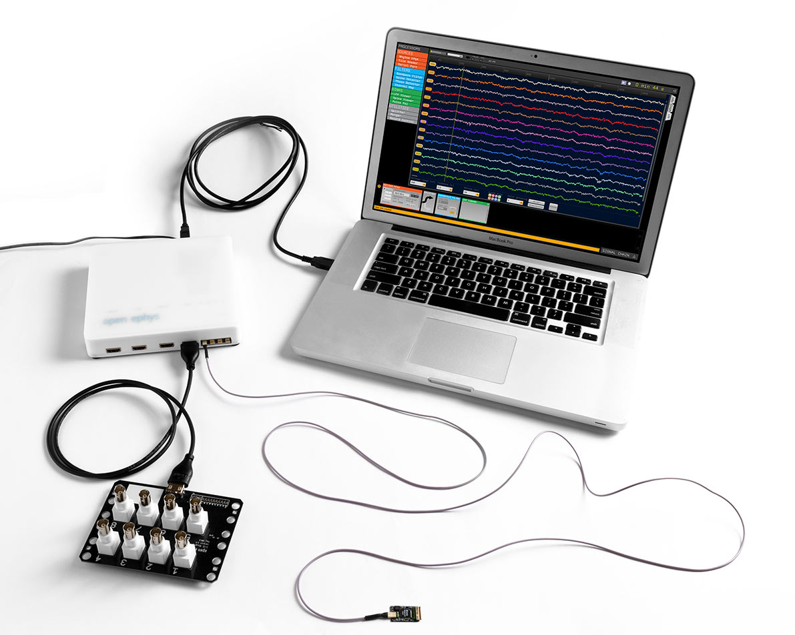
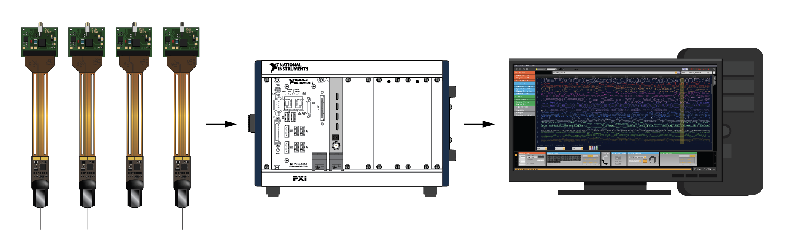

.. _hardwarerequirements:
.. role:: raw-html-m2r(raw)
   :format: html

Hardware requirements
======================

You can demo the Open Ephys GUI on any computer using the :ref:`filereader` to read in data that's already been saved. But if you are planning to run experiments, you'll need to make sure your system is capable enough to keep up with data acquisition. In general, the minimum requirements will depend on how many channels you'd like to acquire simultaneously, and whether you need low-latency closed-loop feedback. Below, we provide some guidelines for configuring your data acquisition machine.

.. tip:: The most important thing you can do to improve performance is use a solid-state drive (ideally NVMe) for writing data. And if you need to record ≥128 channels simultaneously, an SSD is required.

The Open Ephys GUI has expanded from its origins as the software for the Open Ephys Acquisition Board to acquiring extracellular electrophysiology data from a variety of different acquisition systems, such as Open Ephys ONIX, IMEC Neuropixels OneBox, Intan RHD USB, Intan RHD Rec Controller, National Instruments Neuropixels PXI, National Instruments NI-DAQmx, etc. For a complete list of all the devices that the GUI can use as data sources, check out the Sources in the :ref:`plugins` section. You can browse the Sinks in the :ref:`plugins` section to see what other hardware the GUI can control (e.g. Arduino boards and Sanworks PulsePal)

In this section, we detail the main hardware options currently being used for data acquisition with the GUI and what requirements are needed to set them up.
Please refer to each system's documentation for specific information about the hardware.

For the Open Ephys acquisition board
-------------------------------------

More than 1000 `Open Ephys acquisition boards <https://open-ephys.org/acq-board>`__ have been produced and shipped to labs on every continent. This cost-effective, open-source device can easily scale from 16 channels to 512 channels just by adding more headstages and cables. It's a very flexible way to acquire data from a wide variety of electrodes, including tungsten wires, tetrodes, and silicon probes.

The following hardware is recommended for experiments that use the acquisition board:

Computer specs
#####################

* **Operating system** - the acquisition board works equally well on macOS, Windows, and Linux (all distros).

* **Processor** - A 4-core, 3.0+ GHz processor is fine for most recordings. In general, having a faster processor will allow you to build more complex signal chains without worrying about CPU overload. The GUI uses multithreading for data acquisition and recording, so having more cores can also help reduce CPU load.

* **Memory** - at least 1 GB of memory per 32 channels.

* **Data storage** - a solid state drive for writing data is *strongly* recommended for all configurations, and required for any recordings involving at least 128 channels.

* **Graphics card** - the GUI doesn't rely much on the GPU for processing, so a good graphics card is not critical for data acquisition. However, consider upgrading your graphics card to speed up offline analysis steps (such as spike sorting).

* **Connections** - At least one USB 3.0 port

Other hardware
################

These are the minimum requirements for getting up and running. You will likely need additional hardware for the full experiment (e.g. reward ports, mazes, commutators, light for optogenetic stimulation).

* **Acquisition board** (available from the `Open Ephys Store <https://open-ephys.org/acquisition-system/acquisition-board>`__)

* **I/O boards** for interfacing with auxiliary analog and digital signals (available from the `Open Ephys Store <https://open-ephys.org/acquisition-system/io-board-pcb>`__)

* **Headstages and cables** (available as part of the `Open Ephys Starter Kit <https://open-ephys.org/acquisition-system/starter-kit>`__ or from `Intan Technologies <https://intantech.com/pricing.html>`__; there is also a low-profile headstage available from the `Open Ephys Store <https://open-ephys.org/acquisition-system/low-profile-spi-headstage-64ch>`__)

* **Electrodes** - there is lots of flexibility here, as long as you have some way to interface between your electrodes and a compatible headstage. For tetrodes, we recommend the `shuttleDrive <https://open-ephys.org/drive-implant>`__.

For Neuropixels probes
------------------------

Neuropixels are quickly become a new standard for electrophysiology, given their ability to record from hundreds to thousands of neurons across many brain regions in parallel. Neuropixels probes must be ordered from IMEC via `neuropixels.org <https://www.neuropixels.org>`__. All probe types (including 1.0, 2.0, and NHP) are compatible with the Open Ephys GUI through the :ref:`neuropixelspxi` plugin. General questions about Neuropixels can be directed to the Neuropixels Group Slack (sign up `here <https://neuropixelsgroup.slack.com/join/shared_invite/zt-2zbcrd3dw-nr_Z6iYA8nSEERpLRqAwTA#/shared-invite/email>`__).

The following hardware is recommended for experiments with Neuropixels:

Computer specs
################

* **Operating system** - Windows 7, 10, or 11

* **Processor** - minimum of 6 cores, 3.5 GHz

* **Memory** - at least 2 GB per simultaneously recorded probe; a minimum of 16 GB is recommended.

* **Data storage** - a solid state drive is essential (at least 500 MB/s write speed); an NVMe drive is strongly recommended.

* **Graphics card** - the GUI doesn't rely on the GPU for processing, but GPUs are essential for offline analysis. An NVIDIA GPU is likely required (for CUDA compatibility); we recommend buying a GTX 1660 or better.

* **Connections** - the motherboard should have at least one x8- or x16-compatible PCIe slot, in addition to the one used by the GPU.

Other hardware
###############

The following summarizes the additional hardware you'll need to buy to run Neuropixels experiments. OneBoxes, PXI basestations, headstages, and probes can be ordered from `neuropixels.org <https://neuropixels.org>`__. Other PXI components are available from NI.

OneBox
-------

* **OneBox** with included power supply and USB 3.0 cable

* One **breakout board** with SDR cable (for auxiliary I/O)

See the :ref:`onebox` plugin page for more details.

PXI system
----------

* One **PXI chassis** (so far we've tested National Instruments PXIe-1071, PXIe-1082, and PXIe-1083 and ADLINK PXES-2301)

* *(optional)* One **PXI-based analog and digital I/O module** (see the :ref:`NI-DAQmx` page for a list of hardware we've tested)

For chassis without a built-in controller (e.g. PXIe-1071, PXIe-1082), you'll need:

* One **PXI remote control module** (we've tested NI PXIe-8381 and PXIe-8398)

* One **PCIe interface card** (we've tested NI PCIe-8381, PCIe-8382, and PCIe-8398)

* **MXI-Express Cables** to connect the remote control module to the PCIe card

For chassis with a built-in Thunderbolt controller (e.g. PXIe-1083):

* One **Thunderbolt interface card** that's compatible with your motherboard

* One sufficiently long **Thunderbolt cable**

See the :ref:`neuropixelspxi` plugin page for more details.
