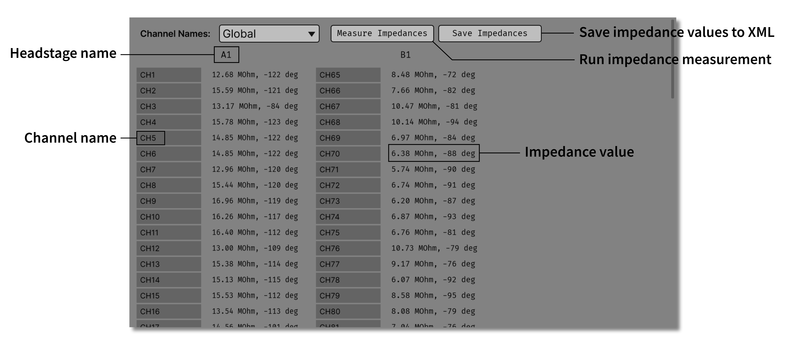
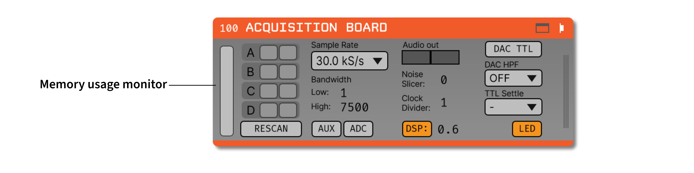

.. _acquisitionboard:
.. role:: raw-html-m2r(raw)
   :format: html

#################
Acquisition Board
#################

..  attention:: This page documents the new acquisition-board plugin using :ref:`Open Ephys GUI 1.0.0-alpha.4 <versions>` or later. 

.. image:: ../../_static/images/plugins/acquisitionboard/acquisitionboard-01.png
  :alt: Annotated settings interface for the Acquisition Board plugin

.. csv-table:: Streams data from any generation of the `Open Ephys acquisition board <https://open-ephys.org/acq-board>`__.
   :widths: 18, 80

   "*Plugin Type*", "Source"
   "*Platforms*", "Windows, Linux, macOS"
   "*Built in?*", "No; install via *Acquisition Board*"
   "*Key Developers*", "Josh Siegle, Aarón Cuevas López"
   "*Source Code*", "https://github.com/open-ephys-plugins/acquisition-board"

.. tip:: For more in-depth documentation on the Open Ephys Acquisition Board, please refer to the `Acquisition Board docs site <https://open-ephys.github.io/acq-board-docs/User-Manual/Generations-differences.html>`__.

Installing and upgrading
==========================

The Acquisition Board plugin is not included by default in the Open Ephys GUI. To install, use **ctrl-P** or **⌘P** to open the Plugin Installer, browse to the "Acquisition Board", and click the "Install" button. After installation, *Acquisition Board* will appear in the processor list on the left side of the GUI's main window.

The Plugin Installer also allows you to upgrade to the latest version of this plugin, if it's already installed. The plugin must be removed from the signal chain prior to upgrading.

Plugin configuration
====================

Headstages
############

On the left-hand side of the module, there are four rows with 2 slots each. Each row represents a headstage port on the acquisition board (denoted as A, B, C, & D left-to-right on the hardware). Each port can accommodate either two headstages *without* an IMU or one headstage *with* an IMU. This corresponds to the following plugin behavior: when a headstage without an IMU is detected, it will occupy one slot in a row. When a headstage with an IMU is detected, it will occupy both slots in a row. When this processor is added to the signal chain, it automatically detects  connected headstages, as well as whether they contain a 64- or 32-channel Intan chip. If you add or remove headstages after the module has been loaded, you must press the "RESCAN" button. 

..  note:: Plugging two headstage into one port requires a `dual headstage adapter <https://open-ephys.github.io/acq-board-docs/Hardware-Guide/Cables.html#dual-headstage-adapter>`__

Using 16-channel headstages
----------------------------

Clicking on the button for one of the detected headstages will toggle it between 32-channel and 16-channel mode. This is necessary because the difference between 16-channel and 32-channel headstages cannot detected in software, and has to be selected manually.

Sample rate selection
#######################

Sample rates between 1 and 30 kHz can be selected with this drop-down menu. This will determine the sample rate for all headstages, digital inputs, and ADCs.

Bandwidth interface
#####################

Used to determine the settings for the analog high and low cut filters on the Intan chip. Because only certain values are possible for each, the number that appears may be different from the number you typed in; the chip will automatically select the nearest value, and that will be indicated in the GUI. 

Turning on AUX channels
#######################

Pressing the "AUX" button toggles the headstage AUX inputs on and off. Each Intan chip can communicate with up to 3 "auxiliary" inputs, which are connected to a 3-axis accelerometer on some headstages. If the button is off (gray), the AUX channels on each headstage will be ignored. If the button is on (yellow), they will be sent as parallel data channels, with the same sampling rate as the neural data.

Turning on ADC channels
########################

Pressing the "ADC" button toggles the ADC inputs on and off. If the button is off (gray), the ADC channels acquired by the board will be discarded. If the button is on (yellow), they will be sent as parallel data channels, with the same sampling rate as the neural data. To use these channels, an I/O board needs to be connected to the second HDMI port from the left.

Audio output
#############

The "AUDIO OUT" interface will allow you select up to 2 channels to preview in real time, directly from the acquisition board. There is an audio jack on the board that's mirrored to the first two analog output channels (CH1 and CH2 of the Digital & Analog I/O for L and R sound outputs when connected to HDMI port for analog output — it is the leftmost HDMI port). To select a channel for monitoring, click on one of the two "Audio Out" buttons to reveal the pop-up channel selector.

.. note:: In general, we recommend using the :ref:`audiomonitor` plugin to listen to spikes through your computer's speakers, as it is much more flexible.

Noise slicer
##############

Sets the threshold for the noise slicer on the hardware audio outputs (sets any values below threshold to zero, to improve the signal-to-noise ratio). In practice, this doesn't work particularly well.

Clock divider
##############

The BNC connector on the back of the board will send a digital pulse each time a new sample is acquired. The clock divided makes it possible to downsample this clock, so a pulse is sent every *N* samples. Note that *N* can only be one or an even number, even though this is not enforced via the settings interface.

DSP button
###########

in addition to the analog filters, the Intan chips also have an on-chip DSP high-pass filter for removing the DC offset on each channel. This can be toggled on and off by clicking the "DSP" button (yellow = on), and the cutoff frequency can be changed by typing a value into the associated text box. Again, there are only certain values for the cutoff frequency; the chip will choose the one closest to what you selected and return this value to the GUI.

DAC TTLs
##########

When this button is on, the digital-to-analog converter (DAC) will generate TTL outputs whenever the output signal crosses a threshold. Note that this is an untested feature and not recommended for experiments.

DAC High-pass filter
######################

Sets the high-pass filter cutoff frequency for the DAC outputs.

TTL settle
###########

Ties one of the digital inputs on the acquisition board/evaluation board to the "fast-settle" functionality of the Intan chips. If the selected digital input channel goes high, it will trigger the reset of the amplifiers across all headstages.

LED button
###########

The button labeled "LED" will turn the board LEDs on or off.

Impedance testing
##################

To open the impedance measurement interface, click the "window" or "tab" buttons at the top of the plugin editor. This will bring up an impedance measurement interface that looks like this:

Memory Monitor
###############

..  note:: This pertains only to hardware Gen2/Gen3 with firmware 1.5.1+

While data is waiting to be transferred from the acquisition board to the computer, it sits in the
acquisition board's buffer. The memory monitor on the left provides a visualization of how much data
has accumulated in this buffer as a percentage of its total capacity. The memory monitor should stay
at or near zero. Accumulated data in the hardware's buffer indicates an error that is causing data
to be read from the hardware too slowly. This might eventually halt the program if the buffer fills
to its capacity.

|

Closed-loop feedback
====================

Installing the "Acquisition Board" will also install the "Acq Board Output" plugin, which can be used to trigger the digital outputs of the acquisition board.

If this plugin is placed downstream of the Acquisition Board plugin, as well as a plugin that generates TTL events (e.g., :ref:`crossingdetector` or :ref:`rippledetector`), the digital output channel specified by the :code:`TTL_OUT` parameter will be temporarily set to high each time a TTL event is received on the :code:`TRIGGER_LINE`. The approximate duration of this event (in milliseconds) is set by the :code:`EVENT_DURATION` parameter. 

This configuration can be used to perform closed-loop feedback experiments in which some feature of the neural data (such as phase of an oscillation, or the presence of a ripple event), is used to trigger stimulation.

|