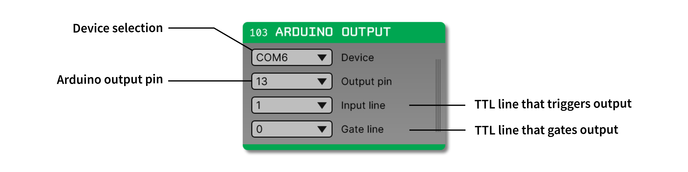

.. _arduinooutput:
.. role:: raw-html-m2r(raw)
   :format: html

#################
Arduino Output
#################

.. csv-table:: Allows events from within the GUI to control the state of digital output pins on an Arduino running `Firmata <https://docs.arduino.cc/retired/hacking/software/FirmataLibrary>`__. Provides a quick and easy way to translate information from software to hardware.
   :widths: 18, 80

   "*Plugin Type*", "Sink"
   "*Platforms*", "Windows, Linux, macOS"
   "*Built in?*", "Yes"
   "*Key Developers*", "Josh Siegle"
   "*Source Code*", "https://github.com/open-ephys/plugin-GUI/tree/main/Plugins/ArduinoOutput"

Compatible devices
=========================

.. role:: red

.. role:: green

Not all Arduino-like devices will work with this plugin. Below is a list of ones we've tested. If you've tried using other devices, please let us know!

.. csv-table::
   :widths: 20, 20

   "**Device**", "**Compatible?**"
   "Arduino Uno", ":green:`Yes`"
   "Arduino Leonardo", ":green:`Yes`"
   "Teensy 3.2", ":red:`No`"

Configuring your Arduino
=========================

This plugin works with any Arduino running the `Firmata <https://docs.arduino.cc/retired/hacking/software/FirmataLibrary>`__ firmware. To install this on your device, first make sure you've downloaded the `Arduino IDE <https://www.arduino.cc/en/software>`__ (version 1.0 or higher) for your platform of choice.

Next, connect the Arduino to your computer and upload the sketch in `File > Examples > Firmata > StandardFirmata`. This will allow your computer to control the state of the Arduino from software.

.. image:: ../../_static/images/plugins/arduinooutput/arduinooutput-02.png
  :alt: Annotated Arduino Output settings interface

.. caution:: Trying to connect to an Arduino that's running firmware other than Firmata can cause the GUI to crash.

Plugin configuration
====================

In order for the Arduino to send output pulses, you'll need a signal chain capable of generating TTL events. These can either come from a source node (such as the :ref:`acquisitionboard`, with the I/O board connected to the Digital Input port) or from a processor that generates events (such as the :ref:`phasedetector`).

Before you start acquisition, select the Arduino device you want to use via the device selector drop-down menu. It will take a few seconds for the GUI to initialize communication with the board. The status of the connection will appear in the Message Center, and the plugin will turn green if the connection is successful.

.. note:: On Mac the Arduino often appears as a USB modem.

After the device is connected, there are three parameters can be changed:

* :code:`OUTPUT_PIN`: The digital I/O pin on your Arduino that will mimic the state of a TTL input line.

* :code:`INPUT_LINE`: The TTL line that will be translated into digital outputs.

* :code:`GATE_LINE`: The TTL line that will gate the hardware output. If this is set to a value other than zero, the Arduino will only send output when the gate line is "high."

|

