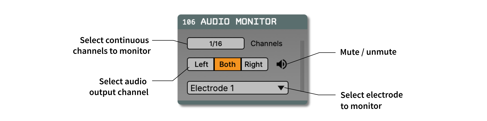

.. _audiomonitor:
.. role:: raw-html-m2r(raw)
   :format: html

#################
Audio Monitor
#################

.. csv-table:: Streams data from incoming continuous channels to the computer's audio output.
   :widths: 18, 80

   "*Plugin Type*", "Utility"
   "*Platforms*", "Windows, Linux, macOS"
   "*Built in?*", "Yes"
   "*Key Developers*", "Anjal Doshi, Josh Siegle"
   "*Source Code*", "https://github.com/open-ephys/plugin-GUI/tree/development-juce6/Plugins/AudioMonitor"

Overview
=========================

The Audio Monitor can be used to listen to any continuous signals processed by the GUI's signal chain. It automatically upsamples the data to match the sampling rate of the computer's audio card, and includes a built-in bandpass filter to enhance the sound of spikes.

**IMPORTANT:** The Audio Monitor only works if it is placed in the middle of a signal chain (not at the end). Ideally it should be located downstream of any Spike Detectors, but upstream of at least one visualizer (e.g. :ref:`spikeviewer` or :ref:`lfpviewer`).

Plugin configuration
====================

Channel selection
------------------

The "Channels" button allows the user to select up to 4 continuous channels to monitor at a time. 

Alternatively, if there is a :ref:`spikedetector` to the left of the Audio Monitor, the continuous channels for each electrode can be selected by choosing an electrode from the drop-down menu at the bottom of the editor.

.. tip:: You can select channels to monitor directly from the Spike Viewer (by clicking one of the "MON" buttons) or the LFP Viewer (by right-clicking on any channel to display a pop-up menu).

Output options
------------------

The audio for each Audio Monitor can be directed to the left, right, or both speakers by clicking the buttons in the middle of the editor. This can be useful for directing the output of one electrode to the left channel and one electrode to the right channel (via a separate Audio Monitor).

Individual Audio Monitors can be muted by clicking the button in the upper right of the editor.

The output volume is controlled by the slider in the control panel. There is also a "gate" slider, which can be used to enhance the sound of individual spikes while suppressing background noise.

.. tip:: If you can't hear any output from the Audio Monitor, check the volume slider in the control panel as well as you're computer's system volume.

Working with multiple data streams
===================================

Each Audio Monitor can only be used to listen to channels from one data stream at a time. The active stream corresponds to whichever stream is currently visible in the stream selector interface (accessed by clicking the vertical bars on the right-hand side of the editor). To listen to data from multiple streams simultaneously, you can place several Audio Monitors in succession.

|

