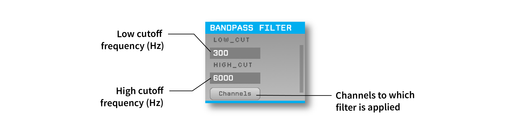

.. _bandpassfilter:
.. role:: raw-html-m2r(raw)
   :format: html

################
Bandpass Filter
################

.. csv-table:: Filters incoming continuous data between the specified low cutoff and high cutoff frequencies (Hz) using a 2nd-order Butterworth filter (maximally flat frequency response in the passband).
   :widths: 18, 80

   "*Plugin Type*", "Filter"
   "*Platforms*", "Windows, Linux, macOS"
   "*Built in?*", "Yes"
   "*Key Developers*", "Josh Siegle"
   "*Source Code*", "https://github.com/open-ephys/plugin-GUI/tree/main/Plugins/FilterNode"

Plugin configuration
###################################

Filter parameters
------------------

The bandpass filter has two parameters, :code:`LOW_CUT` and :code:`HIGH_CUT`. These parameters define the upper and lower cutoff frequencies of the filter, respectively. To change these values, simply type a different number into either text box. 

**Acceptable parameter range:** The minimum value for both parameters is 0.1 Hz, and the maximum value is 15,000 Hz. The low cut cannot be set to a value that's higher than the high cut, and the high cut cannot be set to a value that's lower than the low cut.

.. note:: Filter parameters can be changed during recording, but these changes will not be logged. The parameters that are active at the start of recording will be stored in the :code:`settings.xml` file.

Selecting channels
-------------------

The filtering operation can be restricted to a subset of channels, if desired. For example, if a data stream includes ADC channels, these can be deactivated in the "Channels" interface. In the following example, the filter will be applied to channels 1-11, and channels 12-16 will be ignored.

.. image:: ../../_static/images/plugins/bandpassfilter/bandpassfilter-03.png
  :alt: Annotated Bandpass Filter channel selector

Filter details
###################################

To obtain the same filter in MATLAB, you can use the following commands from the Signal Processing Toolbox:

.. code-block:: matlab

  [b, a] = butter(1, [lowcut highcut]/(samplerate/2)); % filter order is 2x the first argument

  y = filter(b, a, x); % only filters in the forward direction

To obtain the same filter in Python, you can use:

.. code-block:: python

  import numpy as np
  from scipy.signal import butter, filter

  b, a = butter(2, np.array([lowcut, highcut])/(samplerate/2), btype='bandpass')

  y = filter(b, a, x) # only filters in the forward direction

In both examples, :code:`lowcut` and :code:`highcut` are low and high cutoff frequencies (Hz), :code:`samplerate` is the data sample rate (Hz), :code:`x` is the unfiltered data, and :code:`y` is the filtered data.

Working with multiple data streams
###################################

If the Bandpass Filter plugin receives data from multiple incoming streams, a subset of these streams can be bypassed to conserve CPU cycles. For example, this can be helpful for Neuropixels probes if you only want to filter the LFP band channels, and not the AP band channels. Bypassing a stream is more efficient than deselecting all of its channels, as the plugin only needs to perform one check for the whole stream, rather than checking every channel.

To bypass a stream in the Bandpass Filter, click the vertical lines on the right-hand side of the plugin to bring up the Stream Selector, browse to the appropriate stream, and make sure the "Bypass" button is checked.

