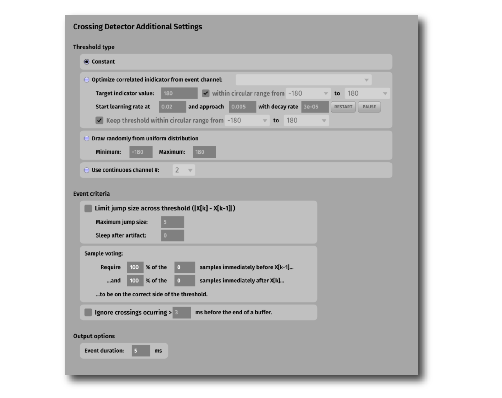

.. _cnnripple:
.. role:: raw-html-m2r(raw)
   :format: html

#####################
CNN Ripple
#####################

.. csv-table:: Uses a convolutional neural network to detect hippocampal ripple events across 8 channels simultaneously.
   :widths: 18, 80

   "*Plugin Type*", "Filter"
   "*Platforms*", "Windows, Linux, macOS"
   "*Built in?*", "No"
   "*Key Developers*", "Rodrigo Amaducci, Andrea Navas-Olive"
   "*Source Code*", "https://github.com/open-ephys-plugins/cnn-ripple"

Installing and upgrading
###########################

The CNN Ripple plugin is not included by default in the Open Ephys GUI. To install, use **ctrl-P** or **⌘P** to access the Plugin Installer, browse to the "CNN Ripple" plugin, and click the "Install" button.

The Plugin Installer also allows you to upgrade to the latest version of this plugin, if it's already installed.

Recommended signal chain
#########################

The Crossing Detector analyzes the values on an incoming continuous channel and outputs events whenever a threshold is crossed. It is meant to be used in conjunction with plugins that output smoothly varying continuous signals, such as the :ref:`phasecalculator` and the :ref:`multibandintegrator`. 

Plugin Configuration
######################

General settings
-----------------

* When the **Channel** that is selected **Rises** and/or **Falls** across the threshold level (specified in the visualizer window), an event is triggered on the `TTL_OUT` line.

* `TIMEOUT_MS` controls the minimum time between two consecutive events (i.e. for this number of milliseconds after an event fires, no more crossings can be detected).

Additional parameters can be configured by clicking the "tab" or "window" buttons in the upper right of the plugin's editor. The settings interface can be seen here:

Threshold level
----------------

There are three different types of thresholds that can be used:

#. **Constant** (default) - the threshold is set to a constant value.

#. **Random** - the plugin randomly chooses a new threshold for each event, based on a uniform distribution

#. **Continuous channel** - the input channel is compared with a second continuous channel on a sample-by-sample basis, to allow the threshold to change dynamically.

Event criteria
---------------

There are three options that can reduce the frequency of spuriously triggered events:

#. **Jump size limit** - prevents triggers when the difference across the threshold is too large in magnitude. This is useful for filtering out wrapped phase jumps, for example.

#. **Sample voting** - makes detection more robust to noise by requiring a larger span of samples before or after :code:`t0` to be on the correct side of the threshold.

#. **Ignore crossings near the end of buffers**

Event duration
----------------

The **event duration** specifies the delay (in ms) between the "OFF" event and the time at which an "ON" event is triggered. The default duration is 100 ms.

|

