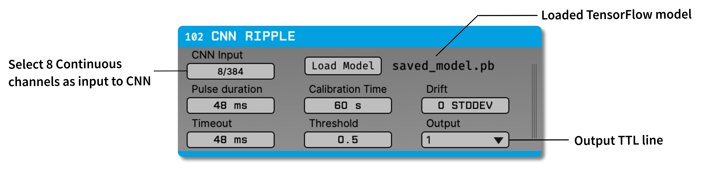

.. _cnnripple:
.. role:: raw-html-m2r(raw)
   :format: html

#####################
CNN Ripple
#####################

.. csv-table:: Uses a 1D convolutional neural network to detect hippocampal ripple events across 8 channels simultaneously. This plugin has been tested with linear arrays, high-density silicon probes, and Neuropixels, and can be used for online or offline ripple detection.
   :widths: 18, 80

   "*Plugin Type*", "Filter"
   "*Platforms*", "Windows, Linux"
   "*Built in?*", "No"
   "*Key Developers*", "Rodrigo Amaducci, Andrea Navas-Olive"
   "*Source Code*", "https://github.com/open-ephys-plugins/cnn-ripple"
   "*Publication DOI*", "`10.7554/eLife.77772 <http://dx.doi.org/10.7554/eLife.77772>`__"

Installing and upgrading
###########################

The CNN Ripple plugin is not included by default in the Open Ephys GUI. To install, use **ctrl-P** or **⌘P** to access the Plugin Installer, browse to the "CNN Ripple" plugin, and click the "Install" button.

The Plugin Installer also allows you to upgrade to the latest version of this plugin, if it's already installed.

Plugin configuration
######################

The plugin editor allows the user to set the following parameters:

- **CNN Input:** The input channels to use for ripple detection (exactly 8 channels must be selected).

- **Load Model:** Opens up a dialog for selecting the CNN model :code:`.pb`` file. A file optimized for detecting ripples on 8 input channels is available `here <https://github.com/open-ephys-plugins/cnn-ripple/tree/master/model>`__.

- **Pulse duration:** Duration (in milliseconds) of the TTL pulse sent when a ripple is detected.

- **Timeout:** Recovery time (in milliseconds) after a pulse is sent.

- **Calibration:** Calibration time before the experiment (in seconds). One minute is usually sufficient.

- **Threshold:** Probability threshold for ripple detection (between 0 and 1).

- **Drift:** Number of standard deviations above which the signal is considered to be dominated by extreme offset drift; the CNN will stop detecting ripples if this threshold is crossed.

- **Output:** TTL line to use for output pulses.

More information
######################

A more detailed characterization of this plugin's performance can be found in the following publication:

Andrea Navas-Olive, Rodrigo Amaducci, Maria-Teresa Juardo-Parras, Enrique R Sebastian, and Liset M de la Prida (2022) `"Deep learning based feature extraction for prediction and interpretation of sharp-wave ripples in the rodent hippocampus" <https://elifesciences.org/articles/77772v1>`__ *eLife* **11**: e77772 

If you use this plugin in your work, be sure to cite this article!

|

