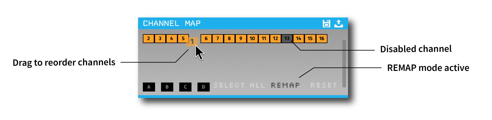
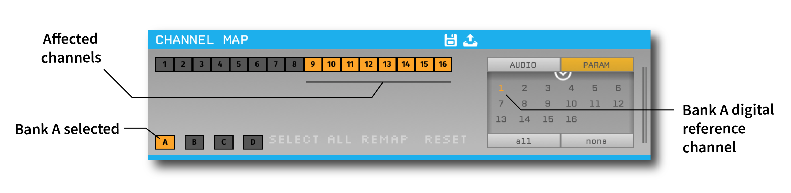

.. _channelmap:
.. role:: raw-html-m2r(raw)
   :format: html

################
Channel Map
################

.. image:: ../../_static/images/plugins/channelmap/channelmap-01.png
  :alt: Annotated Channel Map settings interface

|

.. csv-table:: Used to reorder and delete channels, as well as configure up to four independent digital references.
   :widths: 18, 80

   "*Plugin Type*", "Filter"
   "*Platforms*", "Windows, Linux, macOS"
   "*Built in?*", "Yes"
   "*Key Developers*", "Josh Siegle"
   "*Source Code*", "https://github.com/open-ephys/plugin-GUI/tree/master/Plugins/ChannelMappingNode"

Plugin configuration
=====================

Rearranging channels
---------------------

To rearrange channels, click **REMAP** (it will become darker when selected). You can then re-order channels by dragging them around. Double-clicking on a channel will disable it.

Downstream plugins will receive continuous channels in the new order, and will not receive signals from disabled channels. In the example above, the original channel 2 would appear as channel 1 in any plugins to the right of the Channel Map. And channel 13 would be removed (leaving a total of 15 continuous channels).

This functionality is useful for reordering channels prior to spike detection, so channels belonging to the same tetrode can be easily grouped together.

Selecting digital references
-----------------------------

There are four available reference banks (A, B, C, and D), which can be used to create digital references. 

To configure a reference bank:

#. Make sure the correct bank is selected.

#. Use the "PARAM" drawer on the right side of the plugin to select one channel to serve as the reference.

#. Select the channels in the main area of the editor that will use this reference.

In the example above, channels 9-16 are referenced to channel 1.

.. caution:: Do not confuse them with A, B, C, and D that appear on the right of :ref:`rhythmfpga` module, which represent different headstages and have nothing to with A, B, C, and D on the Channel Map module.

Saving and loading channel mappings
------------------------------------

By clicking the icons at the top right of the module, you can save or load the settings of the Channel Map module in JSON format. This is helpful in cases where you want to load a channel mapping independently of the rest of the signal chain.

An example file for two channels is shown below:

.. code-block:: json

  {
    "0": {
      "mapping": [
        1,
        2
      ],
      "reference": [
        -1,
        -1
      ],
      "enabled": [
        true,
        true
      ]
    },
    "refs": {
      "channels": [
        0,
        -1,
        -1,
        -1
      ]
    },
    "recording": {
      "channels": [
        false,
        false
      ]
    }
  }

