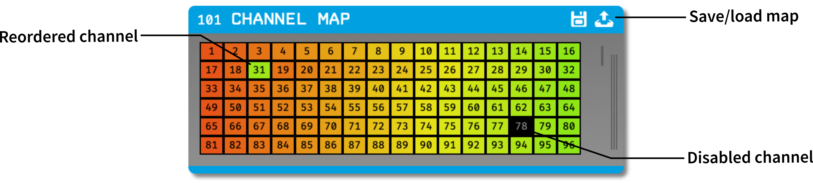

.. _channelmap:
.. role:: raw-html-m2r(raw)
   :format: html

################
Channel Map
################

.. csv-table:: Used to reorder and remove channels within the signal chain.
   :widths: 18, 80

   "*Plugin Type*", "Filter"
   "*Platforms*", "Windows, Linux, macOS"
   "*Built in?*", "Yes"
   "*Key Developers*", "Josh Siegle"
   "*Source Code*", "https://github.com/open-ephys/plugin-GUI/Plugins/ChannelMappingNode"

.. warning:: Due to the way that the GUI connects channels between plugins, channel 1 *must* be enabled. If you disable channel 1 in the Channel Map, then no data will be transmitted downstream.

Plugin configuration
=====================

Reordering channels
---------------------

To reorder channels, simply drag the channel buttons around inside the editor.

Downstream plugins will receive continuous channels in the new order. You can confirm the reordering has occurred by looking at the names of the channels in the :ref:`lfpviewer`.

This functionality is useful for reordering channels prior to spike detection, so channels belonging to the same tetrode can be easily grouped together.

Removing channels
-----------------------------

To remove a channel, right click on its button and select "Disable input channel *N*". To add it back, right click on a disabled channel and select "Enable input channel *N*".

Downstream plugins will not receive continuous channels that have been removed.

.. caution:: The disabled/enabled state of each channel is tied to its relative order within the Channel Map plugin, not its absolute channel number. Therefore, it's important to reorder channels first, *then* remove channels that are not needed. Changing the channel order after some channels have been disabled could result in improper configurations.

Saving and loading channel mappings
------------------------------------

By clicking the icons at the top right of the module, you can save or load the settings for a particular stream in JSON format. This is helpful in cases where you want to load a channel mapping independently of the rest of the signal chain, or you want to define a channel map programatically.

An example JSON string for two channels is shown below:

.. code-block:: json

  {
    "0": {
      "mapping": [
        0,
        1
      ],
      "enabled": [
        true,
        true
      ]
    }
  }

Working with multiple data streams
===================================

The Channel Map plugin maintains an independent map for each incoming data stream. To configure the map for a particular data stream, make sure it is currently active in the stream selector interface (accessed by clicking the vertical bars on the right-hand side of the editor).

|

