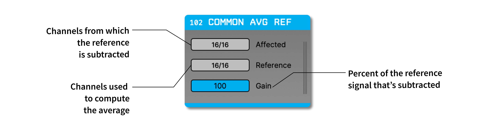
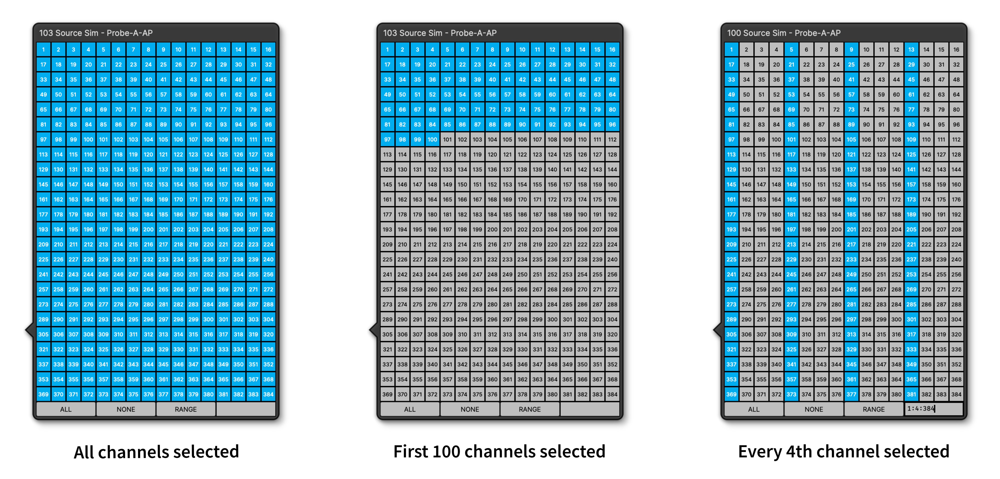

.. _commonaveragereference:
.. role:: raw-html-m2r(raw)
   :format: html

#########################
Common Average Reference
#########################

.. csv-table:: Used to create a reference from the average of multiple channels. Helpful for removing noise that's shared across electrodes.
   :widths: 18, 80

   "*Plugin Type*", "Filter"
   "*Platforms*", "Windows, Linux, macOS"
   "*Built in?*", "Yes"
   "*Key Developers*", "Ryan Maloney, Josh Siegle, Kirill Abramov"
   "*Source Code*", "https://github.com/open-ephys/plugin-GUI/tree/main/Plugins/CommonAverageRef"

Plugin configuration
=====================

There are three settings that affect the behavior of the Common Average Reference:

* :code:`Affected channels`: These are the channels to which the referencing is applied.

* :code:`Reference channels`: These are the channels which are averaged to compute the reference signal. To implement simple digital reference to one electrode, select a single channel at a time.

* :code:`Gain level`: The percentage of the reference signal to use. For a gain level of 100%, the reference signal will be multiplied by 1.0. To adjust the gain level, click on the gain slider and drag upwards or downward.

Some example channel configurations are illustrated in the figure below:

Working with multiple data streams
===================================

The "Reference" and "Affected" channels are only applied within a single stream. Because different streams may be sampled asynchronously, it's not possible to reference channels from one stream to channels in another.

To change the settings for a particular stream, make sure it is active in the stream selector (accsesed by clicking the vertical lines on the right-hand side of the plugin editor).

