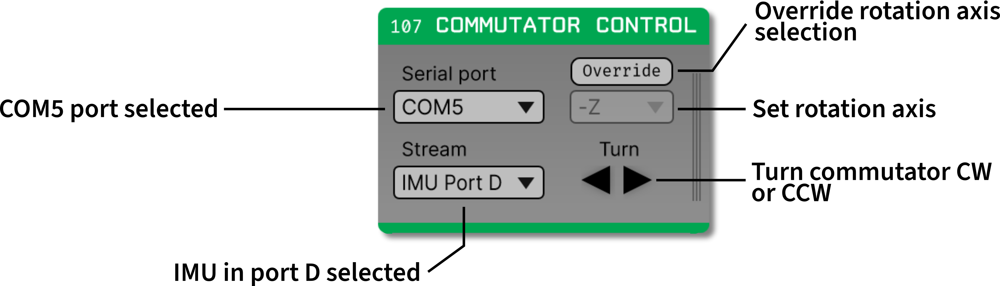

.. _commutatorcontrol:
.. role:: raw-html-m2r(raw)
   :format: html

##################
Commutator Control
##################

..  csv-table:: Prevents twist in the tether connecting a moving animal to a stationary `Open Ephys acquisition board Gen3 <https://open-ephys.org/acq-board>`__.
    :widths: 18, 80

    "*Plugin Type*", "Sink" 
    "*Platforms*", "Windows, Linux, macOS" 
    "*Built in?*", "No" 
    "*Key Developers*", "Brandon Parks, Aarón Cuevas López" 
    "*Source Code*", "https://github.com/open-ephys-plugins/oe-commutator-control"

..  tip:: For more in-depth documentation on the commutator hardware, please refer to the `Open Ephys Commutators docs site <https://open-ephys.github.io/commutator-docs/>`__.

Installing and upgrading
==========================

The Commutator Control plugin is not included by default in the Open Ephys GUI. To install, use
**ctrl-P** or **⌘P** to open the Plugin Installer, browse to "Commutator Control", and click the
"Install" button. After installation, *Commutator Control* will appear in the processor list on the
left side of the GUI's main window.

The Plugin Installer also allows you to upgrade to the latest version of this plugin, if it's
already installed. The plugin must be removed from the signal chain prior to upgrading.

Plugin configuration
====================

Serial port selector
####################

In the top-left corner of the commutator processor, there is a dropdown menu to select the COM port
that corresponds to your commutator. To determine which COM port corresponds to your commutator: 

#.  Unplug  your commutator.

#.  Click the dropdown. Note the COM ports that are shown in the dropdown. 

#.  Plug in your commutator.

#.  Click the dropdown. The COM port that appears in step 4 but not in step 2 is the one that
    corresponds to your commutator.

Stream selector
###############

In the bottom-left corner of the commutator process, there is a dropdown menu to select which IMU
stream you would like to use to calculate commutator rotations. The options provided by the dropdown
correspond to IMUs detected in the Acquisition Board processor.

Rotation axis selector
######################

In the top-right corner of the commutator processor, there is a dropdown menu to select the relevant
rotation axis for calculating commutator rotations. 

The GUI software automatically pre-maps each headstage's orientation axes such that the +Z axis
aligns along the tether where it connects to the headstage, so you shouldn't need to change this
value. However, if you do need to change this value, there is an "override" button to allow you to
do that. For more information on the headstages' axes, look at the `Headstages
<https://open-ephys.github.io/acq-board-docs/Hardware-Guide/Headstages.html#channel-maps>`_ section
of the Acquisition Board docs.

Turn buttons
############

In the bottom-right corner of the commutator processor, there are arrow buttons for controlling the
commutator manually. Click the left arrow to rotate the commutator 0.1 revolutions. Click the right
arrow to rotate the commutator 0.1 revolutions in the other direction. Hold the left arrow to rotate
the commutator continuously. Hold the right arrow to rotate the commutator continuously in the other
direction.
