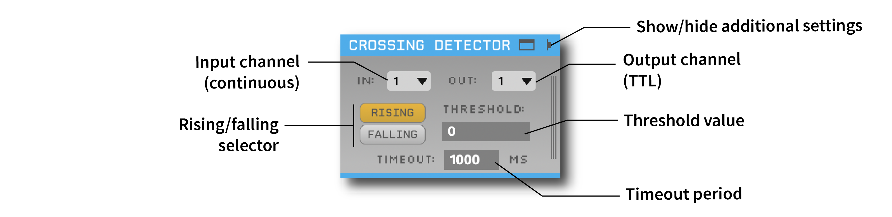

.. _crossingdetector:
.. role:: raw-html-m2r(raw)
   :format: html

#####################
Crossing Detector
#####################

.. csv-table:: Emits events when continuous signals cross a threshold
   :widths: 18, 80

   "*Plugin Type*", "Filter"
   "*Platforms*", "Windows, Linux, macOS"
   "*Built in?*", "No"
   "*Key Developers*", "Ethan Blackwood, Mark Schatza"
   "*Source Code*", "https://github.com/open-ephys-plugins/crossing-detector"

Installing and upgrading
###########################

The Crossing Detector plugin is not included by default in the Open Ephys GUI. To install, use **ctrl-P** to access the Plugin Installer, browse to the "Crossing Detector" plugin, and click the "Install" button.

The Plugin Installer also allows you to upgrade to the latest version of this plugin, if it's already installed.

Plugin Configuration
######################

The Crossing Detector analyzes the values on an incoming continuous channel, and outputs events whenever a threshold is crossed. It is meant to be used in conjunction with plugins that output smoothly varying continuous signals, such as the :ref:`phasecalculator` and the :ref:`multibandintegrator`. 

The most important parameters are available in the plugin editor:

* **Input channel**: Continuous (input) channel to be analyzed.

* **Rising/falling selector**: Determines whether events are emitted whenever the signal rises above the threshold, or falls below the threshold.

* **Output channel**: Event (TTL) channel on which this plugin will output events.

* **Timeout**: Minimum time elapsed between one event and the next. If the signal crosses the threshold within <timeout> ms after the last event, no event will be emitted.

Additional parameters can be configured by clicking the "tab" or "window" buttons in the upper right of the plugin's editor. The settings interface can be seen here:

.. image:: ../../_static/images/plugins/crossingdetector/crossingdetector-02.png
  :alt: Crossing Detector visualizer with additional settings

.. note:: By default, the event duration is set to 5 ms, which is too short to be visualized in the LFP Viewer. To ensure that the events are displayed, change the duration to 100 ms or higher.

.. image:: ../../_static/images/plugins/crossingdetector/crossingdetector-03.png
  :alt: Sample output of Crossing Detector