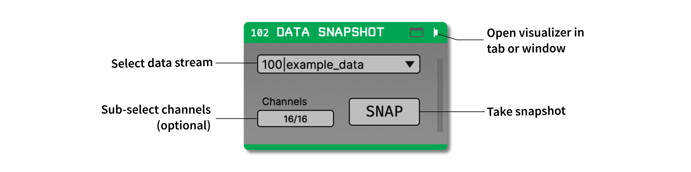
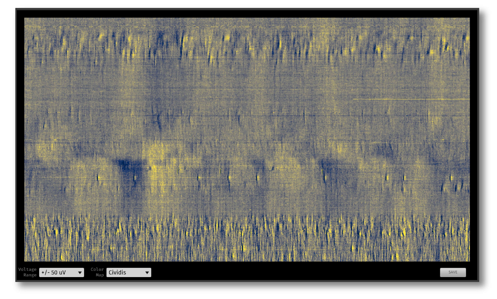

.. _datasnapshot:
.. role:: raw-html-m2r(raw)
   :format: html

#########################
Data Snapshot
#########################

.. csv-table:: Converts a short segment of data into an image (time x channels). Such images are typically created offline to assess data quality, but this plugin makes it possible to generate them during an experiment.
   :widths: 18, 80

   "*Plugin Type*", "Sink"
   "*Platforms*", "Windows, Linux, macOS"
   "*Built in?*", "Yes"
   "*Key Developers*", "Josh Siegle"
   "*Source Code*", "https://github.com/open-ephys-plugins/data-snapshot"

Installing and upgrading
==========================

The Data Snapshot plugin is not included by default in the Open Ephys GUI. To install, use **ctrl-P** or **⌘P** to open the Plugin Installer, browse to the "Online PSTH" plugin, and click the "Install" button.

The Plugin Installer also allows you to upgrade to the latest version of this plugin, if it's already installed.

Plugin configuration
======================

The following parameters can be modified in the plugin editor:

- **Input stream** - Select one incoming stream to use.
- **Window size** - The width of the image in milliseconds (default = 100 ms, max = 200 ms).
- **Channels** - The channels to use to create the image (by default, all channels are included).

The following parameters can be modified in the plugin visualizer.

- **Voltage range** - Limits of the color map applied to the image (in microvolts)
- **Color map** - Image color map (Greys, Cividis, Viridis, RdGy, or RdBu)

All parameters take effect the next time the "snap" button is pressed.

Plugin usage
======================

First, open the visualizer in a tab or window, then press the "snap" button to display the data as an image. To save the current image as a PNG, press the "save" button.

This plugin was designed to provide quick feedback about data quality in high-channel count recordings by converting a short snippet of data into an image. It's especially useful for Neuropixels or other probes with a linear site layout. It can be used to visualize spikes across the length of the probe, spot dead or noisy channels, or detect high-frequency noise that's hard to see in the LFP Viewer.

By placing a Data Snapshot plugin at various locations in the signal chain, you can easily visualize the effects of different Filters (such as :ref:`bandpassfilter`, :ref:`commonaveragereference`, or :ref:`neuropixelscar`). Because this plugin only generates images when you press the "snap" button, there is very little overhead for using multiple Data Snapshot plugins at once.

|

