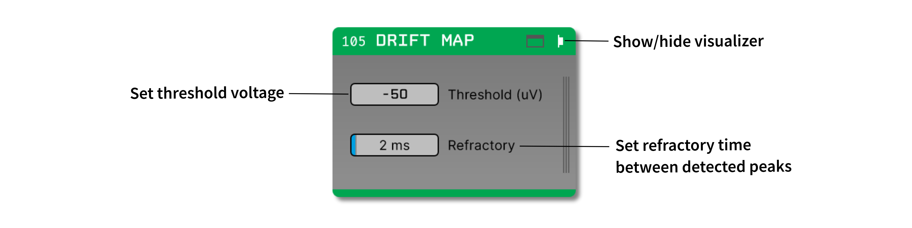
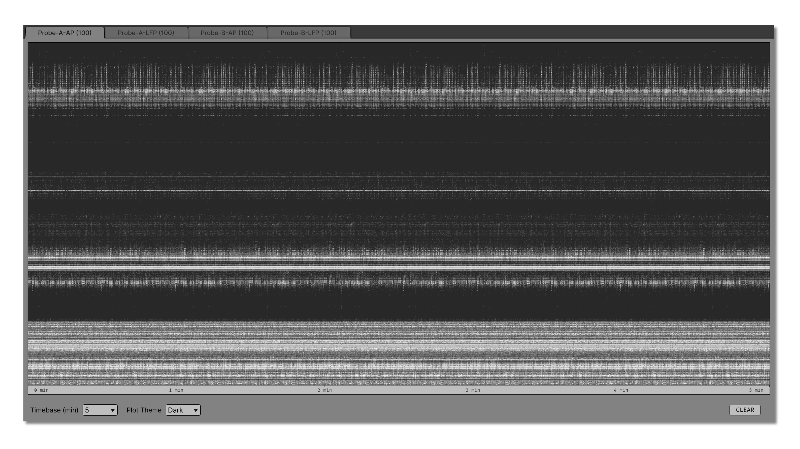

.. _driftmap:
.. role:: raw-html-m2r(raw)
   :format: html

#########
Drift Map
#########

.. csv-table:: View a zoomed-out spike raster over long recording intervals, with time on the horizontal axis and electrode channel position on the vertical axis.
   :widths: 18, 80

   "*Plugin Type*", "Sink"
   "*Platforms*", "Windows, Linux, macOS"
   "*Built in?*", "No"
   "*Key Developers*", "Josh Siegle"
   "*Source Code*", "https://github.com/open-ephys-plugins/drift-map"

Installing and upgrading
########################

The Drift Map plugin is not included by default in the Open Ephys GUI. To install, use **ctrl-P** or **⌘P** to open the Plugin Installer, browse to the "Drift Map" plugin, and click the "Install" button.

The Plugin Installer also allows you to upgrade to the latest version of this plugin, if it's already installed.

Recommended signal chain
########################

The Drift Map plugin is intended for high-channel-count extracellular recordings, especially Neuropixels data, but it can display threshold crossings from any incoming continuous data stream. It should be placed downstream of a :ref:`bandpassfilter`, so that threshold crossings are detected accurately.

Because Drift Map is a Sink plugin, it does not modify continuous data or event data that pass to downstream processors.

Opening the visualizer
######################

Open the canvas by clicking the "tab" or "window" buttons at the top right of the plugin editor.

The visualizer creates one tab for each incoming data stream. Each tab is labelled with the stream name and source node ID. If channel group, depth, or position metadata is available from the upstream source, channels are sorted by probe geometry before being displayed. Otherwise, channels are shown in their original stream order.

The canvas shows a time-by-channel raster for the selected stream. Each dot represents a detected negative peak. Time runs from left to right, and channels are arranged vertically according to the incoming channel order or available probe geometry metadata.

Detection controls
##################

The plugin editor contains editors for peak detection settings:

* **Threshold (uV)** sets the negative voltage threshold for detected peaks. The default value is -50 μV. More negative values detect fewer, larger events.

* **Refractory (ms)** sets the minimum separation between detected peaks on the same channel. The default value is 2 ms.

The visualizer contains additional controls for adjusting the display:

* **Timebase (min)** sets the visible time range of the plot. Available values are 1, 2, 5, 10, 15, 30, and 60 minutes.

* **Plot Theme** switches the raster between dark and light plot rendering.

* **CLEAR** removes the accumulated drift map history from all stream tabs.

Threshold and refractory changes affect newly detected peaks. Peaks that have already been drawn remain in the accumulated raster until **CLEAR** is clicked.

Creating a drift map
####################

Drift Map begins accumulating peaks when acquisition starts. It detects local negative minima that fall below the selected threshold and pass the per-channel refractory period. The plot updates continuously while acquisition is running.

Dot brightness reflects peak amplitude. Larger detected peaks are drawn brighter, while smaller threshold crossings are drawn more faintly. The time axis is labelled in minutes and begins at the first detected peak in the current history.

Use the stream tabs at the top of the visualizer to switch between incoming data streams. Hidden tabs continue to receive periodic updates, so their drift maps remain available when you switch back to them.

Interpreting the display
########################

Drift Map is useful for assessing whether the probe is moving relative to the recorded neurons over long time intervals. Stable recordings typically show activity bands that remain at similar depths over time. Vertical shifts, fading bands, or sudden changes in density can indicate probe drift, tissue movement, or changing noise levels.

The plugin detects threshold crossings directly from the continuous signal. It is not a spike sorter, and it does not cluster or assign units. Instead, it should be used as a visual summary of probe stability over time.

Zooming and navigation
######################

The drift map keeps following the newest data by default. You can inspect older time ranges with the mouse:

* Use the mouse wheel over the plot to zoom in or out around the cursor position.

* Click and drag inside the plot to pan through accumulated history.

* Double-click the plot to return to the latest data.

Changing **Timebase (min)** resets the view to the newest data with the selected visible time range.

|