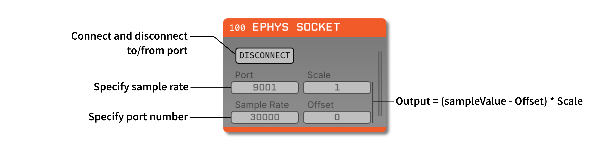

.. _ephyssocket:
.. role:: raw-html-m2r(raw)
   :format: html

#####################
Ephys Socket
#####################

.. csv-table:: Receives formatted data from a TCP socket that implements a particular :ref:`header format <Header Format for Custom Data Streams>`. A common use case is to receive data streamed from :ref:`Bonsai <In Bonsai>`. This is intended to be a quick way to stream ephys data from a third-party application and visualize in the Open Ephys GUI. Below is a way to setup streaming between Bonsai and the Open Ephys GUI, which can be extended to other software and/or hardware that carry the same header format.
   :widths: 18, 80

   "*Plugin Type*", "Source"
   "*Platforms*", "Windows, Linux, macOS"
   "*Built in?*", "No"
   "*Key Developers*", "Jon Newman, Brandon Parks"
   "*Source Code*", "https://github.com/open-ephys-plugins/ephys-socket"

Installing and upgrading
###########################

The Ephys Socket plugin is not included by default in the Open Ephys GUI. To install, use **ctrl-P** or **⌘P** to access the Plugin Installer, browse to the "Ephys Socket" plugin, and click the "Install" button.

The Plugin Installer also allows you to upgrade to the latest version of this plugin, if it's already installed.

Plugin Configuration
######################

In Bonsai
-----------

#. Make sure you have the **Bonsai.Ephys** and **OpenEphys.Sockets.Bonsai** packages installed. For the latter, you'll have to set the package source to "Community Packages".

#. Create a signal chain that includes (at least):

   * A source that generates an `OpenCV.Net.Mat` output (e.g., :code:`Rhd2000EvalBoard`, which is compatible with the Open Ephys acquisition board)

   * A member selector that isolates the `OpenCV.Net.Mat` output

   * The :code:`TcpServer` and :code:`SendMatOverSocket` nodes from **OpenEphys.Sockets.Bonsai**.

#. Click on the :code:`TcpServer`, and edit the fields there:

   * Set the address (for communication within the same computer, put "localhost" without quotes)

   * Add a name to use for the connection channel. This can be an arbitrary name, but must match the same name used in the :code:`SendMatOverSocket` node

   * Change the port number to :code:`9001`

#. (Optional) Add a "Select Channels" operator before :code:`SendMatOverSocket`, to select a subset of channels for streaming.

#. Click on the :code:`SendMatOverSocket` node, and choose the connection created previously from the drop-down menu

#. Start the workflow to initiate the data stream.

The workflow should look something like the one pictured below (:code:`.bonsai` file available in the `Ephys Socket GitHub repo <https://github.com/open-ephys-plugins/ephys-socket/tree/main/Resources>`__):

.. image:: ../../_static/images/plugins/ephyssocket/ephyssocket-02.png
  :alt: A compatible Bonsai workflow using hardware

A second workflow is included in the same `Resources folder <https://github.com/open-ephys-plugins/ephys-socket/tree/main/Resources>`__ which uses a function generator (imported from **Bonsai.Dsp**). This workflow is useful for testing socket connections without requiring hardware to be connected:

.. image:: ../../_static/images/plugins/ephyssocket/ephyssocket-03.png
  :alt: A compatible Bonsai workflow using a function generator

In Open Ephys
--------------

#. Drag and drop the Ephys Socket plugin onto the signal chain.

#. Add downstream filters or sinks (i.e., :code:`LFP Viewer`, :code:`Record Node`, etc.).

#. Ensure the **port** matches the same number used in Bonsai.

#. Ensure the **frequency** parameter matches the sample rate of the Bonsai data stream. By default the Open Ephys acquisition board acquires data at 30000 Hz.

#. Change the **offset** and **scale** values as needed, but it is important to know that the Open Ephys GUI works in microvolts represented as floating points. These values may be required to transform your data into microvolts; for example, the Open Ephys Acquisition Board requires a scale of 0.195 and an offset of 32768 to correctly convert data from `uint16` to `float` values. 

   * If values are sent as microvolts, then **scale** and **offset** can be set to 1 and 0, respectively. Note that this will require more bandwidth.

#. Click the "Connect" button to establish the connection with Bonsai. If it's not connecting, make sure the Bonsai workflow is running, and the **port** numbers match. Once the connection is made, all input parameters will be grayed out, and cannot be changed until the socket is disconnected.

   * If no data is being sent from Bonsai yet (e.g., the acquisition board is still initializing), the socket will not connect. Wait until the hardware is actively sending data before attempting to connect the socket.

#. Start acquisition in Open Ephys. If all is working, you should see the data stream in the LFP Viewer.

#. If the header format is changed in any way, such as by modifying the number of channels or changing the data type, the Open Ephys GUI will automatically detect these changes and stop acquiring data.

   * If the GUI was not actively acquiring data, it is necessary to disconnect the socket and connect again to read the updated header values.
   
   * Note that attempting to start acquisition after changing these values will automatically disconnect the socket anyway, forcing a new connection to be made.

.. warning:: This plugin does not guarantee that samples will not be lost in transit, so it's essential to save your data stream on the Bonsai end. There are at least two ways data loss can occur: 1) When a data stream is first connected, there is no guarantee that the data will be saved, since data is not acquired immediately after connecting the socket. 2) If too much data is being sent and the Open Ephys GUI cannot process the data quickly enough, some packets may be lost due to the TCP buffer filling up. If you suspect samples are being dropped (e.g., if the LFP Viewer is not updating at the expected speed), sending a lower bandwidth might fix the problem.

Header Format for Custom Data Streams
######################################

While the :code:`SendMatOverSocket` node (found in **OpenEphys.Sockets.Bonsai**, see :ref:`In Bonsai` for details) is a common use case for sending `OpenCV.Net.Mat` data over the TCP socket, it is not the only way to stream data. As long as whatever is used to stream data (e.g., a Python script that sends data over the TCP socket) correctly prepends a header to the data stream, Ephys Socket can correctly interpret the data.

An example Python script is included in the `Resources <https://github.com/open-ephys-plugins/ephys-socket/tree/main/Resources>`__ folder of the plugin repository, which implements the format described here. Each variable is 4 bytes long (with the exception of the Bit Depth, which is 2 bytes long), and must be sent in the order listed below. The total header length is 22 bytes.

.. csv-table:: Ephys Socket header variables
    :widths: 18, 10, 60
    
    "**Variable**", "**Data Type**", "**Description**"
    "Offset", "`int32`", "Integer defining the offset in the data stream. For TCP sockets, value must always be set to **0**."
    "Number of Bytes", "`int32`", "Total number of bytes sent in each packet. Calculated as :code:`num_bytes = num_channels * num_samples * element_size`. This does **not** include the header bytes."
    "Bit Depth", "`int16`", "Depth defines the OpenCV.Mat `Depth <https://github.com/horizongir/opencv.net/blob/main/src/OpenCV.Net/CoreTypes.cs#L93>`__, an enumeration defined as :code:`[U8, S8, U16, S16, S32, F32, F64]`, where U is 'unsigned', S is 'signed', F is 'float', and the number indicates the number of bits. For example, :code:`U16` means 'unsigned integer with 16 bits'. Note that the enumeration is zero-indexed, where :code:`U8 = 0`, and :code:`F64 = 6`"
    "Element Size", "`int32`", "Number of bytes needed for each sample. For :code:`U16`, :code:`element_size = 2`, while for :code:`F64`, :code:`element_size = 8`."
    "Number of Channels", "`int32`", "Number of channels per packet."
    "Number of Samples", "`int32`", "Number of samples sent per channel per packet."

.. note::

    Pay attention to the order of data samples in the example script. Samples are not interleaved, but rather in each packet the samples for channel 1 are sent, followed by the samples for channel 2, and so on.

Remote Control
#################

Some Ephys Socket settings can be modified via the GUI's built-in HTTP server. Commands are sent as "config messages" to the Ephys Socket node.

.. note::

    Parameters cannot be modified while acquisition is running, nor can they be modified if the port is connected. To change any settings remotely, the port must be disconnected in the GUI

The following commands are available:

1. :code:`ES INFO` : returns a JSON string containing information about all available variables (i.e., scale, offset, port, and frequency)
2. :code:`ES SCALE <data_scale>` : set the data scale
3. :code:`ES OFFSET <data_offset>` : set the data offset
4. :code:`ES PORT <port>` : set the port number
5. :code:`ES FREQUENCY <sample_rate>` : set the sampling frequency
