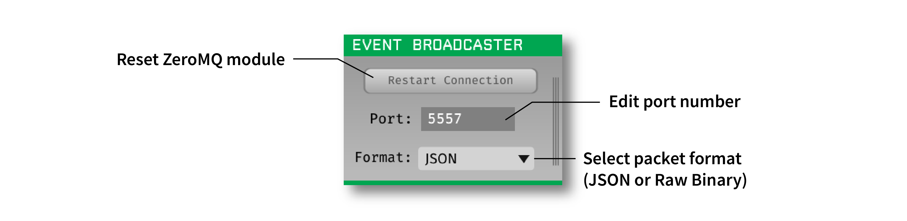

.. _eventbroadcaster:
.. role:: raw-html-m2r(raw)
   :format: html

#################
Event Broadcaster
#################

.. csv-table:: Sends events from the GUI to external applications using a ZeroMQ socket. Can be used to transmit "lightweight" information about ongoing spikes/events; if the full continuous data is needed, the :ref:`zmqinterface` should be used instead.
   :widths: 18, 80

   "*Plugin Type*", "Sink"
   "*Platforms*", "Windows, Linux, macOS"
   "*Built in?*", "No"
   "*Key Developers*", "Christopher Stawarz"
   "*Source Code*", "https://github.com/open-ephys-plugins/event-broadcaster"

Installing and upgrading
###########################

The Event Broadcaster plugin is not included by default in the Open Ephys GUI. To install, use **ctrl-P** or **⌘P** to open the Plugin Installer, browse to the "Event Broadcaster" plugin, and click the "Install" button.

The Plugin Installer also allows you to upgrade to the latest version of this plugin, if it's already installed.

Plugin configuration
######################

**Restart connection**: Resets the ZeroMQ data streaming backend

**Port**: Modifies the port number from which this plugin will send data. 

**Format**: Select the event packet format (:code:`JSON` or :code:`Raw Binary`).

The Event Broadcaster packages and sends all incoming events and spikes, regardless of their stream of origin.

Each event is transmitted as a multi-part message, with the first part indicating the message type (0 = TTL event, 1 = spike), and the second part containing either a JSON string or a raw binary payload.

JSON Packet Format
###################

Spikes
-------

.. code-block:: 

   {
      "event_type" : "spike",
      "stream" : "stream_name",
      "source_node" : 105,
      "electrode" : "Electrode 1",
      "num_channels" : 4,
      "sample_rate" : 30000,
      "sample_number" : 193722,
      "sorted_id" : 0,
      "amp1" : 210,
      "amp2" : 150,
      "amp3" : 20,
      "amp4" : 5
   }

TTL Events
----------

.. code-block:: 

   {
      "event_type" : "ttl",
      "stream" : "stream_name",
      "source_node" : 101,
      "sample_rate" : 30000,
      "channel_name" : "TTL Event Channel",
      "sample_number" : 103922,
      "line" : 2,
      "state" : 1
   }

Raw Binary Packet Format
#########################

When sending packets in raw binary mode, the Event Broadcaster serializes the events into the same format used internally by the GUI. For the details of the serialized spikes, refer to the source code in :code:`Event.h` and :code:`Spike.h`.

Receiving data in Python
########################

See the `open-ephys-python-tools <https://github.com/open-ephys/open-ephys-python-tools/tree/main/open_ephys/streaming/>`__ repository for a more complete implementation.

.. code-block:: python

   import zmq
   import json

   url = "tcp://localhost:5557"
        
   context = zmq.Context()
   socket = context.socket(zmq.SUB)
   socket.connect(url)

   for eventType in (b'ttl', b'spike'):
      socket.setsockopt(zmq.SUBSCRIBE, eventType)

   def callback(info):
      #do something with the incoming data
      print(info)

   while True:
      parts = socket.recv_multipart()

      event_info = json.loads(parts[1].decode('utf-8'))

      callback(event_info)

