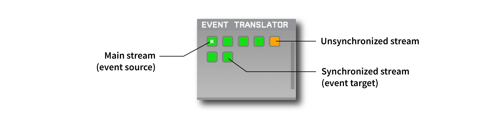

.. _eventtranslator:
.. role:: raw-html-m2r(raw)
   :format: html

#################
Event Translator
#################

.. csv-table:: Copies events from one data stream to all other synchronized streams.
   :widths: 18, 80

   "*Plugin Type*", "Utility"
   "*Platforms*", "Windows, Linux, macOS"
   "*Built in?*", "Yes"
   "*Key Developers*", "Josh Siegle"
   "*Source Code*", "https://github.com/open-ephys-plugins/EventBroadcaster"

Recommended signal chain
=========================

The Event Translator plugin only works if it has multiple data streams passing through it. This can happen when using a source plugin that generates multiple streams on its own (such as :ref`neuropixelspxi`), or when using a :ref:`merger` with multiple source nodes.

All incoming streams *must* share a digital input, with relatively slow (~1 Hz or less) TTL events at regular or random intervals. This shared hardware input makes it possible to determine the exact offset and scaling of each source's sample clock relative to the "main" data stream.

Plugin configuration
=====================

By default, the Event Translator will set the first stream as the main stream, and TTL line 1 (1-based indexing) as the sync line.

 * To change the main stream, click on one of the gray sync buttons and select "Set as main clock."

* To change the sync line for individual streams, click on one of the gray sync buttons and select the line to which the shared digital input is connected.

It's possible to change the main stream and sync lines while acquisition is active, but not after recording has started.

Expected behavior
==================

When acquisition starts, the sync buttons will turn orange prior to synchronization, and then green once they are synchronized. Synchronization requires that at least two TTL events have been received simultaneously by the main stream and an auxiliary stream.

Once a stream is synchronized, all TTL events from the main stream (except those on the sync line) will be realigned to that stream's local clock and added to the event buffer.

|

