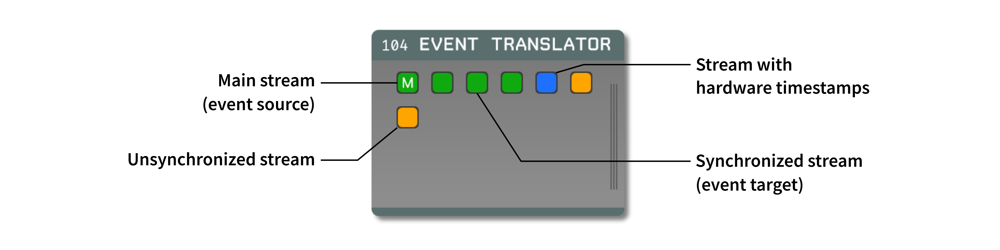

.. _eventtranslator:
.. role:: raw-html-m2r(raw)
   :format: html

#################
Event Translator
#################

.. csv-table:: Translates events across data streams.
   :widths: 18, 80

   "*Plugin Type*", "Utility"
   "*Platforms*", "Windows, Linux, macOS"
   "*Built in?*", "Yes"
   "*Key Developers*", "Josh Siegle"
   "*Source Code*", "https://github.com/open-ephys-plugins/EventBroadcaster"

Plugin configuration
=====================

The Event Translator takes events from one data stream 