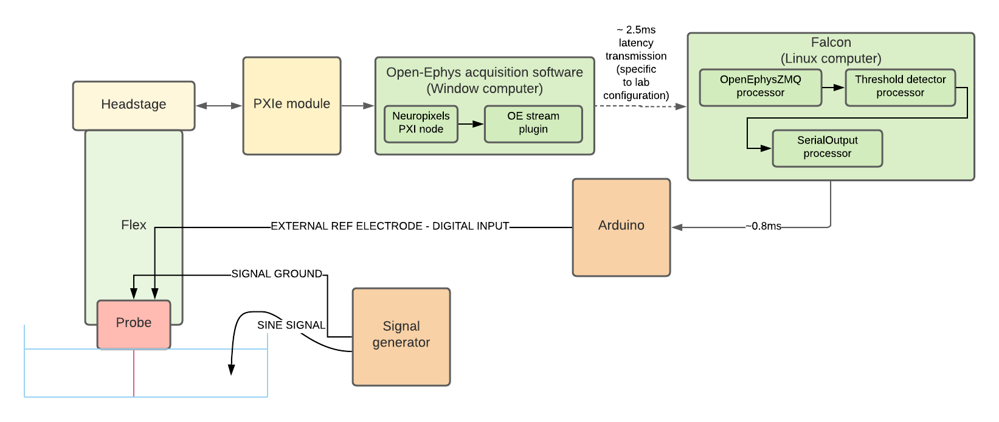

.. _falconoutput:
.. role:: raw-html-m2r(raw)
   :format: html

#####################
Falcon Output
#####################

.. csv-table:: Streams all continuous channels with low latency.
   :widths: 18, 80

   "*Plugin Type*", "Sink"
   "*Platforms*", "Windows, Linux"
   "*Built in?*", "No"
   "*Key Developers*", "Marine Chaput"
   "*Source Code*", "https://github.com/open-ephys-plugins/falcon-output"

Installing and upgrading
###########################

The Falcon Output plugin is not included by default in the Open Ephys GUI. To install, use **ctrl-P** to access the Plugin Installer, browse to the "Falcon Output" plugin, and click the "Install" button.

The Plugin Installer also allows you to upgrade to the latest version of this plugin, if it's already installed.

Plugin Configuration
######################

This plugin will stream all incoming continuous channels via a ZMQ socket. The only setting available to the user is the output port. To use a port other than the default (3335), change the text field in the plugin's editor to the desired port number, and click "Set Port."

Latency Measurements
######################

This plugin has been originally developed to stream Neuropixels data from the Open Ephys GUI to `Falcon <https://falcon-core.readthedocs.io/en/latest/>`__, a Linux-based library used for real-time processing of neural data.

To run the latency tests, the following configuration was used:

A Neuropixels probe was placed in a saline bath, with the bath connected to the positive terminal of signal generator outputting a sine wave signal. Neuropixels data was acquired on a Windows computer using a PXIe system and the Open Ephys :ref:`neuropixelspxi` plugin. A Falcon Output plugin was placed downstream in the signal chain, to stream the data over a network connection.

On a separate computer running Linux, the Falcon signal chain was configured with an OpenEphysZMQ processor, a Threshold Detector processor, and a SerialOutput processor. Whenever the incoming sine wave crossed a threshold, Falcon triggered an output from an Arduino, which was acquired by the digital input of the PXIe system.

The total roundtrip time of this system had the following characteristics:

* **Median:**: 9.2 ms
* **Standard deviation:** 1.3 ms
* **Maximum:** 13 ms

Therefore, when using one Neuropixels probe, this configuration is suitable for closed-loop feedback experiments that require a minimum response time of around 10 ms.
