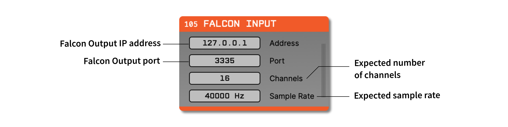
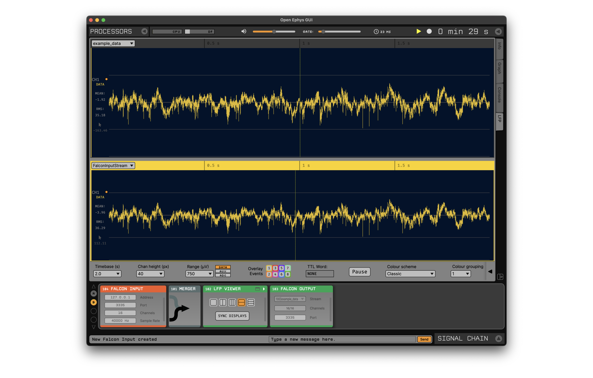

.. _falconoutput:
.. role:: raw-html-m2r(raw)
   :format: html

#####################
Falcon Output
#####################

.. image:: ../../_static/images/plugins/falconoutput/falconoutput-01.png
  :alt: Annotated Falcon Output Editor

.. csv-table:: Streams continuous channels with low latency.
   :widths: 18, 80

   "*Plugin Type*", "Sink"
   "*Platforms*", "Windows, Linux"
   "*Built in?*", "No"
   "*Key Developers*", "Marine Chaput"
   "*Source Code*", "https://github.com/open-ephys-plugins/falcon-output"

Installing and upgrading
###########################

The Falcon Output plugin is not included by default in the Open Ephys GUI. To install, use **ctrl-P** to access the Plugin Installer, browse to the "Falcon Output" plugin, and click the "Install" button.

The Plugin Installer also allows you to upgrade to the latest version of this plugin, if it's already installed.

Plugin Configuration
######################

Each Falcon Output plugin sends continuous data and event codes for one data stream. To select the data stream (if multiple streams are available), use the drop-down menu in the plugin editor. Once a stream has been selected, the channels to send can be changed by clicking the "Channels" button. If not all continuous channels are needed by the client, then deselecting the unused channels is recommended.

To use a network port other than the default (3335), change the text field in the plugin's editor to the desired port number.

See the `Falcon <https://falcon-core.readthedocs.io/en/latest/>`__ documentation for information on setting up a Falcon client.

Creating a custom client
#########################

The Falcon Output plugin uses ZeroMQ to stream data. Unlike the :ref:`zmqinterface` plugin, this plugin uses the `FlatBuffers <https://google.github.io/flatbuffers/>`__ serialization library to reduce latency. An example C++ client can be found in the :code:`clients` directory of the plugin repository.

Falcon Input
#############

In GUI version 0.6.x, installing the Falcon Output plugin also adds a source plugin called "Falcon Input." This can be used to read data from a Falcon Output plugin that lives in a different instance of the Open Ephys GUI. For example, you could configure the GUI on one computer with a source node, a Record Node, and a Falcon Output, and then use a Falcon Input plugin as the source for visualization and/or closed-loop feedback on a different machine. 

It's also possible to use Falcon Input and Output plugins within the same instance of the GUI. In the example image below, data from the Falcon Input is merged together with the original File Reader stream. The LFP Viewer shows the same data from both streams, with a slight delay on the Falcon Input stream:

Latency Measurements
######################

This plugin has been originally developed to stream Neuropixels data from the Open Ephys GUI to `Falcon <https://falcon-core.readthedocs.io/en/latest/>`__, a Linux-based library used for real-time processing of neural data.

To run the latency tests, the following configuration was used:

.. image:: ../../_static/images/plugins/falconoutput/falcon_use_case.png
  :alt: Hardware + software configuration for latency measurmements

A Neuropixels probe was placed in a saline bath, with the bath connected to the positive terminal of signal generator outputting a sine wave signal. Neuropixels data was acquired on a Windows computer using a PXIe system and the Open Ephys :ref:`neuropixelspxi` plugin. A Falcon Output plugin was placed downstream in the signal chain, to stream the data over a network connection.

On a separate computer running Linux, the Falcon signal chain was configured with an OpenEphysZMQ processor, a Threshold Detector processor, and a SerialOutput processor. Whenever the incoming sine wave crossed a threshold, Falcon triggered an output from an Arduino, which was acquired by the digital input of the PXIe system.

The total roundtrip time of this system had the following characteristics:

* **Median:**: 9.2 ms
* **Standard deviation:** 1.3 ms
* **Maximum:** 13 ms

Therefore, when using one Neuropixels probe, this configuration is suitable for closed-loop feedback experiments that require a minimum response time of around 10 ms.
