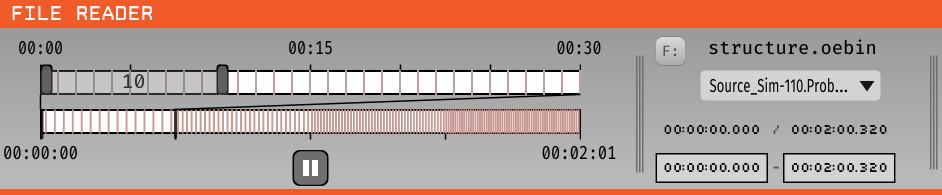

.. _filereader:
.. role:: raw-html-m2r(raw)
   :format: html

File Reader
=====================

|

.. csv-table:: Reads data from a local file.
   :widths: 18, 80

   "*Plugin Type*", "Source"
   "*Platforms*", "Windows, Linux, macOS"
   "*Built in?*", "Yes"
   "*Key Developers*", "Aarón Cuevas López, Pavel Kulik"
   "*Source Code*", "https://github.com/open-ephys/plugin-GUI/tree/master/Source/Processors/FileReader"

Loading Data
###################

The File Reader is compatible with files saved in the :ref:`binaryformat` (indexed with a :code:`structure.oebin` file), :ref:`openephysformat` (indexed with a :code:`structure.openephys` file) and :ref:`nwbdataformat` (indexed with a :code:`*.nwb` file) which can either be saved directly from the Open Ephys GUI or from another program. 

Each input file can contain mulitple streams but only one stream can be played back per FileReader during acquisition. The pulldown menu below the active filename allows switching between the available streams. In order to play multiple streams simultaneously, you can merge multiple FileReaders, each with the same input file and a different selected stream.  

You can play back a subset of a recorded file by changing the "start" and "end" times at the bottom of the File Reader editor.

File Scrubbing
######################

For recordings longer than 30 seconds, a drawer button will appear on the left side of the File Reader to access the Scrubber Interface. 
The interface allows finer control over configuring playback.

**Full Timeline**

The bottom timeline spans the length of the recording. The colored vertical bars along the timeline correspond to recorded events associated with the active stream. A slider along this timeline is fixed at a 30 second interval and allows adjusting the start and stop time for playback.

**Zoom (30 Second) Timeline**

The top timeline spans the currently selected interval of 30 seconds by the Full Timeline. The Zoom Timeline also contains a slider, however this slider can span anywhere from 1 to 30 seconds. The default value is 10 seconds. Moving the right slider handle adjusts the length of the selected interval. Moving the left slider handle moves the entire interval back and forth along the timeline. Clicking and dragging anywhere inside the interval also moves the entire interval along the timeline. Playback will automatically stop when it reaches the end of the current interval.

**Playback Button**

The playback button's state indicates whether or not to playback the currently selected interval while acquisition is active. If the 'pause state' is showing, this means playback will be active during acquisition. If the 'play state' is showing, then playback will NOT be active during acquisition. Toggle the button to change to the desired state as needed.  

Sample Data
######################

There are four example files included in the GUI repository that can be used with the File Reader, found in the `Resources/DataFiles` directory (source code download) or the `DataFiles` directory (executable download):

* :code:`data_stream_16ch_cortex` - data from 8 stereotrodes (16 channels total) recorded from barrel cortex of an awake mouse. The signals contain many action potentials, and are useful for test spike detection pipelines.

* :code:`data_stream_16ch_hippocampus` - one channel of data recorded from mouse CA1, copied across 16 channels. The signals have large-amplitude theta oscillations, and can be used to test phase-triggered stimulation.

* :code:`data_stream_sine_wave` - 16 channels of a simple, 1000-microvolt sine wave. There's a small glitch near the end.

* :code:`chirps_16_channels_At40kHz` - 16 channels of frequency sweeps at 40 kHz