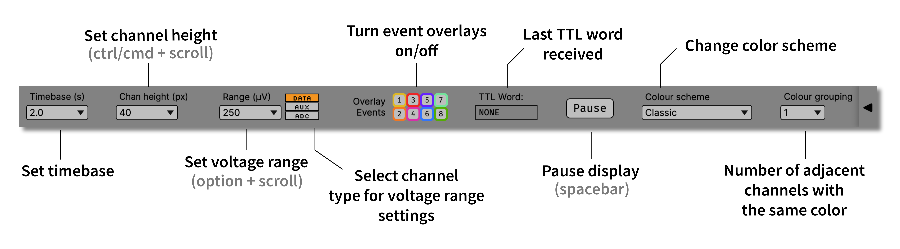

.. _lfpviewer:
.. role:: raw-html-m2r(raw)
   :format: html

#############
LFP Viewer
#############

|

.. csv-table:: "LFP" stands for "local field potential," but this visualizer can display any type of continuous signal. It's an essential plugin for monitoring overall data quality before and during an experiment.
   :widths: 18, 80

   "*Plugin Type*", "Sink"
   "*Platforms*", "Windows, Linux, macOS"
   "*Built in?*", "Yes"
   "*Key Developers*", "Josh Siegle, Jakob Voigts, K. Michael Fox, Anjal Doshi, Daniel Wagenaar"
   "*Source Code*", "https://github.com/open-ephys/plugin-GUI/tree/master/Plugins/LfpDisplayNode"

|

.. image:: ../../_static/images/plugins/lfpviewer/lfpviewer-03.png
  :alt: LFP Viewer screenshot

.. note:: The LFP Viewer Beta is no longer being developed, but it's still part of the GUI because it's ability to display multiple subprocessors simultaneously may be desirable in some cases. Multi-subprocessor display will be added to the standard LFP Viewer in the near future, at which point the "beta" version will be deprecated.

Plugin configuration
######################

**Event display buttons:** determine whether particular event channels are overlaid on the LFP display. Disabling channels that are on for long periods of time can make the display look nicer.

**Color grouping:** used to keep the same display colors for blocks of channels (helpful if you're recording in stereotrode or tetrode configuration)

**Invert button:** yellow if the LFP signals are inverted so that spikes point up

**Drawmethod button:** yellow if a simplified drawing method is used (causes aliasing of spikes, but may render faster)

**Pause button / Space:** pauses the LFP display without stopping acquisition. When it's pressed again, the display goes back to real time.

**Shift + Scroll wheel:** Increase / Decrease the voltage range.

**Ctrl + Scroll wheel:** Increase / Decrease the spread.

