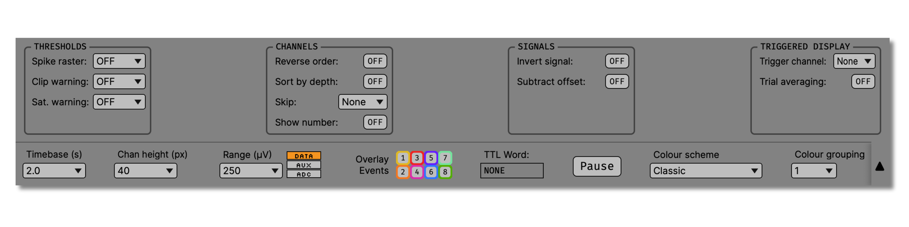
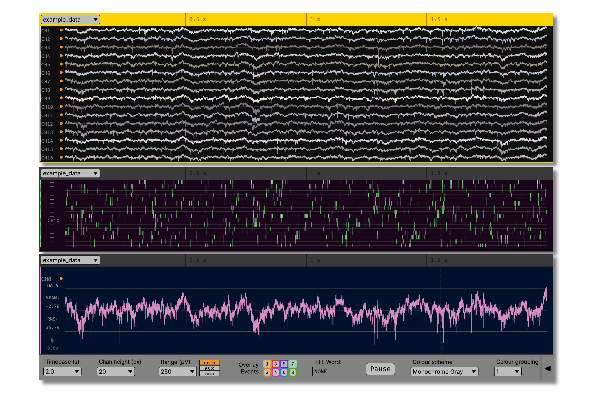

.. _lfpviewer:
.. role:: raw-html-m2r(raw)
   :format: html

#############
LFP Viewer
#############

.. image:: ../../_static/images/plugins/lfpviewer/lfpviewer-01.png
  :alt: Annotated LFP Viewer settings interface

.. csv-table:: "LFP" stands for "local field potential," but this visualizer can display any type of continuous signal. It's an essential plugin for monitoring overall data quality before and during an experiment. Each LFP Viewer can display up to 3 segments of data at a time, either side-by-side or stacked on top of one another.
   :widths: 18, 80

   "*Plugin Type*", "Sink"
   "*Platforms*", "Windows, Linux, macOS"
   "*Built in?*", "Yes"
   "*Key Developers*", "Josh Siegle, Jakob Voigts, K. Michael Fox, Anjal Doshi, Daniel Wagenaar"
   "*Source Code*", "https://github.com/open-ephys/plugin-GUI/tree/main/Plugins/LfpDisplayNode"

Plugin configuration
######################

Layout selection
-----------------

The LFP Viewer can display up to three segments of data, depending on the layout that is selected. Each section can display different segments of the same block of channels, or can point to a different sub-processor. The settings for section 1, 2, and 3 are preserved when the layout is changed.

This example shows three displays in "stacked" mode, one showing the continuous traces, one viewing the data in spike raster mode, and one set to display a single channel (toggled by double-clicking on a channel in the LFP Viewer).

Main options
--------------

The most commonly used options are always visible along the bottom of the LFP Viewer. If there are multiple simultaneous displays, the display that is linked to the options interface will be highlighted in yellow.

.. image:: ../../_static/images/plugins/lfpviewer/lfpviewer-02.png
  :alt: LFP Viewer settings

* **Timebase:** Sets the width of the display (in seconds). Additional timebases can be added by typing a custom value in the dropdown menu.

* **Chan height:** Sets the amount of vertical screen space allocated for each channel (not applicable in single-channel mode). Additional channel heights (between 6 and 100 pixels) can be added by typing a custom value in the dropdown menu.

* **Range:** Sets the vertical extent of individual channel displays. The y-range of the display will be equal to 100% of the selected voltage range, with boundaries at +/-50%. For the default range of 250 µV, the display will extend from -125 to +125 µV. Ranges can be set independently for different channel types (:code:`DATA`, :code:`AUX`, and :code:`ADC`). Additional ranges can be added by typing a custom value in the dropdown menu.

* **Event overlay:** By default, events on TTL lines 1-8 will be overlaid as translucent vertical bars. These can be toggled on and off for individual lines by clicking the event overlay buttons.

* **Pause:** The "pause" button will cause an individual display to stop updating, without affecting data acquisition or recording. As of GUI v0.6.4, it's possible to click and drag the timescale of a paused LFP Viewer to scroll backwards in time up to 3x the width of the display. When the display is paused, it's possible to change the channel height or range of the display, but not the timebase. You can also toggle single-channel mode to take a closer look at individual channels.

* **Color scheme:** Changes the appearance of the display (channel color and background color).

* **Color grouping:** Sets the number of adjacent channels with the same color. For example, if you're recording with tetrodes, you can group the colors for every four channels.

Additional options
-------------------

The interfaces for additional settings can be exposed by clicking on the triangle in the lower right of the LFP Viewer.

Thresholds
===========

* **Spike raster:** Sets the threshold for the spike raster view. If a value other than :code:`OFF` is selected (or a custom threshold is entered), the LFP Viewer will show vertical lines at the location of threshold crossings, rather than displaying the continuous trace.

* **Clip warning:** If set to :code:`ON`, a white line will be shown whenever the value of a given channel goes out of range of the display. The precise clipping value will depend on the voltage range that is currently selected.

* **Sat. warning:** If set to a value other than :code:`OFF`, red and white diagonal lines will be shown whenever the value of given channel crosses the selected threshold. This is used to detect when signals go out of range of the analog-to-digital converters, which results in information loss.

Channels
===========

* **Reverse order:** Displays the channels in opposite numerical order (highest-numbered channels at the top of the screen).

* **Sort by depth:** Displays the channels by depth, if this information is available. Currently, only the :ref:`neuropixelspxi` plugin includes information about channel depth.

* **Skip:** Sets the display to show every Nth channel. This is useful if you're using a probe with many densely space contacts, and don't need to visualize every one simultaneously.

* **Show number**: Displays the channel indices, rather than the channel names, on the left-hand side of the LFP Viewer.

Signals
===========

* **Invert signal:** By default, negative voltages point downward, and positive voltages point upward. This button switches that convention for all channels (e.g., so spikes point upward). The signal for individual channels can be inverted by right-clicking on that channel in the LFP Viewer.

* **Subtract offset:** Removes the DC offset for each channel (useful for visualizing Neuropixels data).

Triggered display
==================

* **Trigger channel:** Selects the event channel used for triggering. If a channel other than :code:`None` is selected, the display will only update on rising edge events on that channel. If mutiple events occur within the selected timebase, triggering will be disabled until the display has reached the right edge of the screen.

* **Trial averaging:** When :code:`ON`, the display will show the average signal across trials, rather than individual traces. Each incoming event on the trigger channel will update the average.

* **Reset trials:** If trial averaging mode is :code:`ON`, this button will set the trial count to zero and reset the averaging process.

Single-channel mode
######################

Double-clicking on any channel in the LFP Viewer will switch the display into single-channel mode. When single-channel mode is active, the mean and standard deviation of the current channel are shown on the left-hand side of the display. In addition, clicking anywhere within the display will update the "uV" value based on the y-position of the cursor. This feature can be used to measure the approximate amplitude of spikes by clicking on the location of the peak and trough.

The full height of the display is determined by the "range" parameter in the main options bar. Horizontal lines appear at -25%, 0%, and 25% of the range value. For the default range of 250 µV, the display will stretch from -125 to +125 µV, with lines indicating -62.5, 0, and +62.5 µV.

Audio monitoring
######################

If you have an :ref:`audiomonitor` plugin in your signal chain, you can select which channels to monitor by right-clicking on them in the LFP Viewer.

|
