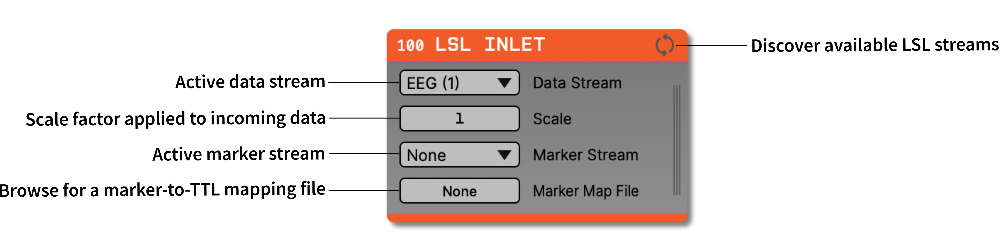

.. _lslinlet:
.. role:: raw-html-m2r(raw)
   :format: html

#####################
LSL Inlet
#####################

.. csv-table:: Streams continuous data from devices that use the Lab Streaming Layer protocol. See the `Lab Streaming Layer documentation <https://labstreaminglayer.readthedocs.io/info/intro.html>`__ for more information about this library and a list of supported devices.
   :widths: 18, 80

   "*Plugin Type*", "Source"
   "*Platforms*", "Windows, Linux, macOS"
   "*Built in?*", "No"
   "*Key Developers*", "Florin Pop, Chadwick Boulay"
   "*Source Code*", "https://github.com/open-ephys-plugins/lab-streaming-layer-io"

Installing and upgrading
###########################

The LSL Inlet plugin is not included by default in the Open Ephys GUI. To install, use **ctrl-P** to access the Plugin Installer, browse to the "LSL Inlet" plugin, and click the "Install" button.

The Plugin Installer also allows you to upgrade to the latest version of this plugin, if it's already installed.

Plugin Configuration
######################

Before starting data acquisition, a data stream needs to be selected. The list of available LSL streams is updated every time the "Discover available LSL streams" button is pressed. During data acquisition, samples can be scaled in real time by adjusting the Scale factor.

A marker stream can be optionally selected. The list of marker streams only shows streams that have an irregular rate and a single channel. When a marker is received it is broadcasted to the entire signal chain. For a marker to be shown in the LFP Viewer, a marker-to-TTL mapping is required. This is a JSON file that contains a set of Key-Value pairs of markers and corresponding TTL lines, for example:

.. code::

  {
      "Marker_1": 1,
      "Marker_2": 2
  }

|