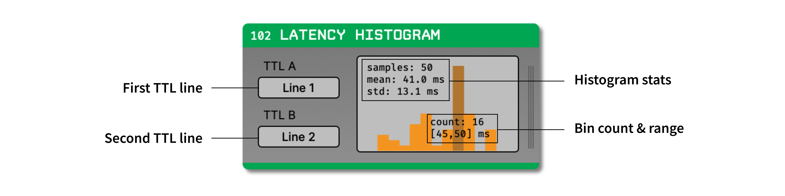

.. _latencyhistogram:
.. role:: raw-html-m2r(raw)
   :format: html

#########################
Latency Histogram
#########################

.. csv-table:: Displays latencies between events on two TTL lines as a histogram.
   :widths: 18, 80

   "*Plugin Type*", "Sink"
   "*Platforms*", "Windows, Linux, macOS"
   "*Built in?*", "No"
   "*Key Developers*", "Josh Siegle"
   "*Source Code*", "https://github.com/open-ephys-plugins/latency-histogram"

Installing and upgrading
==========================

The Latency Histogram plugin is not included by default in the Open Ephys GUI. To install, use **ctrl-P** or **⌘P** to open the Plugin Installer, browse to the "Latency Histogram" plugin, and click the "Install" button.

The Plugin Installer also allows you to upgrade to the latest version of this plugin, if it's already installed.

Plugin configuration
======================

The following parameters can be modified in the plugin editor:

- **TTL A** - The event line to use as the first reference.
- **TTL B** - The event line to use as the second reference.

The following actions can be performed inside the Histogram view by right-clicking anywhere inside the view.

- **Clear** - Clears the histogram display and its values
- **Save values** - Saves the histogram statistics to a JSON file

Plugin usage
======================

Select the two TTL event lines for which you want to calculate the latency. The histogram will display the latency between the two TTL lines in milliseconds. The histogram will be updated in real time as events are received. You can see the count of any bin and the range of that bin by hovering over the respective histogram bar. You can clear the plot at any time by right-clicking inside the plot and selecting "Clear". You can also save the histogram statistics to a JSON file by right-clicking inside the plot and selecting "Save values".

|

