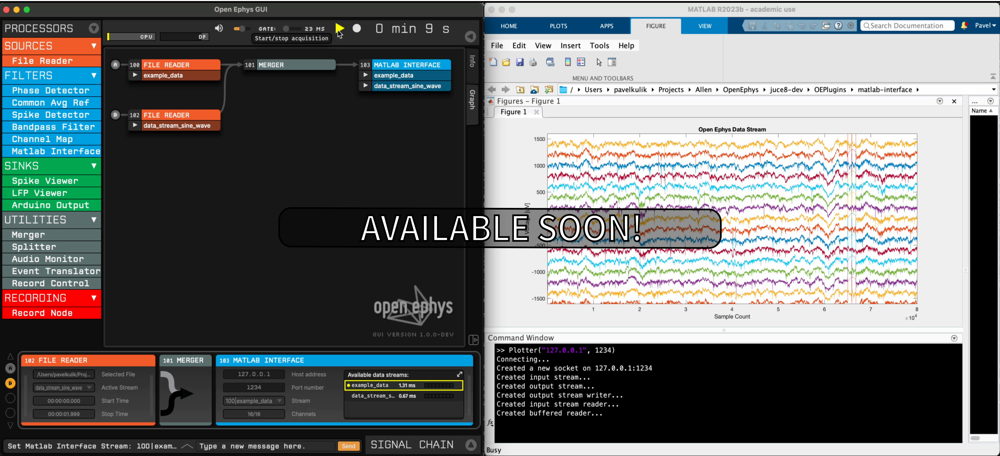

.. _matlabinterface:
.. role:: raw-html-m2r(raw)
   :format: html

################
MATLAB Interface
################

.. image:: ../../_static/images/plugins/matlabinterface/matlabinterface-01.png
  :alt: Annotated Matlab Interface editor

|

.. csv-table:: Streams live data from Open Ephys to a MATLAB session on the same network. This plugin is still in early development stages and currently only supports streaming a single channel of data at a time.
   :widths: 18, 80

   "*Plugin Type*", "Filter"
   "*Platforms*", "Windows, Linux, macOS"
   "*Built in?*", "No"
   "*Key Developers*", "Pavel Kulik"
   "*Source Code*", "https://github.com/open-ephys-plugins/MatlabInterface"

The MATLAB Interface currently streams a single channel of data from the Open Ephys GUI to a running MATLAB session. The streaming channel can be switched on the fly during acquisition. This is particularly useful when setting up experiments using high-channel count electrodes, such as Neuropixels probes, and running basic tests without having to build a separate Open Ephys plugin. Instead, only the MATLAB script needs to be modified to alter how the incoming data is processed. A MATLAB API along with examples is included with the source code. A MATLAB template class is included below:

.. code-block:: matlab

   classdef MyClass < GenericProcessor

	    properties
	        %define any variables you want to keep track of here (see examples)
	    end

	    methods 

	        function self = MyClass(host, port)
	            
	            self = self@GenericProcessor(host, port);

	            %Initialize any variables here (see examples)

	            self.process();

	        end

	    end

	    methods (Access = protected)

	        function process(self)
	            
	            while (true) 

	                process@GenericProcessor(self); 

	                numSamples = self.dataIn.numSamplesFetched;
	                
	                data = self.dataIn.continuous(1:end);

	                %Do whatever you want with the data here (see examples)

	            end

	        end

	    end

	end

