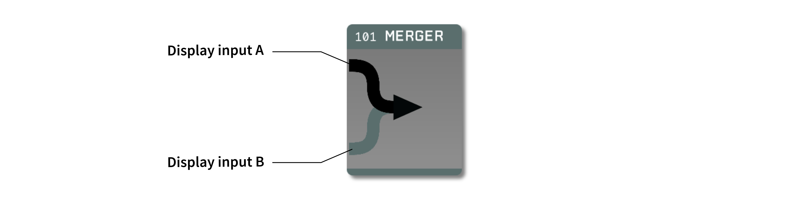
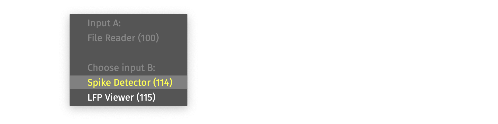
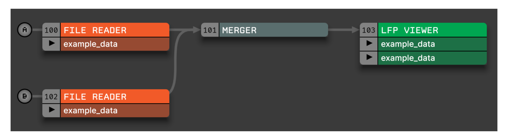

.. _merger:
.. role:: raw-html-m2r(raw)
   :format: html

################
Merger
################

.. csv-table:: Allows multiple signal chains to be combined into one.
   :widths: 18, 80

   "*Plugin Type*", "Utility"
   "*Platforms*", "Windows, Linux, macOS"
   "*Built in?*", "Yes"
   "*Key Developers*", "Josh Siegle, Aarón Cuevas López"
   "*Source Code*", "https://github.com/open-ephys/plugin-GUI/tree/main/Source/Processors/Merger"

Recommended usage
######################

A Merger is required whenever downstream plugins need information from multiple data streams in order to perform their functionality. An example of this would be the Record Node, which can automatically synchronize incoming data streams that share a common digital input line. If it's not necessary to combine information from multiple streams (e.g., if you're just visualizing data in the LFP Viewer), then a Merger is not needed; instead, it's usually better to process the data streams in parallel to reduce the complexity of the overall signal chain.

.. note:: It is not possible to place multiple Mergers in a row. If you need to merge more than two data sources together, insert at least one other plugin between the Mergers.

Plugin configuration
######################

First, drop the Merger into the editor viewport right of the first signal chain to be merged (input A).

There are two ways to connect the second signal chain (input B):

#. Click the bottom of the Merger to display input B, then drop the desired source plugin to the left of the Merger.

#. Right click on the Merger's name to bring up a popup menu that shows all of the plugins available for merging. Select one of the options to connect it to Merger input B:

The Merger has no effect on the underlying data; instead, it instructs the GUI to connect all of the channels from its two inputs to the output plugin. This can easily be seen when visualizing the relevant portion of the signal chain in the Graph Viewer:

