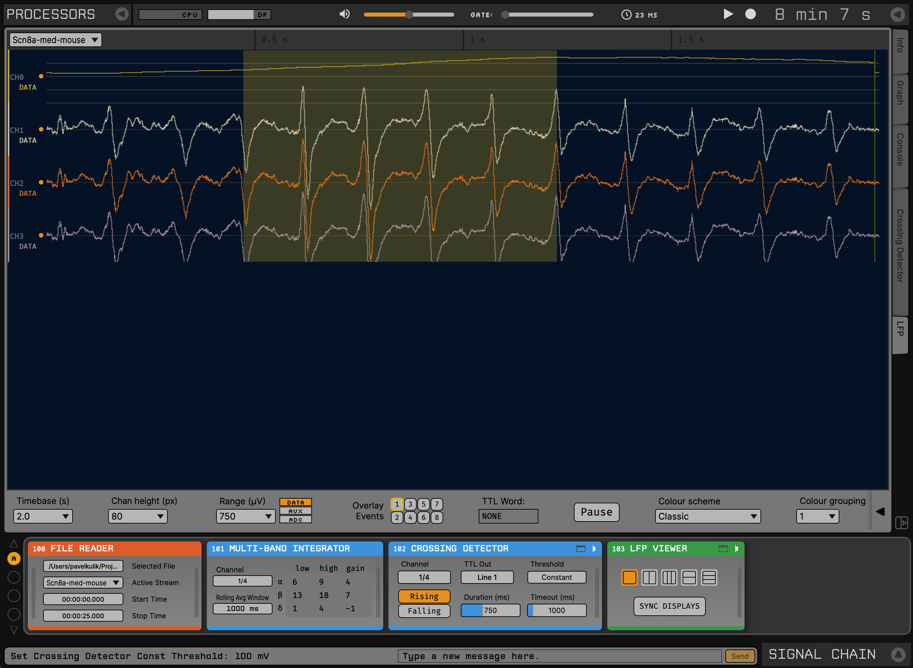

.. _multibandintegrator:
.. role:: raw-html-m2r(raw)
   :format: html

#####################
Multi-Band Integrator
#####################

.. csv-table:: Mixes, weights, and applies a rolling average to bandwidths of interest on a single channel. This plugin can be used to trigger feedback based on neural oscillations.
   :widths: 18, 80

   "*Plugin Type*", "Filter"
   "*Platforms*", "Windows, Linux, macOS"
   "*Built in?*", "No"
   "*Key Developers*", "Michelle Fogerson"
   "*Source Code*", "https://github.com/open-ephys-plugins/multi-band-integrator"

|

The output of the Multi-Band Integrated can be thought of as a real-time power signal for waveforms with complex but well-specified frequency components. It can be paired with the :ref:`crossingdetector` plugin to trigger events when the output power reaches a threshold.

It was originally developed by Michelle Fogerson in the Huguenard Lab at Stanford to detect absence-like seizures in mice based on their spectral properties (see `Sorokin et al., 2016 <https://www.cell.com/neuron/comments/S0896-6273(16)30864-9>`__ for more details). The default parameters are set for detecting these oscillations:

* **Band 1:** 6-9 Hz, gain = 4

* **Band 2:** 13-18 Hz, gain = 7

* **Band 3:** 1-4 Hz, gain = -1

It can also be configured to detect oscillations in different frequency bands, such as ripples, spindles, or alpha waves, although this hasn't been tested yet.

Installing and upgrading
###########################

The Multi-Band Integrator plugin is not included by default in the Open Ephys GUI. To install, use **ctrl-P** to access the Plugin Installer, browse to the "Multi-Band Integrator" plugin, and click the "Install" button.

The Plugin Installer also allows you to upgrade to the latest version of this plugin, if it's already installed.

Plugin Configuration
######################

The plugin editor allows the user to specify:

* **Rolling average window duration**: Window over which to smooth the output of the multi-band integrator. 

* **Input channel**: The continuous channel that will be analyzed. This channel will be overwritten by the result of the multi-band integration operation, so make sure you have your Record Node placed *before* the Multi-Band Integrator in the signal chain. The signal prior to smoothing the output will be written to the channel adjacent to the input channel.

* **Frequency Bands**: For each of 3 frequency bands, you can configure the **lower bound**, **upper bound**, and **gain**. To use fewer than three bands, set one or more of the gains to 0. Gains can also be set to negative values in order to subtract power in particular bands from the output.

The plugin is typically used in conjunction with the :ref:`crossingdetector`. The screenshot below shows an example of detecting absence-like seizures, using the example data found in the `Multi-Band Integrator GitHub repository <"https://github.com/open-ephys-plugins/multi-band-integrator">`__:

