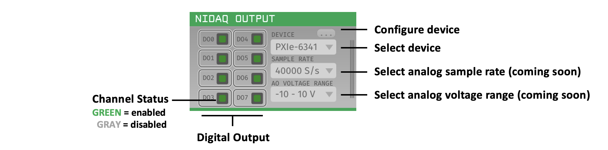

.. _NI-DAQOutput:
.. role:: raw-html-m2r(raw)
   :format: html

NI-DAQ Output
==============

.. csv-table:: Streams event data acquired or generated by the GUI out of the GUI using National Instruments (NI) hardware digital lines. Use multiple instances of this plugin to output digital data from several PXI-, PCI-, and/or USB-based NI devices simultaneously. Analog output capabilities are coming soon. 
   :widths: 18, 80

   "*Plugin Type*", "Sink"
   "*Platforms*", "Windows only"
   "*Built in?*", "No"
   "*Key Developers*", "Pavel Kulik"
   "*Source Code*", "https://github.com/open-ephys-plugins/nidaq-output"

Requirements
#######################

* One National Instruments data acquisition (DAQ) device (PXI, PCI, or USB); see below for a list of devices we've tested.

* (optional) An NI terminal block (e.g. BNC-2090A or BNC-2110) and compatible cables

* Installed NI-DAQmx drivers (available for download `here <https://www.ni.com/en-us/support/downloads/drivers/download.ni-daqmx.html#348669>`__; version 20.0+ recommended).

Installing and upgrading
############################

The NI-DAQ Output plugin is not included by default in the Open Ephys GUI. To install, use **ctrl-P** or **⌘P** to open the Plugin Installer, browse to the "NI-DAQ Output" plugin, and click the "Install" button.

The Plugin Installer also allows you to upgrade to the latest version of this plugin, if it's already installed.

Compatible hardware
#####################

So far, we've tested the following devices with this plugin:

.. csv-table::
   :widths: 30, 30, 30

   "**Device**", "**Output**", "**Price**"
   "PXI-6133", "8 digital", "$3643"
   "PXIe-6341", "24 digital", "$1239"
   "PXI-6521", "16 digital (24 V logic)", "$715"
   "PCIe-6321", "24 digital", "$746"
   "USB-6001", "13 digital", "$220"
   "USB-6259 (BNC)", "32 digital", "$3995"

Connecting to your NIDAQ hardware
##################################

When you drag and drop the NI-DAQ Output plugin from the Processor List onto the Editor Viewport, it automatically checks for all connected NI devices. If multiple devices are found, the 'Device Selector' combo box will be enabled and allow selection among all available devices. Only one device can be active per plugin, insert multiple plugins to use multiple devices simultaneously. The module only looks for devices when the plugin initially is dropped into the EditorViewport. If a new device is connected after the plugin is dropped, you will need to delete/re-insert a new NI-DAQ Output module to be able to see the new device.

The editor will automatically generate control buttons for each digital input available on the selected NI device. The channel status toggle button is set to on (green) by default for all channels and is intended to enable/disable output on the fly. Toggling an enabled channel to off (gray) will disable output on that channel. Disabling digital channels is particularly useful when a digital input line is constantly high or a digital line is not used at all. 

Configuring the Plugin
#########################

Clicking the **...** button will display the popup menu above allowing you to configure the plugin. The following settings are available:

* **Analog Output Channels** - Coming soon!

* **Digital Output Channels** - Select the number of digital output channels to use. The number of channels available depends on the NI device selected and how many digital channels are required for your experimental setup. The intention here is to not clutter the editor with channels you are not actively using. Adding/removing channels will automatically update the editor to reflect the changes.

* **Digital Write Size** - Select the size of the digital write in bits. Some devices only support 8-bit writes, while others support 16-bit or 32-bit. The plugin will attempt to automatically detect the write size based on your device. If the write size is not correctly detected, you can manually select the write size here.

* **Active Port Selection** - Select which digital IO port(s) to enable as output on the selected NI device. Different ports may have different functionality regarding timing and transitions, refer to the user manual for your particular device to ensure you are using the appropraite port for your experiment. Port selection is also necessary when also using the NIDAQmx plugin to read digital inputs from the same device. Given the plugin architecture of the GUI, the user must ensure that the same port is not used for both input and output. Toggling a port will enable/disable output on that port, where green indicates the port is enabled and red indicates the port is disabled.