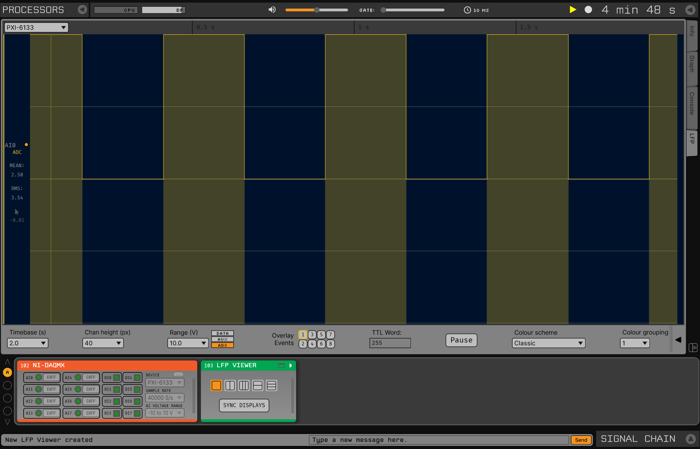
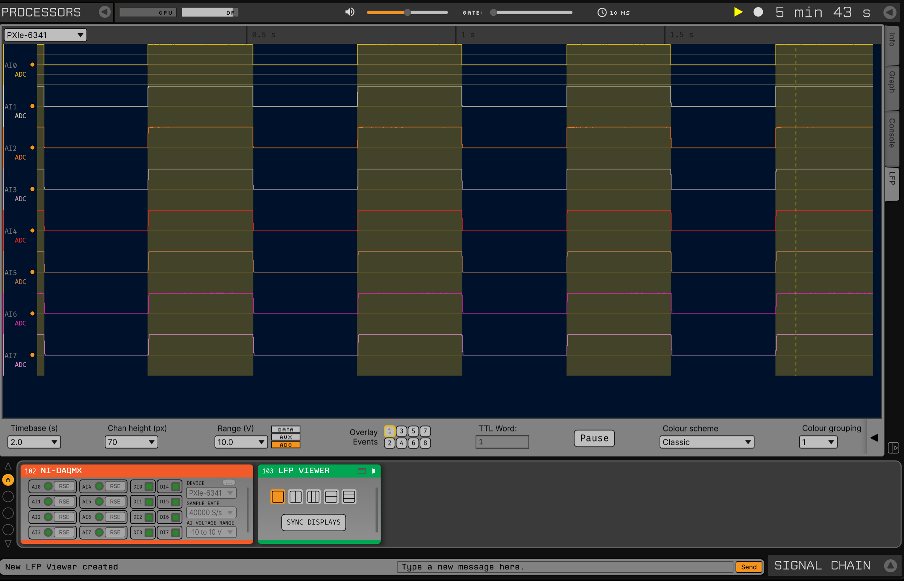
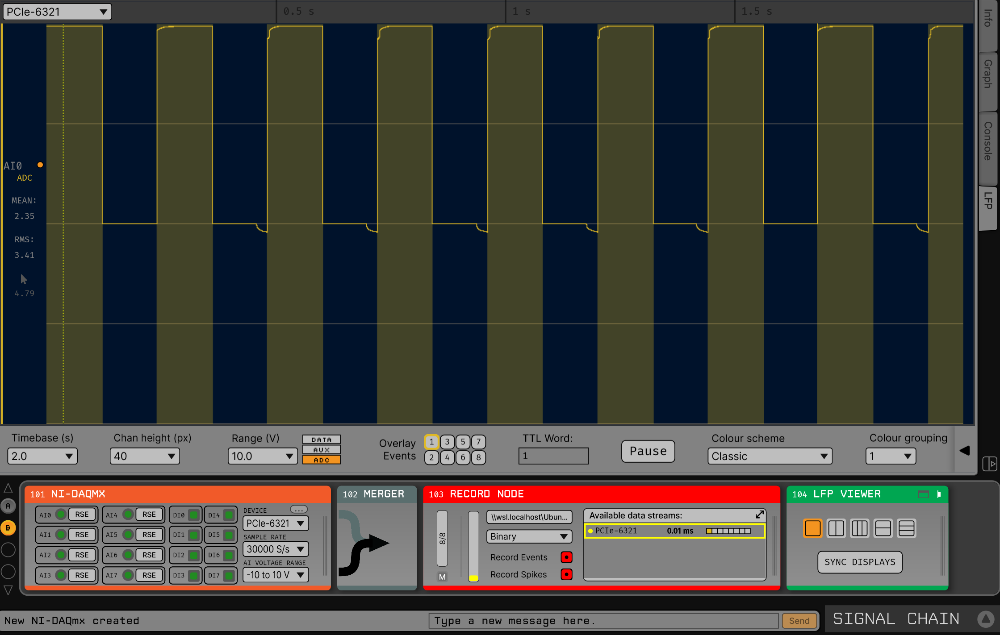
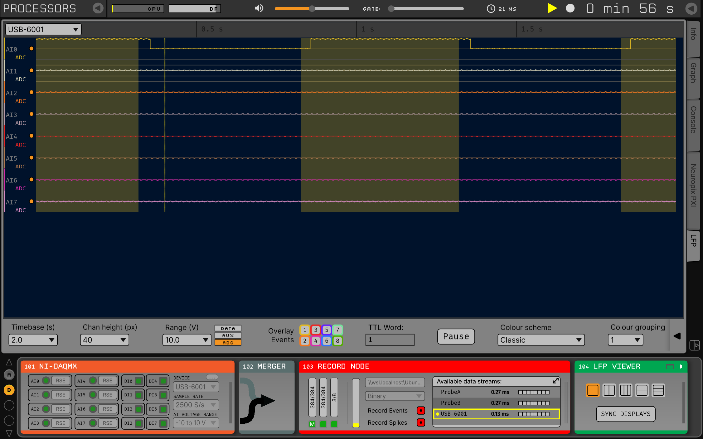

.. _nidaqmx:
.. role:: raw-html-m2r(raw)
   :format: html

################
NIDAQmx
################

.. image:: ../../_static/images/plugins/nidaqmx/NIDAQmx.png
  :alt: NIDAQmx plugin settings interface

|

.. csv-table:: Streams analog and digital data from National Instruments hardware. The module can acquire data from multiple PXI-based and/or USB-based National Instruments (NI) devices simultaneously. The NIDAQmx module can also be used in tandem with the Neuropix-PXI plugin, to read in analog and digital inputs in parallel with Neuropixels data.
   :widths: 18, 80

   "*Plugin Type*", "Source"
   "*Platforms*", "Windows only"
   "*Built in?*", "No"
   "*Key Developers*", "Pavel Kulik"
   "*Source Code*", "https://github.com/open-ephys-plugins/nidaq-plugin"

Hardware requirements
#######################

For PXI-based acquisition: 

* One PXI chassis (so far we've tested National Instruments PXIe-1071 and PXIe-1082)

* One PXI remote control module, housed in the PXI chassis (we've tested National Instruments PXIe-8381 and PXIe-8398) – requires NIDAQmx driver 19.0 or higher

* One PXI-based analog and digital I/O module (we've tested and highly recommend National Instruments PXI-6133)

* Cables to connect the remote control module to the PCIe card (e.g., National Instruments MXI-Express Cables, Gen 3 x8)

* One PXI-based NI-DAQ BNC/terminal block (we've tested the BNC-2090A and BNC-2110)

.. note:: The NIDAQmx plugin is currently only able to sync analog and digital input signals from NI cards that support correlated (hardware-timed) digital I/O. It is not trivial to discern this capability from the NI data sheets, so please double-check that your particular card supports this feature prior to purchasing a card. Again, we highly recommend the PXI-6133 card. This module also does not yet support NI cards that only have digital inputs (ex: NI 6521).

For USB-based acquisition:

* One NI USB device (we've tested the USB-6001)

* One micro-USB (or related) cable to connect the USB device to the computer. 

.. tip:: These devices are known to experience 'signal ghosting' if unused analog input channels are not grounded. Grounding at least one positive terminal of an unused analog input channel can reduce ghosting by ~99% of the highest amplitude active channel. 

Connecting to the NIDAQmx system
##################################

Once your PXI system is up and running, you can drag and drop the NIDAQmx module from the Processor List onto the Editor Viewport. The module automatically checks for all connected NI devices and by default loads the first device found. The device product name appears directly to the right of 'NIDAQmx' in the title.

If multiple NI devices are found, a 'Device Swap' button will appear in the top right corner that acts as a toggle switch to cycle through all available devices. The module only looks for devices when the plugin is dropped into the EditorViewport. If a new device is connected after the plugin is dropped, you will need to drop a new NIDAQmx module to be able to connect to the new device.

The editor will automatically generate control buttons for each analog and digital input available on the currently selected NI device. Each analog channel contains a channel status toggle button as well as a terminal configuration toggle button. The channel status toggle button is set to on (green) by default for all channels and is intended to enable/disable channels on the fly. Toggling an enabled channel to off (gray) will 'zero-out' the data coming in on that channel. 

Each analog channel also contains a terminal configuration toggle specific to the device connected. Possible terminal device configurations are RSE (Referenced Single-Ended), NRSE (Non-Referenced Single-Ended), DIFF (Differential) and PDIF (Pseudo-Differential). The terminal configuration toggle setting in the module should match the configuration in your experimental setup. Since most NI devices cannot infer the terminal configuration electronically, it is on the user to ensure the module configuration matches the experimental setup prior to acquiring and recording data. An inconsistent terminal configuration can affect the amplitude and voltage offset of the incoming data.

Each digital channel contains a channel status toggle button as well. Disabling digital channels is particularly useful when a digital input line is constantly high or a digital line is not used at all. 

On the right side of the module are pull-down selection menus to select the sample rate and voltage range of all analog input channels (set individually for each channel). The module defaults to the highest sample rate as well as the largest voltage range available on the devices. Sample rate and voltage range selection are both disabled during data acquisition and recording. 

Offline Synchronization
#########################################

The NIDAQmx module has its own sample clock, even if it's in the same PXI chassis as other hardware (e.g. a Neuropixels basestation). Therefore, it needs to be treated as a separate device when performing offline synchronization.

To align timestamps across devices, one device has to be treated as the "master" clock, and all other sets of timestamps must be scaled and shifted to match this clock. This requires that a digital sync line is shared across all devices. For now, you'll need to manually connect a sync line to one of the digital input lines on all of your devices. If you don't already have a solution for this, we recommend using an Arduino running the sync-barcodes program, which generates unique temporal barcode patterns every 30 s. This will allow you to align sample clocks accurately, even if your devices are stopped and started at different times.

To perform the alignment, you'll need to identify the first and last shared sync pulse in the recording. The temporal offset between the start of the first sync pulses defines the shift between any device and the master clock. Once you know this, you can calculate the expected interval between the firs and last sync pulse (given the expected sample rate of a device). The ratio of the actual interval to the expected interval defines the scaling factor for that device.

Then, each non-master clock can be transformed by the following equation (in Matlab):

.. code-block:: matlab

  aligned_timestamps = scaling .* original_timestamps + shift;

The "aligned_timestamps" will now be aligned to the master clock, and are ready for analysis.

Online Synchronization
#########################################

A record node can automatically detect if two or more incoming digital channels share the same physical signal. Since each device acquires data asynchronously, a shared clock signal between two different devices will have different timestamps for corresponding TTL events. A record node can designate one of these channels as the main ‘synchronization channel’ and convert the timestamps coming from devices that physically share the same synchronization signal to align with the main device. 

The simplest way to synchronize a NIDAQ device with Neuropixels probes is to set the Neuropixels-PXI as the main synchronization device by physically connecting the SMA output of the Neuropixels basestation to any digital input channel on the NIDAQ device. 

In OpenEphys, merging a Neuropixels-PXI module and a NIDAQ module into a Record Node will show either one or two subprocessors per probe (depending if the 2.5kHz LFP band is included by the probe model) and one subprocessor for the NIDAQ device. Each subprocessor’s sync channel monitor will turn green if the digital line on that subprocessor is synchronized with any of the other subprocessors coming into that record node. 

In the example below, upon starting acquisition, the first and third sync channel monitors in the record node turn green first, as these contain the 30kHz AP band of the probes and the source of the synchronization signal. Shortly after, the fifth sync channel monitor turns green, which contains the sync signal coming into the NIDAQ device from the Neuropixel probe's basestation. 

|

.. image:: ../../_static/images/plugins/nidaqmx/NIDAQmx_synced.png
  :alt: NIDAQmx plugin synced

.. tip:: For more information about recording and synchronization in Open Ephys, please see the documentation here: "https://open-ephys.github.io/gui-docs/User-Manual/Recording-data/index.html"

NIDAQ Device Review
#########################################

We have tested and recommend using one or more of the devices below, in order of performance. In all of the below examples, a 5V ~2Hz square wave @50% duty cycle from an Arduino is used to demonstrate the analog and digital input behaviors you can expect to see using each device in Open Ephys.

PXI Devices
#########################################

6133 
#########################################
The PXI‑6133 supports simultaneous-sampling, which means the analog and digital channels are guaranteed to be sampled simultaneously in time and synchronized with each other before they reach the GUI. Passing the square wave test signal to both the first analog and first digital input on the card shows that both signals are synchronized:

|

|

.. note::he 6133 takes a few (3-5) seconds to initialize after the acquisition button has been pressed before data will start to appear in the LFPViewer. 

Furthermore, the analog input channels on the 6133 are well-isolated and there is no signal cross-talk on any of the unused analog input channels:

|

.. tip:: The voltage on the unused channels may float at a constant non-zero value if left open. It is good practice to either ground or short the non-used analog inputs to avoid this. 

6341
#########################################
The PXIE performs almost as well as the 6133, however, there is cross-talk across unused channels when applying the same test signal as above. That is, if a signal is physically connected to only the first analog input channel, a ‘ghost’ of the signal will appear across all of the open analog input channels as shown below:

| 

|

However, if a 10Hz square wave is added to the second analog input and to the second digital input, there is no interference between the new signal and the original test signal on either the analog or digital channels:

|

.. image:: ../../_static/images/plugins/nidaqmx/6341_Combo.png
  :alt: NIDAQmx plugin PXIE-6341 multiple analog and digital inputs without interference

|

6521 
#########################################
The NI 6521 only supports digital input channels that swing higher than +11V in order to get a TTL signal. Nonetheless, this card can still be a cheap(er) alternative for experiments that may only require digital channels alongside neural data. If you are using a 5V microcontroller in your experiments, you will need to boost your digital lines from 5V to something higher than 11V. A potential solution here is to use a 12V power source and a transistor inverter circuit.

|

PCIE Devices
#########################################

6321
#########################################
The PCIE 6321 card does not require the PXI chassis and can be connected directly to the PCIE slot of a PC motherboard. This card exhibits the same behavior with the test signal as the PXI-6341, however, there is some overshooting observed at steep signal transition points. Smooth analog signals will not exhibit this behavior. 

| 

|

USB Devices
#########################################

USB devices do not support simultaneous sampling out of the box, meaning analog and digital signals will not be synchronized by the device itself.  

6001
#########################################
Applying the test signal to the first analog and second digital input of the USB 6001 results in the digital channels going high significantly before the analog channels. The USB devices also inherit the ghosting and overshooting issues mentioned in previous devices. 

|

The delay between the observed analog and digital inputs is not guaranteed to be constant. By grounding any unused analog channels, the USB 6001 can still achieve a clean and isolated signal on its analog channels:

|

 