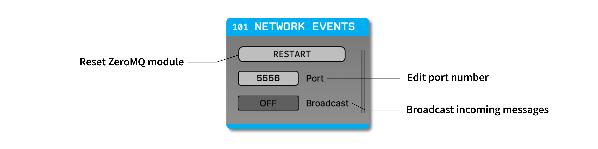

.. _networkevents:
.. role:: raw-html-m2r(raw)
   :format: html

################
Network Events
################

|

.. csv-table:: Adds TTL events via a network connection.
   :widths: 18, 80

   "*Plugin Type*", "Filter"
   "*Platforms*", "Windows, Linux, macOS"
   "*Built in?*", "No"
   "*Key Developers*", "Shay Ohayon, Josh Siegle, Aarón Cuevas López, Christopher Stawarz, Arne Meyer"
   "*Source Code*", "https://github.com/open-ephys-plugins/network-events"

Installing and upgrading
###########################

The Network Events plugin is not included by default in the Open Ephys GUI. To install, use **ctrl-P** or **⌘P** to open the Plugin Installer, browse to the "Network Events" plugin, and click the "Install" button.

The Plugin Installer also allows you to upgrade to the latest version of this plugin, if it's already installed.

Plugin configuration
########################

Since the Network Events module sends events, and not continuous data, it cannot be placed at the beginning of a signal chain. The plugin will add events to all data streams that pass through it.

Remote control commands
################################################

TTL Events
-----------

The primary purpose of the Network Events module is to add TTL events to one or more of the GUI's data streams via a remote connection. This makes it straightforward to store event times and trigger outputs from external software, such as Python or Matlab scripts.

:code:`TTL [Line=0-255] [State=0/1]` – Sends an **ON** (1) or **OFF** (0) TTL event on the specified TTL line. 

Other commands
---------------

The Network Events module can also respond to commands related to starting/stopping acquisition and recording. However, these commands are also available via the Open Ephys HTTP Server (added in GUI version 0.6.0). It's recommended to use the HTTP Server commands whenever possible, as these do not rely on a specific plugin.

:code:`StartAcquisition` – Starts data aquisition

:code:`StopAcquisition` – Stops data aquisition

:code:`StartRecord [RecordNode=record_node_id] [CreateNewDir=1] [RecDir=recording_directory_path] [PrependText=some_text] [AppendText=some_text]` – Starts recording of data

* :code:`RecordNode` – Only apply the `CreateNewDir` & `RecDir` options to the specified record node

* :code:`CreateNewDir` – creates a new (sub)directory with the current date string

* :code:`RecDir` – sets the recording directory

* :code:`PrependText` – sets the text to be prepended to the date string

* :code:`AppendText` – sets the text to be appended to the date string

:code:`StopRecord` – Stops recording

:code:`IsAcquiring` – Returns 1 if acquiring, 0 if not

:code:`IsRecording` – Returns 1 if recording is active, 0 if not

:code:`GetRecordingPath [RecordNode=record_node_id]` – Get's the main recording path or, if record node is specified, then record node specific recording path

:code:`GetRecordingNumber [RecordNode=record_node_id]` – Get's the main recording number or, if record node is specified, then record node specific recording number

:code:`GetExperimentNumber [RecordNode=record_node_id]` – Get's the main experiment number or, if record node is specified, then record node specific experiment number

Example Code
##################

Matlab
-------
In the GUI's `Matlab Resources`_ folder, you'll find a :code:`matlab_zeroMQ_wrapper_example.m`, which shows how to send messages. Assuming the zeroMQ mex file is in the same directory (which it should be by default), all you have to do is initialize the connection using 'StartConnectThread' and the appropriate url, then send a message using 'Send', the handle of your connection, and the string you want. 

Python
--------
An Python example can be found at in the `Python Resources`_ folder: :code:`record_control_example_client.py`

.. _ZeroMQ: https://zeromq.org/
.. _Matlab Resources: https://github.com/open-ephys-plugins/network-events/tree/main/Resources/Matlab
.. _Python Resources: https://github.com/open-ephys-plugins/network-events/tree/main/Resources/Python

